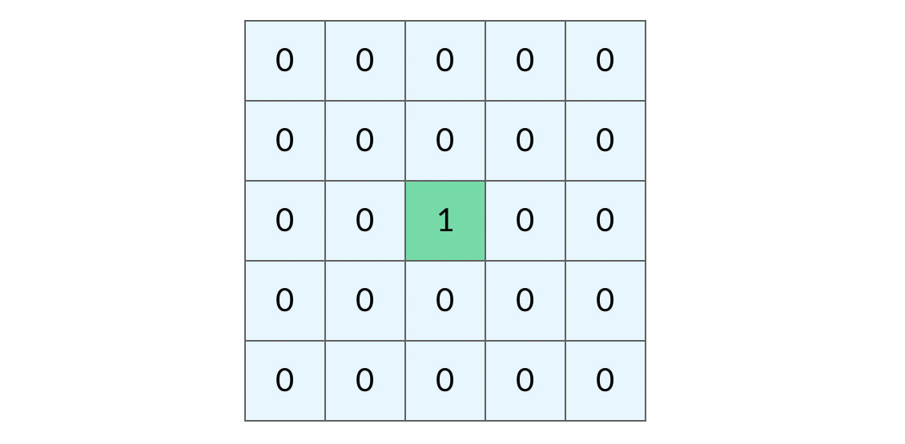
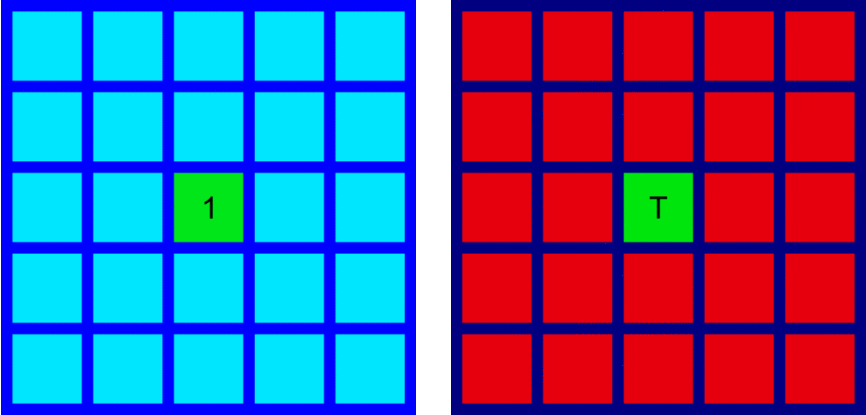

# 宽度搜素：层级遍历，最短距离，拓扑排序

### BFS知识要点列表
1. [二叉树的层级遍历](./coding/bfs/levels.md)
1. [BFS经典最短路径题](./coding/bfs/shortest.md)
1. [YYDS, 拓扑排序](./coding/bfs/topsort.md)

### **浅谈遍历的思维**
**只要上过算法课的人，都会晓得深搜(DFS)和宽搜(BFS)。就这么说吧，搜索就是穷举遍历的过程，只不过有时候穷举遍历的过程中发现了可以exit的条件可以提前结束而已。宽搜的本质是面（或者说由点及面），属于集体作战。深搜的话属于一条线走到天黑，属于单打独斗。为了加深DFS和BFS之间的不同作战规则，我这里贴两个基于矩阵（也是图）遍历的gif图。**

> 先感受一下BFS由点及面的作战，看着像蒙古骑兵占领世界。


> 再感受一下DFS单兵作战的一条线深入，看着像二战时候德国，只不过最后德国人并没能占领世界。


> **建议刷完二叉树的同学再来读这篇文章，会有更深刻的理解。**

!> 先上个结论：好多人觉得DFS更通用，BFS只是在无权有向图的最短路径类题里作用比较大，我个人觉得能用BFS的地方就别用DFS。

先上BFS框架吧，这个框架是通用框架，有两个可变化点需要提一下：
1. BFS解题时是否需要层级遍历？不需要的话那个`int sz = q.size()`可以不用写；
1. 解题时候是否需要维护`Set<Node> visited`这个哈希集？有没有其他方法可以直接改原来数组的值来达到`避免走回头路`的目的？

```java
// 计算从起点 start 到终点 target 的最近距离
int BFS(Node start, Node target) {
    Queue<Node> q; // 核心数据结构
    Set<Node> visited; // 避免走回头路
    
    q.offer(start); // 将起点加入队列
    visited.add(start);
    int step = 0; // 记录扩散的步数

    while (q not empty) {
        int sz = q.size();
        /* 将当前队列中的所有节点向四周扩散 */
        for (int i = 0; i < sz; i++) {
            Node cur = q.poll();
            /* 划重点：这里判断是否到达终点 */
            if (cur is target)
                return step;
            /* 将 cur 的相邻节点加入队列 */
            for (Node x : cur.adj()) {
                if (x not in visited) {
                    q.offer(x);
                    visited.add(x);
                }
            }
        }
        /* 划重点：更新步数在这里 */
        step++;
    }
}
```

