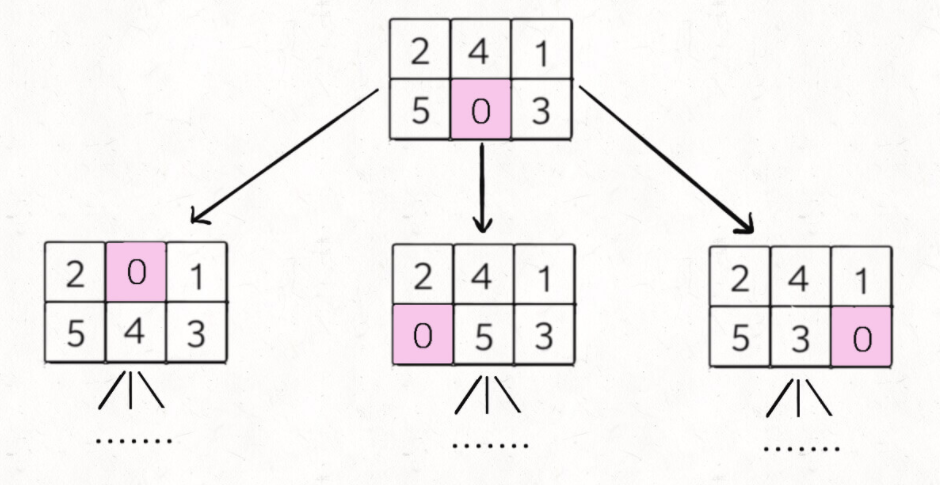

# 用BFS找最短路径

!> 所有BFS题目的本质就是`让你从一幅图中从起点start到达终点end的最短距离`。BFS 相对 DFS 的最主要的区别是：BFS 找到的路径一定是最短的，但代价就是空间复杂度可能比 DFS 大很多。

### **刷题列表**
1. [111. 二叉树的最小深度（简单）](#二叉树的最小深度) 
1. [133. 克隆图（中等）](#克隆图)
1. [611. 领扣-骑士的最短路径（中等）](#骑士的最短路径)
1. [178. 领扣-图是否是树](#图是否是树) 
1. Shortest Path Visiting all nodes: https://leetcode.com/problems/shortest-path-visiting-all-nodes/
1. Sequence Reconstruction: https://leetcode.com/problems/sequence-reconstruction/
1. [127. 单词接龙（中等）](#单词接龙) 
1. Number of Islands: https://leetcode.com/problems/number-of-islands/ 
1. [752. 打开转盘锁（中等）](#打开转盘锁) 
1. [773. 滑动谜题（困难）](#滑动谜题)


### 二叉树的最小深度
[111. 二叉树的最小深度（简单）](https://leetcode.com/problems/minimum-depth-of-binary-tree/)

?> **思路** 二叉树的层级遍历那篇帖子里提过，答案请看[**这里**](./coding/bfs/levels?id=二叉树的最小深度)。

### 克隆图
[133. 克隆图（中等）](https://leetcode.com/problems/clone-graph/) 

?> **思路** 这题思路非常直接：1. 先遍历一遍，把所有的新node都先创建出来；2. 再遍历一遍map，把新的node的neighbors都填上；步骤1反正要遍历所有的node嘛，那就试试dfs和bfs吧。

```js
//反正要遍历所有的node嘛，试试dfs
var cloneGraph = function(node) {
    if(!node) return null;
    //先遍历一遍，把所有的新node都先创建出来
    let visited = new Set();
    let map = new Map();
    dfs(node, visited, map);

    //再遍历一遍map，把新的node都连起来
    for(const [node, newNode] of map.entries()){
        let neighbors = node.neighbors;
        let newNeighbors = [];
        for(const neighbor of neighbors){
            newNeighbors.push(map.get(neighbor));
        }
        newNode.neighbors = newNeighbors;
    }
    
    return map.get(node);
};

const dfs = (node, visited, map) => {
    
    if(visited.has(node)){
        return;
    }
    
    let newNode = new Node(node.val);
    map.set(node, newNode);
    visited.add(node);
    
    //遍历所有neighbors
    for(const neighbor of node.neighbors){
        dfs(neighbor, visited, map);
    }
}
```
```js
var cloneGraph = function(node) {
    if(!node) return node;
    
    let nodes = getNodes(node);
    
    //init a map
    let map = new Map();
    for(const n of nodes){
        map.set(n, new Node(n.val));
    }
    
    //copy neighbors
    for(const n of nodes){
        let newNode = map.get(n);
        for(const neighbor of n.neighbors){
            let newNeighbor = map.get(neighbor);
            newNode.neighbors.push(newNeighbor);
        }
    }
    
    return map.get(node);
};

const getNodes = (node) => {
    let visited = new Set();
    visited.add(node);
    let q1 =[node];
    //BFS
    while(q1.length > 0) {
        let curr = q1.shift();
        
        for(const neighbor of curr.neighbors) {
            if(!visited.has(neighbor)){
                visited.add(neighbor)
                q1.push(neighbor); 
            }
        }
    }
    return Array.from(visited);
}
```

### 骑士的最短路径
[611. 领扣-骑士的最短路径（中等）](https://www.lintcode.com/problem/611/) 

?> **思路** 这题思路就是无权图的最短路径。小技巧就是用个数组来表示骑士的8个不同的移动方向。

```js
/**
 * Definition of Point:
 * class Point {
 *   constructor(x = 0, y = 0) {
 *     this.x = x;
 *     this.y = y;
 *   }
 * }
 */
export class Solution {
  /**
   * @param grid: a chessboard included 0 (false) and 1 (true)
   * @param source: a point
   * @param destination: a point
   * @return: the shortest path 
   */
  constructor(){
    this.DIRS = [[1,2],[1,-2],[-1,2],[-1,-2],[2,1],[2,-1],[-2,1],[-2,-1]];
  }
  
  shortestPath(grid, source, destination) {
    let m = grid.length, n=grid[0].length;
    let q = [[source.x, source.y]];
    grid[source.x][source.y] = 1;
    let step = 0;
    while(q.length>0) {
        let size = q.length;
        for(let i=0; i<size; i++){
            let cur = q.shift();
            if(cur[0]==destination.x && cur[1]==destination.y){
                return step;
            }
            //扩散
            for(const dir of this.DIRS){
                let x = cur[0]+dir[0];
                let y = cur[1]+dir[1];
                if(x<0 || y<0 || x>=m || y>=n) continue;
                if(grid[x][y] != 0) continue;

                q.push([x,y]);
                grid[x][y] = 1;
            }
        }
        step++;
    }
    return -1;
  }
}
```

### 单词接龙
[127. 单词接龙（中等）](https://leetcode.com/problems/word-ladder/) 

?> **思路** 这题是个隐式图，可以转化成有向无权图。有个小技巧就是在`getNeighbors`中用ascii码来变换一个字符，小写字母a到z的ascii码是97到122，所以可以遍历word中每一个字符并用`String.fromCharCode(i)`来计算新的置换字符。还有一个点要注意，就是把每个遍历过得word直接从wordSet删除，以达到`避免走回头路`的目的。

```js
var ladderLength = function(beginWord, endWord, wordList) {
    let wordSet = new Set(wordList);
    
    let step=1;
    let q=[beginWord];
    
    while(q.length>0){
        let size = q.length;
        for(let i=0; i<size; i++){
            let cur = q.shift();
        
            if(cur==endWord){
                return step;
            }
            
            //遍历邻居
            for(const neighbor of getNeighbors(cur, wordSet)){
                q.push(neighbor);
                wordSet.delete(neighbor);
            }

        }
        
        step++;
    }
    
    return 0;
};

const getNeighbors = (word, wordSet) => {
    let res = [];
    for(let k=0; k<word.length; k++){
        let c = word.charAt(k);
        for(let i=97; i<=122; i++){
            if(String.fromCharCode(i)==c) continue;
            let neighbor = word.substring(0,k)+String.fromCharCode(i) + word.substring(k+1);
            if(wordSet.has(neighbor)){
                res.push(neighbor);
            }
        }
    }
    
    return res;
}
```

### 图是否是树
[178. 领扣-图是否是树](https://www.lintcode.com/problem/178/) 

?> **思路** 这题比较直接，看一个图是否是树，主要就是没有环+所有节点时候都能连通。题中已经说了不会出现重复边，所以先判断边数是否为n-1来判定是否有环。然后再判断是否所有节点都连通，这时候BFS遍历就派上用场了，看所有点能否连通，就看一次BFS遍历能否遍历完所有的点。

```java
public class Solution {
    /**
     * @param n: An integer
     * @param edges: a list of undirected edges
     * @return: true if it's a valid tree, or false
     */
    public boolean validTree(int n, int[][] edges) {
        if (n == 0) {
            return false;
        }
        //题中已经说了不会出现重复边，所以先判断边数
        if(edges.length != n-1) return false;

        //再看是否所有边都联通
        //建邻接表
        Map<Integer, Set<Integer>> graph = initializeGraph(n, edges);
        
        // bfs
        Queue<Integer> queue = new LinkedList<>();
        Set<Integer> hash = new HashSet<>();
        
        queue.offer(0);
        hash.add(0);
        while (!queue.isEmpty()) {
            int node = queue.poll();
            for (Integer neighbor : graph.get(node)) {
                if (hash.contains(neighbor)) {
                    continue;
                }
                hash.add(neighbor);
                queue.offer(neighbor);
            }
        }
        
        return (hash.size() == n);
    }
    
    private Map<Integer, Set<Integer>> initializeGraph(int n, int[][] edges) {
        Map<Integer, Set<Integer>> graph = new HashMap<>();
        for (int i = 0; i < n; i++) {
            graph.put(i, new HashSet<Integer>());
        }
        
        for (int i = 0; i < edges.length; i++) {
            int u = edges[i][0];
            int v = edges[i][1];
            graph.get(u).add(v);
            graph.get(v).add(u);
        }
        
        return graph;
    }
}
```
### 打开转盘锁
[752. 打开转盘锁（中等）](https://leetcode.com/problems/open-the-lock/) 

?> **思路** 这题很经典，是用BFS找最短路径的比较好的展示。有一个小技巧就是把deadends里元素先放入visited的map里，这样就能达到`避免走回头路`的目的。还有一个小技巧就是用`N = [9,0,1,2,3,4,5,6,7,8,9,0]`这样0到9每个数的左右就都能找到。

```js
var N = [9,0,1,2,3,4,5,6,7,8,9,0];
var openLock = function(deadends, target) {
    
    //用一个visited，免走回头路
    visited = {};
    for(const deadend of deadends){
        visited[deadend] = true;
    }
    //用BFS框架
    //没什么好思路？穷举呗
    let q = [];
    if(!deadends.includes('0000')){
        q = ['0000'];
        visited['0000'] = true;
    }
    
    let step = 0;
    while(q.length>0){
        let len = q.length;
        //遍历当前q的所有节点
        for(let i=0; i<len; i++){
            let cur = q.shift();

            if(cur == target) return step;
            //找他的所有邻居
            for(let j=0;j<cur.length;j++){
               let d = cur.charAt(j); 
               //每个字节都有两个方向
               let dig = d*1;
               let nxt = cur.substring(0,j)+N[dig+1+1]+cur.substring(j+1);
               if(!visited[nxt]){
                   q.push(nxt);
                   visited[nxt]=true;
               } 
               let prev = cur.substring(0,j)+N[dig]+cur.substring(j+1); 
               if(!visited[prev]){
                   q.push(prev);
                   visited[prev]=true;
               }  
            }
            
        }
        step++;
    }
    
    return -1;
    
};
```
### 滑动谜题
[773. 滑动谜题（困难）](https://leetcode.com/problems/sliding-puzzle/) 

?> **思路** 对于这种计算最小步数的问题，我们就要敏感地想到 BFS 算法。这题说实话挺难得，难在如何快速的转化这题成能套用BFS框架的问题。这个题目转化成 BFS 问题是有一些技巧的，我们面临如下问题：

>1. 一般的 BFS 算法，是从一个起点 start 开始，向终点 target 进行寻路，但是拼图问题不是在寻路，而是在不断交换数字，这应该怎么转化成 BFS 算法问题呢？
>2. 即便这个问题能够转化成 BFS 问题，如何处理起点 start 和终点 target？它们都是数组哎，把数组放进队列，套 BFS 框架，想想就比较麻烦且低效。

首先回答第一个问题，BFS 算法并不只是一个寻路算法，而是一种暴力搜索算法，只要涉及暴力穷举的问题，BFS 就可以用，而且可以最快地找到答案。如何穷举出 board 当前局面下可能衍生出的所有局面？这就简单了，看数字 0 的位置呗，和上下左右的数字进行交换就行了：



对于第二个问题，我们这里的 board 仅仅是 2x3 的二维数组，所以可以压缩成一个一维字符串。其中比较有技巧性的点在于，二维数组有「上下左右」的概念，压缩成一维后，如何得到某一个索引上下左右的索引？
```java
// 记录一维字符串的相邻索引
int[][] neighbor = new int[][]{
        {1, 3},
        {0, 4, 2},
        {1, 5},
        {0, 4},
        {3, 1, 5},
        {4, 2}
};
```


至此，我们就把这个问题完全转化成标准的 BFS 问题了。

```js
//表示转成一维后，每个坐标点的邻居的坐标
var NEIGHBORS = [[1, 3],[0, 4, 2],[1, 5],[0, 4],[3, 1, 5],[4, 2]];
var slidingPuzzle = function(board) {
    //先把target写出来
    let target = "123450";
    let visited = {};
    
    let state = board[0].join('')+''+board[1].join('');
    
    let q = [state];
    let step=0;
    while(q.length>0){
        let size = q.length;
        for(let i=0; i<size; i++){
            let cur = q.shift();
            if(cur == target){
                return step;
            }

            for(const neighbor of getNeighbors(cur)){
                if(visited[neighbor]) continue;

                q.push(neighbor);
                visited[neighbor]=true;
            }
        }
        
        step++;
    }
    
    return -1;
    
}

const getNeighbors = (state) => {
    //找到0的位置
    let pos = -1;
    for(let i=0; i<state.length; i++) {
        if(state[i] == '0'){
            pos = i;
            break;
        }
    }
    
    let neighbors = [];
    
    let neighborsPosition = NEIGHBORS[pos];
    for(const neighborPosition of neighborsPosition){
        let stateArr = state.split('');
        [stateArr[neighborPosition], stateArr[pos]] = [stateArr[pos], stateArr[neighborPosition]];
        neighbors.push(stateArr.join(''));
    }
    
    return neighbors;
}
```
