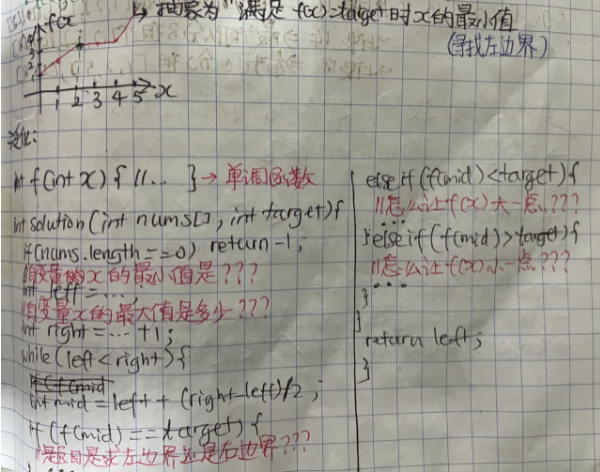

# 二分法之二分答案

### 能否找到单调函数？
1. 怎么能够从题目语义中抽象出来一个基于自变量x的单调函数f(x)，外加一个目标值target。
1. 抽象出单调函数后，把题目转化成`计算满足约束条件f(x)==target时候x的（最大/最小）值`。

?> 下面贴图是二分答案的模板：



> 这篇帖子主要就是演示怎么从题目抽象出抽象函数f(x)和目标值target的思路过程。

### **刷题列表**
1. [69 平方根](#平方根)
1. [287 找重复数字](#找重复数字) 
1. [410 分割数组的最大值（困难）](#分割数组的最大值) 
1. [875 爱吃香蕉的柯柯](#爱吃香蕉的柯柯)  
1. [1011 运送包裹的能力](#运送包裹的能力) 
1. [183 领扣-木材加工](#木材加工) 

### 平方根
[69 平方根](https://leetcode.com/problems/sqrtx/)  

?> **[思路]** 一个正整数的平方根最少是1，最大是x它本身，所以这题就转化成了找右边界的问题。转化出单调函数

> 1. 自变量x：平方根的值
> 1. f(x): 测试平方根的值越大，它的平方值也就越大
> 1. target： 所求平方根的值就是target

```js
var mySqrt = function(x) {
    //二分法基础
    let left = 1, right=x;
    while(left<right){
        let mid = Math.floor(left + (right-left)/2);
        if(mid*mid==x){
            return mid;
        }
        else if (mid*mid>x){
            right = mid;
        }
        else if (mid*mid<x){
            left = mid+1;
        }
    }
    
    return left-1;
};
```
### 找重复数字
[287 找重复数字](https://leetcode.com/problems/find-the-duplicate-number/)  

?> **[思路]** 因为知道只有一个重复的数字，而且答案最小是1，最大是nums.length-1，这就可以二分答案了。创建一个函数来数小数等于摸个数值x的个数cnt，如果这个cnt大于这个数字x本身，说明重复的数字肯定是在左半区，所以`right=mid`。转化出单调函数

> 1. 自变量x：唯一重复数字的值
> 1. f(x): 小于等于x的数字数量大于x，说明重复的数字肯定是在左半区
> 1. target： 测试数字mid的值就是target

```js
var findDuplicate = function(nums) {
    //二分答案，并drop一半
    let left=1, right=nums.length-1;
    while(left<right){
        let mid = Math.floor((left+right)/2);
        if(countSmaller(nums, mid)>mid){
            right=mid;
            
        } else {
            left=mid+1;
        }
        
    }
    
    return left;
};

const countSmaller = (nums, mid) => {
    let cnt = 0;
    for(const num of nums){
        if(num<=mid){
            cnt++;
        }
    }
    
    return cnt;
}
```

### 分割数组的最大值
[410 分割数组的最大值](https://leetcode.com/problems/split-array-largest-sum/ )

?> **[思路]** 分割数组之和的最小值(答案)肯定大于1，小于nums数组和，这时候就可以二分答案了。转化出单调函数

> 1. 自变量x：子数组的上限值
> 1. f(x): 上限越大，最少可分数组越少
> 1. target： 给出的数组分割限制M（最少可分数组量）就是target


```js
var splitArray = function(nums, m) {
    let left=0, right = nums.reduce((accum, b)=>accum+b, 0);
    
    //转化为找左边界问题
    while(left<right){
        let mid = Math.floor((right+left)/2);
        if(getNumOfSubarray(nums, mid)<=m){
            right = mid;
        } 
        else {
            left = mid+1;
        }
    }
    
    return left;
};

const getNumOfSubarray =(nums, mid) => {
    //类似于贪心算法
    let res = 0;
    let sum = 0;
    for(let i=0; i<nums.length; i++){
        //数组最大元素值超过mid，不可能分割数组了
        if(nums[i]>mid) return Number.MAX_VALUE; 
        if(sum + nums[i]<=mid){
            sum += nums[i];
        } else {
            res++;
            sum = nums[i];
        }
    }
    
    return res+1;
}
```

### 爱吃香蕉的柯柯
[875 爱吃香蕉的柯柯](https://leetcode.com/problems/koko-eating-bananas/) 

?> **[思路]** 转化出单调函数

> 1. 自变量x：柯柯吃香蕉的速度
> 1. f(x): 吃香蕉的速度越快，吃完香蕉的时间就越短 → 需要f(x)时间吃完所有香蕉
> 1. target： 吃香蕉的时间限制H就是target，是对f(x)的返回值的约束


```js
var minEatingSpeed = function(piles, h) {
    let max = Math.max(...piles);
    
    let left=1, right = max;
    while(left<right){
        let mid = Math.floor(left+(right-left)/2);
        
        if(finishAllHour(piles, mid) == h){
            right = mid;
        }
        
        if(finishAllHour(piles, mid) < h){
            right = mid;
        }
        
        if(finishAllHour(piles, mid) > h){
            left = mid+1;
        }
    }
    
    return left;
};

const finishAllHour = (piles, k) => {
    let res = 0;
    for(let i=0; i<piles.length; i++){
        res += Math.ceil(piles[i]/k);
    }
    
    return res;
}
```

### 运送包裹的能力
[1011 运送包裹的能力](https://leetcode.com/problems/capacity-to-ship-packages-within-d-days/) 

?> **[思路]** 转化出单调函数

> 1. 自变量x：船的运载量
> 1. f(x): 船的运载量越大，送达天数越少 → 需要f(x)天送达所有货物
> 1. target： 送达天数限制D就是target，是对f(x)的返回值的约束


```js
var shipWithinDays = function(weights, days) {
    let left=1, right=weights.reduce((accum, b)=>accum+b, 0)+1;
    
    while(left<right){
        let mid = Math.floor(left+(right-left)/2);
        if(getDaysToComplete(weights, mid) > days){
            left = mid+1;
        } else {
            right = mid;
        }
    }
    
    return left;
};

const getDaysToComplete = (weights, mid) => {
    let days = 0;
    let sum = 0;
    for(const weight of weights){
        
        if(weight>mid) return Number.MAX_VALUE;
        
        if(sum + weight > mid){
            sum = weight;
            days++;
        }
        else {
            sum += weight;
        }
    }
    
    return days+1;
}
```
### 木材加工
[183 木材加工](https://www.lintcode.com/problem/183/)  

?> **[思路]** 转化出单调函数
> 1. 自变量x：输出木材的长度
> 1. f(x): 输出木材长度越长，可切成的段数量越少
> 1. target： 需要得到的木材段数限制就是target


```js
export class Solution {
  /**
   * @param L: Given n pieces of wood with length L[i]
   * @param k: An integer
   * @return: The maximum length of the small pieces
   */
  woodCut(L, k) {
    // 这题核心是找到单调函数再用二分法
    // 先找自变量x：输出木材段的长度就是x
    // 单调函数f(x)：输出木材段的长度越大，可输出的段数就越少
    // 找target：需要得到的小段的数目至少为k的限制就是target

    let maxLen = Math.max(...L);
    let left=1, right=maxLen+1; //找右边界
    while(left<right){
        let mid = Math.floor(left+(right-left)/2);
        if(this.getLen(L,mid)==k){
            left=mid+1;
        } else if(this.getLen(L,mid)>k){
            left=mid+1;
        } else if(this.getLen(L,mid)<k){
            right=mid;
        }
    }

    return left-1;
  }

  getLen(L, mid) {
      let res = 0;
      for(const l of L){
          res += Math.floor(l/mid);
      }
      return res;
  }
}
```
