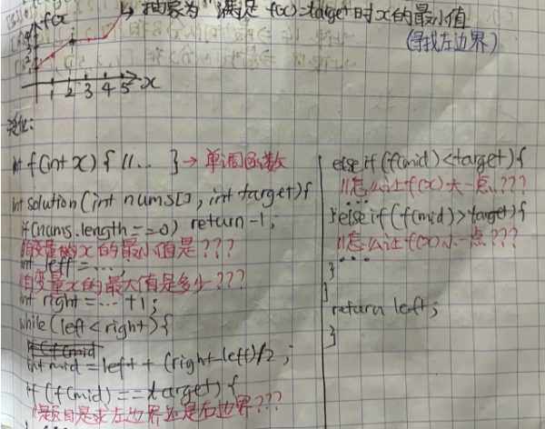

# 二分法之二分答案

### 能否找到单调函数？
1. 怎么能够从题目语义中抽象出来一个基于自变量x的单调函数f(x)，外加一个目标值target。
1. 抽象出单调函数后，把题目转化成`计算满足约束条件f(x)==target时候x的（最大/最小）值`。

?> 下面贴图是二分答案的模板：



> 这篇帖子主要就是演示怎么从题目抽象出抽象函数f(x)和目标值target的思路过程。

### **刷题列表**
1. [34 排序数组中查找元素的第一个和最后一个](#排序数组中查找元素的第一个和最后一个)  
1. [278 第一版错误](#第一版错误) 
1. [658 找到k个最接近元素] https://leetcode.com/problems/find-k-closest-elements/ 
1. [900 901 BST中找最接近的k个值] https://www.lintcode.com/problem/901/ 

### 排序数组中查找元素的第一个和最后一个
[34 排序数组中查找元素的第一个和最后一个](https://leetcode.com/problems/find-first-and-last-position-of-element-in-sorted-array/)  

?> **[思路]** 二分模板的标准答案找左边界和右边界，请背诵

```java
class Solution {
    public int[] searchRange(int[] nums, int target) {
        if(nums.length==0) return new int[]{-1,-1};
        
        return new int[]{findLeft(nums, target), findRight(nums, target)};
    }
    
    private int findLeft(int[] nums, int target){
        int left=0, right=nums.length;
        
        while(left<right){
            int mid = left + (int) (right-left)/2;
            if(nums[mid]<target){
                left = mid+1;
            } else {
                right = mid;
            }
        }
        
        if(left==nums.length) return -1;
        return nums[left]!=target?-1:left;
    }
    
    private int findRight(int[] nums, int target){
        int left=0, right=nums.length;
        
        while(left<right){
            int mid = left + (int) (right-left)/2;
            if(nums[mid]<=target){
                left = mid+1;
            } else {
                right = mid;
            }
        }
        
        if(left==0) return -1;
        return nums[left-1]!=target?-1:left-1;
    }
}
```
### 第一版错误
[278 第一版错误](https://leetcode.com/problems/first-bad-version/)

?> **[思路]** 

```java
/* The isBadVersion API is defined in the parent class VersionControl.
      boolean isBadVersion(int version); */

public class Solution extends VersionControl {
    public int firstBadVersion(int n) {
        int left = 1, right = n, ans = -1;
        while (left <= right) {
            int mid = left + (right - left) / 2; // to avoid overflow incase (left+right)>2147483647
            if (isBadVersion(mid)) {
                ans = mid; // record mid as current answer
                right = mid - 1; // try to find smaller version in the left side
            } else {
                left = mid + 1; // try to find in the right side
            }
        }
        return ans;
    }
}
```

### 分割数组的最大值
[410 分割数组的最大值](https://leetcode.com/problems/split-array-largest-sum/ )

?> **[思路]** 分割数组之和的最小值(答案)肯定大于1，小于nums数组和，这时候就可以二分答案了。转化出单调函数

> 1. 自变量x：子数组的上限值
> 1. f(x): 上限越大，最少可分数组越少
> 1. target： 给出的数组分割限制M（最少可分数组量）就是target


```js
var splitArray = function(nums, m) {
    let left=0, right = nums.reduce((accum, b)=>accum+b, 0);
    
    //转化为找左边界问题
    while(left<right){
        let mid = Math.floor((right+left)/2);
        if(getNumOfSubarray(nums, mid)<=m){
            right = mid;
        } 
        else {
            left = mid+1;
        }
    }
    
    return left;
};

const getNumOfSubarray =(nums, mid) => {
    //类似于贪心算法
    let res = 0;
    let sum = 0;
    for(let i=0; i<nums.length; i++){
        //数组最大元素值超过mid，不可能分割数组了
        if(nums[i]>mid) return Number.MAX_VALUE; 
        if(sum + nums[i]<=mid){
            sum += nums[i];
        } else {
            res++;
            sum = nums[i];
        }
    }
    
    return res+1;
}
```

### 爱吃香蕉的柯柯
[875 爱吃香蕉的柯柯](https://leetcode.com/problems/koko-eating-bananas/) 

?> **[思路]** 转化出单调函数

> 1. 自变量x：柯柯吃香蕉的速度
> 1. f(x): 吃香蕉的速度越快，吃完香蕉的时间就越短 → 需要f(x)时间吃完所有香蕉
> 1. target： 吃香蕉的时间限制H就是target，是对f(x)的返回值的约束


```js
var minEatingSpeed = function(piles, h) {
    let max = Math.max(...piles);
    
    let left=1, right = max;
    while(left<right){
        let mid = Math.floor(left+(right-left)/2);
        
        if(finishAllHour(piles, mid) == h){
            right = mid;
        }
        
        if(finishAllHour(piles, mid) < h){
            right = mid;
        }
        
        if(finishAllHour(piles, mid) > h){
            left = mid+1;
        }
    }
    
    return left;
};

const finishAllHour = (piles, k) => {
    let res = 0;
    for(let i=0; i<piles.length; i++){
        res += Math.ceil(piles[i]/k);
    }
    
    return res;
}
```

### 运送包裹的能力
[1011 运送包裹的能力](https://leetcode.com/problems/capacity-to-ship-packages-within-d-days/) 

?> **[思路]** 转化出单调函数

> 1. 自变量x：船的运载量
> 1. f(x): 船的运载量越大，送达天数越少 → 需要f(x)天送达所有货物
> 1. target： 送达天数限制D就是target，是对f(x)的返回值的约束


```js
var shipWithinDays = function(weights, days) {
    let left=1, right=weights.reduce((accum, b)=>accum+b, 0)+1;
    
    while(left<right){
        let mid = Math.floor(left+(right-left)/2);
        if(getDaysToComplete(weights, mid) > days){
            left = mid+1;
        } else {
            right = mid;
        }
    }
    
    return left;
};

const getDaysToComplete = (weights, mid) => {
    let days = 0;
    let sum = 0;
    for(const weight of weights){
        
        if(weight>mid) return Number.MAX_VALUE;
        
        if(sum + weight > mid){
            sum = weight;
            days++;
        }
        else {
            sum += weight;
        }
    }
    
    return days+1;
}
```
### 木材加工
[183 木材加工](https://www.lintcode.com/problem/183/)  

?> **[思路]** 转化出单调函数
> 1. 自变量x：输出木材的长度
> 1. f(x): 输出木材长度越长，可切成的段数量越少
> 1. target： 需要得到的木材段数限制就是target


```js
export class Solution {
  /**
   * @param L: Given n pieces of wood with length L[i]
   * @param k: An integer
   * @return: The maximum length of the small pieces
   */
  woodCut(L, k) {
    // 这题核心是找到单调函数再用二分法
    // 先找自变量x：输出木材段的长度就是x
    // 单调函数f(x)：输出木材段的长度越大，可输出的段数就越少
    // 找target：需要得到的小段的数目至少为k的限制就是target

    let maxLen = Math.max(...L);
    let left=1, right=maxLen+1; //找右边界
    while(left<right){
        let mid = Math.floor(left+(right-left)/2);
        if(this.getLen(L,mid)==k){
            left=mid+1;
        } else if(this.getLen(L,mid)>k){
            left=mid+1;
        } else if(this.getLen(L,mid)<k){
            right=mid;
        }
    }

    return left-1;
  }

  getLen(L, mid) {
      let res = 0;
      for(const l of L){
          res += Math.floor(l/mid);
      }
      return res;
  }
}
```
