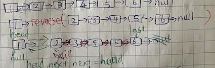
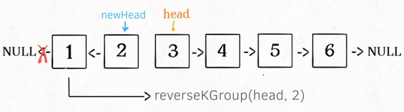

# 关于链表的一些小技巧
> 
> **更新(2023-07-05)**
> 写个最简单的总结，说说为什么要刷单链表。
> 
> 1. 单链表的**迭代**操作，比如说[翻转单链表](https://leetcode.com/problems/reverse-linked-list/)，记住三个指针的移动，`pre`, `cur`, `nxt`;
> 1. 单链表的**递归**操作，比如说[92.反转链表II](https://leetcode.com/problems/reverse-linked-list-ii/)，用递归解法会更直观;
>       * 递归式的DFS遍历，操作位置基本上就是后序遍历（离开节点时候，所以通常是尾部节点最先被处理到）-> 因为前序的话迭代解法更优美；
>       * 单链表的递归性体现在两种思路里：
>           * 一个链表可以切成**两**部分：头节点head + 以head.next为头节点的子链表；比如说翻转链表的时候，你可以通过`newHead = reverse(head.next)`拿到后部子链表的newHead，然后针对前部分的hea进行这么一个装B操作`head.next.next=head; head.next=null;`;
>           * 一个链表也可以这样切成**两**部分：前半部分以head为头的子链表 + 以b为头节点的后半部分子链表，而且前半部分的尾部接到后半部分的头部；比如说[25.K个一组翻转链表](https://leetcode.com/problems/reverse-nodes-in-k-group)，假设有个函数`fn(head, k) -> ListNode`能让你做到K个一组反转链表，那是不是意味这种思路呢？ `fn(2->1->4->3->6->5->7, 2)`可以分解成`reverse(2->1)`外加`fn(4->3->6->5->7, 2)`对不对？为了使递归的code直观简洁且优美，前个函数`reverse(2->1)`要确保return的是node(1)原本的next（也就是node(4)），这样你的newHead就是node(4)，那么才能递归式的call`fn(newHead=reverse(2->1), 2)`。
>       * 单链表不是用来锻炼递归思维的最佳入门训练题，但是等你刷完二叉树的遍历和分治题了再回头来看，这里的递归性也是非常好的训练题：
> 1. **快慢指针**找中点，找环；
> 1. dummy头节点的妙用，避免了很多if语句；
> 1. 单链表本身不提供size，但是很多时候你需要知道size了才能做题，那么当你迭代遍历完整个链表得到size的时候能不能**捎带私活**的做一些其它操作？比如说找到倒数第k个节点？
>

> **技巧大纲**
> 1. 比如说让你找一个链表的中点，前提是你提前不知道链表的长度`list.size()`，这看着是不是像stream类的题？你当然可以先暴力遍历一遍找出这个集合的大小，然后再从头开始走一半，但是吧如果你知道有个**快慢指针**这玩意儿了，那好啦，我就一个快指针当探头去探索链表的末端，然后慢指针就相当于一个缓存了。当然了**快慢指针**最经典的还是探索一个链表是否有环，判断一个链表是否有环你可以用个hashset来存储所有遍历过得节点对吧？那如果你不能用hashset做缓存呢？那快慢指针就是最佳解法了。然后你在回顾一下拿到`合理的单词缩写`那题，`internationalization`缩写成`i18n`，核心思想上其实也是个快慢指针对吧？这不过这次快指针去探索的能跳多少步。
>
> 1. 还有一种就是利用**有序**来讨巧，比如说让你合并两个有序链表并且合并完还是有序的，你会不？是不是跟k路合并有序数组，或者合并两个有序区间（还记得那道题的区间有序是说先按照区间右端排序再按区间左端排序吗？）是不是都一回事？因为只要是**单调有序的东西**，所有问题都变得有章可循了。
>
> 1. 最后一部分呢，我想说链表题也是可以锻炼**递归思维**的。你体会体会，一个链表咋组成的？你可以说是由很多个链表节点的“有序”(这里有序是说节点存在next指针)集合，但是你其实也可以这么认为**一个链表是由一个头head节点和一个子链表组成的**，你琢磨琢磨是不是这么回事儿？这个“子链表”可以是空链表对吧？当你一直嵌套嵌套，到最后就是尾部tail节点解一个空的“子链表”了对吧？这就是链表的递归属性。既然具备**递归属性**，那是不是DFS啊，分治法，还甚至动规的一些思路就可以用上了？**DFS**嘛，其实就是将for循环交给语言运行框架里的“栈”了，说实话递归写法还生出来额外的“栈”空间复杂度，你是有时候你想吹牛逼炫技，递归写法还真好使，比如说你用递归的方式来做`判断是否为回文联表`那道题，还真挺装逼。还有一道特别适合用递归来炫技的题就是`反转一个链表`那题，不过你得小心怎么把代码准确无bug写出来，还得合理的解释给面试官听。那么链表也是一个线性的**图**对吧？我们当然也可以用**BFS**来遍历对吧？这个BFS遍历时候发现每个节点只有最多一个neighbor邻居，也就是说每步上都确定的看不到小伙伴。Lol，其实我们说的BFS就是在for循环遍历这个链表嘛。
>
> 1. 听我给你讲讲怎么解释给面试官听，又显得不那么装逼。假设给你的输入链表是`2->3->1->5->4`，你可以定义真么一个函数，给你个函数`fn(head) -> newHead`，你想别考虑具体怎么实现，这个函数就是可以让你输入一个链表的头结点head然后输出一个新的头结点newHead，你先别管怎么做到的。到这里你发现了啥？输入和输出是同种的数据类型对吧？那说明了啥 -> 说明你可以肆无忌惮的用递归的方式call这个函数了，你心中只要清楚的直到这个fn函数的定义就是输入`2->3->1->5->4`你会得到`4->5->1->3->2`。那咋个**递归式**的实现呢？
>       * 你是否记得我们说一个链表是由一个头结点`head`和**子链表**组成的？这里头结点用`head`表示，那么子链表呢？无他，你就可以用`head.next`表示子链表，好理解吧？
>       * 基于这个切分，如果我们apply那个`fn(head)`函数在**子链表**`head.next`上，你是否感觉这就是**后序遍历**的写法？你需要做的就是找出这个原本的`head`和你`fn(head.next)`之间的关系。再具体基于我们的例子，你是不是就是需要找出他俩的关系？`2` 和 `fn(3->1->5->4)`，这里好理解吧？先别跳入细节，`fn(3->1->5->4)`是不是理论上应该返回新的链表`4—>5->1->3`？但是你要知道此时原本的head(1)还是next指向node(3)的，这时候你需要**后序位置**处理这个head(1)和node(3)的相互关系。你就可以写这么两行装逼代码：`head.next.next=head; head.next=null`，这里其实就是调换了一下原本的head(1)还是next指向node(3)的前后关系。
>       * 到这里了，递归嘛，总得有出口对吧？fn函数的出口是啥？就是当你发现你的**子链表**只要一个节点时候，你就可以直接返回了。
>
> 1. 上段说递归写法可以用来炫技，其实有写题用递归写法才好解释。比如说`反转一个链表II`那题要求你**反转链表的中间的一部分**，这题就真的是递归解法的优势的最佳诠释了。这个问题其实可以用动规的思维来解决，听我细细道来。上面我们提到了给你一个链表你怎样递归式的反转它，现在额外加一个条件，不让你反转整个链表了，而是让你反转链表的前N个节点，这该咋整呢？比如说给你的输入链表是`2->3->1->5->4`，让你反转前3个节点，那么反转后的结果就是`1->3->2->5->4`。那你就定义个函数`fn(head, N)`，还是像上面提到的一样，你脑子的链表是由头结点`head`和**子链表**组成的，那么你的思路是不是就是要找这个原本的`head`和你`fn(head.next, N-1)`之间的关系呢？`N-1`是因为你减掉了原本的头结点`head`。
>       * 基于这个递归思维，我们再来考虑一下这函数`fn(head, N)`的出口。上面提到的`fn(head)`的出口是当你发现就剩一个节点的时候，是因为那说明到达了尾结点，但是这里呢我们不需要到达尾结点才退出，而是要当**N==1**的时候就是边界了。
>       * 上面提到的`fn(head)`里，我们看到原本的头结点要在最后将它的next指针指向null，是因为他就是反转后链表的尾节点了，agian，这里`fn(head, N)`函数呢，要在**N==1**的时候退出，而且要同时记录一下这个**N==1**时候节点的next节点作为successor，这样我们就可以最后把原本的头结点的next指针指向这个successor。
>       * 不过原题呢是要求**反转链表的中间的一部分**，也就是说函数长这样`fn(head, left, right) -> :ListNode`，这是最后一道关了，基于以上的基础，你应该能一眼就看着这`fn(head, left, right) -> :ListNode`函数的递归性质了吧？如果left不是1，那我就直接递归式的这么写`head.next = reverseBetween(head.next, left-1, right-1)`，直到当left==1了，好嘞，那么就接call之前讨论的`fn(head, N)`函数对吧？`return reverseN(head, right)`。
>
>1. 继续诉说链表的递归属性，那就到了这题[25.K个一组翻转链表](https://leetcode.com/problems/reverse-nodes-in-k-group)。为什么说这题是具备递归属性的呢，听我细细道来好让你慢慢品。之前我说每个链表都是一个头结点head加上一个**子链表head.next**，这使得链表具备了递归性，其实这句话数学上还不够严谨，你想想啊头结点`head`是不是其实也是个**子链表**？所以我觉得可以更概括的这么说：**每个链表都是可以切割成两个子链表，而且第一个子链表的尾节点连接着第二个子链表的头结点**，这样表述是不是显得更抽象？所以每个**子链表**就是个子问题，这样是不是就有了分治的思维了？假设给你这个链表`1->2->3->4->5->6->7`，让你K=2个一组反转这个链表，你得到答案应该是`2->1->4->3->6->5->7`。这里你体会体会哈，让你K=2一组，那是不是说，我可以先把这个链表`1->2->3->4->5->6->7`的前两个元素独立切割出来当做一个链表`2->1`，然后剩下的元素也是一个链表`4->3->6->5->7`，这样假设有个函数`fn(head, k) -> ListNode`能让你做到K个一组反转链表，那是不是意味这种思路呢？ `fn(2->1->4->3->6->5->7, 2)`可以分解成`reverse(2->1)`外加`fn(4->3->6->5->7, 2)`对不对？还有一个地方要注意就是，为了是递归性的延续，你的函数`reverse(2->1)`要确保return的是node(1)原本的next也就是node(4)，这样你的newHead就是4，那么才能递归式的call`fn(4->3->6->5->7, 2)`，所以为了代码直观简洁，你可以想象一个左闭右开的区间`[a,b)`，你的函数可以写成`reverse(ListNode a, ListNode b)`，你要使这个函数反转a和b之间的元素不包括b。
>
>1. 快到结尾了，要提一下链表题里的**虚拟节点dummy**的广泛应用，就是当你发现你要写一堆的if...else条件来检查某个节点是否为null的时候，你就应该想想自己是不是要借助强大的**dummy大姐**了，不行你就试试不用**大姐**写这道题：[21. 合并两个链表](https://leetcode.com/problems/merge-two-sorted-lists/)
> 
>1. 我们最开始的时候说过链表也具备**粒子性**，但我们似乎花了很长篇幅在说装逼用的**递归性**，主要是因为当你把每个节点看做独立的元素时候，你能做的差不多就是个for循环了，next指针的存在也不敢相当于让你能记录元素的坐标而已，没啥可挑战的对吧？顶多你也就玩玩双指针的一笑套路而已，而且双指针还不能用那种可以从右往左倒着遍历的那种指针。那我们就看看怎么用迭代的方式来反转一个列表吧：
```java
ListNode reverse(ListNode a) {
    ListNode pre, cur, nxt;
    pre = null; cur = a; nxt = a;
    while (cur != null) {
        nxt = cur.next;
        // 逐个结点反转
        cur.next = pre;
        // 更新指针位置
        pre = cur;
        cur = nxt;
    }
    // 返回反转后的头结点
    return pre;
}
```
这儿你可以形象的参照这图来理解：

```java
/** 反转区间 [a, b) 的元素，注意是左闭右开 */
ListNode reverse(ListNode a, ListNode b) {
    ListNode pre, cur, nxt;
    pre = null; cur = a; nxt = a;
    // while 终止的条件改一下就行了
    while (cur != b) {
        nxt = cur.next;
        cur.next = pre;
        pre = cur;
        cur = nxt;
    }
    // 返回反转后的头结点
    return pre;
}
```
> 关于中点，当链表长度为偶数的时候，其实有两个意义的`中点`，如下图所示：**


```js
// 左中点右中点完全是while循环的条件决定
const getListLeftMid = (head) => {
    let slow=head, fast=head;
    while (fast.next && fast.next.next) { //这里循环接收停止的节点是左中点
        slow=slow.next;
        fast=fast.next.next;
    }
    // slow停止在左中点上
    return slow;
}

const getListRightMid = (head) => {
    let slow=head, fast=head;
    while (fast && fast.next) { //这里循环接收停止的节点是右中点
        slow=slow.next;
        fast=fast.next.next;
    }
    // slow停止在右中点上
    return slow;
}
```

### [刷题列表](#刷题列表)
1. [61.旋转链表](https://leetcode.com/problems/rotate-list/) 
> **要点** 迭代可解题，但是记得如果k大于链表长度，用取模进行递归唷.
1. [86.切割链表](https://leetcode.com/problems/partition-list/) 
> **要点** 迭代可解题，也不用额外的两个不同的q来维护，要原地修改.
1. [143.重排序链表](https://leetcode.com/problems/reorder-list/) 
> **要点** 快慢指针先找中点，再分割成两个链表，然后对第二个链表反转，最后把两个两边进行合并操作.
1. [19.删除倒数第k个节点](https://leetcode.com/problems/remove-nth-node-from-end-of-list/) 
> **要点** 算是特殊类的两个指针，第一个先走k步，然后第二个开始走，这样第一个指针到达终点需要n-k步，这时候第二个到达倒数第k个点.
1. [141.链表环](https://leetcode.com/problems/linked-list-cycle/) 
> **要点** 快慢指针找环.
1. [142.链表环II](https://leetcode.com/problems/linked-list-cycle-ii/) 
> **要点** 找环开始的位置，非常有技巧性，请参阅[这里](https://labuladong.github.io/algo/2/18/17/).
1. [206.反转链表](https://leetcode.com/problems/reverse-linked-list/)
> **要点** 迭代反转，递归翻转呢？非常有技巧性.
1. [92.反转链表II](https://leetcode.com/problems/reverse-linked-list-ii/) 
> **要点** 用递归写非常有意思，请参阅[这里](https://labuladong.github.io/algo/2/18/18/).
1. [234.回文链表](https://leetcode.com/problems/palindrome-linked-list/) 
> **要点** 迭代可解题，但是用递归更有意思.
1. [876.链表中点](https://leetcode.com/problems/middle-of-the-linked-list/) 
> **要点** 经典快慢双指针.
1. [83.删除链表重复元素](https://leetcode.com/problems/remove-duplicates-from-sorted-list/) 
> **要点** 快慢双指针，一前一后，快指针前面探头，慢指针后面存储，很有技巧性.
1. [25.K个一组翻转链表](https://leetcode.com/problems/reverse-nodes-in-k-group) 
> **要点** 学会迭代法反转链表中[a，b)区间里的元素.
1. [24.两两交换节点](https://leetcode.com/problems/swap-nodes-in-pairs/) 
> **要点** 
> 1. [21.合并两链表](https://leetcode.com/problems/merge-two-sorted-lists/) 
> **要点** 就俩，用不着heap.
1. [23.k路归并有序链表](https://leetcode.com/problems/merge-k-sorted-lists/) 
> **要点** 用heap，或者两两合并，或者递归形式两两合并.
1. [160.两链表交点](https://leetcode.com/problems/intersection-of-two-linked-lists/) 
> **要点** 把两个链表连起来，请参阅[这里](https://labuladong.github.io/algo/2/18/17/).
1. [372. 领扣 - 在O(1)时间复杂度删除链表节点](https://www.lintcode.com/problem/372/) 
> **思路** 题的关键是说这个节点在中间，不是最后一个节点，所以`node.next.next`肯定存在。没啥好说的，其实要找节点node上修改数值成它的next的val，然后跳过它原本的next。

#### **找链表`中点`**
[找链表中点](https://leetcode.com/problems/middle-of-the-linked-list/) 

###  **刷题列表**
1. [61.旋转链表](https://leetcode.com/problems/rotate-list/) **`Notes`** 迭代可解题，但是记得如果k大于链表长度，用取模进行递归唷.
1. [86.切割链表](https://leetcode.com/problems/partition-list/) **`Notes`** 迭代可解题，也不用额外的两个不同的q来维护，要原地修改.
1. [143.重排序链表](https://leetcode.com/problems/reorder-list/) **`Notes`** 先找中点，再分割成两个链表，然后对第二个链表反转，最后把两个两边进行合并操作.
1. [19.删除倒数第k个节点](https://leetcode.com/problems/remove-nth-node-from-end-of-list/) **`Notes`** 两个指针，第一个先走k步，然后第二个开始走，这样第一个指针到达终点需要n-k步，这时候第二个到达倒数第k个点.
1. [141.链表环](https://leetcode.com/problems/linked-list-cycle/) **`Notes`** 快慢指针找环.
1. [142.链表环II](https://leetcode.com/problems/linked-list-cycle-ii/) 
> **`Notes`** 找环开始的位置，非常有技巧性，请参阅[这里](https://labuladong.github.io/algo/2/18/17/).
1. [206.反转链表](https://leetcode.com/problems/reverse-linked-list/) 
> **`Notes`** 迭代反转，递归翻转呢？非常有技巧性.

```js
/**
 * @param {ListNode} head
 * @return {ListNode}
 */
var reverseList = function(head) {
    if(!head || !head.next) return head;
    
    let last = reverseList(head.next);
    //后序遍历
    head.next.next = head; //重点：这里是技巧
    head.next=null
    
    return last;
};
```
1. [92.反转链表II](https://leetcode.com/problems/reverse-linked-list-ii/) **`Notes`** 用递归写非常有意思，请参阅[这里](https://labuladong.github.io/algo/2/18/18/).
1. [234.回文链表](https://leetcode.com/problems/palindrome-linked-list/) **`Notes`** 迭代可解题，但是用递归更有意思.
```java
class Solution {
    private ListNode left;
    public boolean isPalindrome(ListNode head) {
        left = head;
        return traverse(head);
    }
    
    private boolean traverse(ListNode right){
        if(right==null) return true;
        
        boolean next = traverse(right.next);
        if(!next) return false;
        
        if(right.val == left.val){
            left = left.next;
            return true;
        }
        
        return false;
    }
}
```
1. [876.链表中点](https://leetcode.com/problems/middle-of-the-linked-list/) 
**思路** 经典快慢双指针.
1. [83.删除链表重复元素](https://leetcode.com/problems/remove-duplicates-from-sorted-list/) 
**思路** 快慢双指针，一前一后，很有技巧性.
```js
var deleteDuplicates = function(head) {
    
    if (!head) return null;
    let fast=head, slow=head;
    while(fast){
        if(slow.val != fast.val) {
            slow.next = fast;
            slow = slow.next;
        }
        
        fast = fast.next;
    }
    
    // 断开与后面重复元素的连接
    slow.next = null;
    return head;
};
```
1. [25.K个一组翻转链表](https://leetcode.com/problems/reverse-nodes-in-k-group) 

**思路** 学会迭代法反转链表中[a，b)区间里的元素.
1. [24.两两交换节点](https://leetcode.com/problems/swap-nodes-in-pairs/) 
**思路** 两个指针，第一个先走k步，然后第二个开始走，这样第一个指针到达终点需要n-k步，这时候第二个到达倒数第k个点.
1. [21.合并两链表](https://leetcode.com/problems/merge-two-sorted-lists/) **`Notes`** 用不着heap.
1. [23.k路归并有序链表](https://leetcode.com/problems/merge-k-sorted-lists/) **`Notes`** 用heap，或者两两合并，或者递归形式两两合并.
1. [160.两链表交点](https://leetcode.com/problems/intersection-of-two-linked-lists/) **`Notes`** 把两个链表连起来，请参阅[这里](https://labuladong.github.io/algo/2/18/17/).
1. [372. 领扣 - 在O(1)时间复杂度删除链表节点](https://www.lintcode.com/problem/372/) 
> **思路** 题的关键是说这个节点在中间，不是最后一个节点，所以`node.next.next`肯定存在。没啥好说的，其实要找节点node上修改数值成它的next的val，然后跳过它原本的next。
```java
public class Solution {
    /*
     * @param node: the node in the list should be deleted
     * @return: nothing
     */
    public void deleteNode(ListNode node) {
        // write your code here
        if(node == null) return;
        node.val = node.next.val;
        node.next = node.next.next;
    }
}
```

