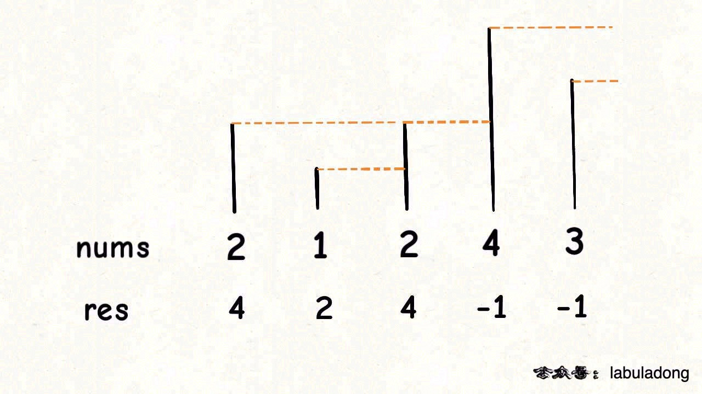

# 单调栈问题

**单调栈三步走**
1. 维护一个递增或者递减的stack；
1. 遍历原数组，正着遍历还是倒着遍历也根据递减还是递增的情况，已经求得是最大值还是最小值，如果stack非空，就比较当前元素值和栈顶元素值，根据维持的是递增还是递减单调栈，来判定要不要pop出栈顶元素；
1. 把当前元素push进栈；

**单调栈应用模板**
```java
int[] getNextElement(int[] nums){
    int n = nums.length;
    // 存放答案的数组
    int[] res = new int[n];
    // 单调栈
    Stack<Integer> s = new Stack<>();

    //倒着遍历
    for(int i=n-1; i>=0; i--){
        // 判定个子高矮
        while (!s.isEmpty() && s.peek() <= nums[i]) {
            // 矮个起开，反正也被挡着了。。。
            s.pop();
        }
        // nums[i] 身后的 next great number
        res[i] = s.isEmpty() ? -1 : s.peek();
        s.push(nums[i]);
    }
    return res;
}
``` 


### 刷题列表
1. [316. 去重重复字母](https://leetcode.com/problems/remove-duplicate-letters/)
> **思路** 字符串去重能多难？就直接用hashmap或者trie呗；但是这个lexicographical order还真是把人难住了，单单hashmap不好使啊。子串需要保持原序嘛，看到lexi order直接去单调栈上想吧。解法请看这里[](./coding/classic/strings?id=去重重复字母)
>
1. [84. 柱状图中最大的矩形](https://leetcode.com/problems/largest-rectangle-in-histogram/) 
>   **思路** 简单来说就是要维护一个递增的单调栈。还有一个技巧就是最后要用一个最小值clear单调栈里剩余的元素。
>
```java
class Solution {
    
    private int largestArea = 0;
    public int largestRectangleArea(int[] heights) {
        //单调栈
        Stack<Integer> s = new Stack<>();
        
        for(int i=0; i<=heights.length; i++){
            int height = i==heights.length?0:heights[i];
            while(!s.isEmpty() && heights[s.peek()]>height){
                int h = heights[s.pop()];
                int w = s.isEmpty()?i:i-s.peek()-1;
                largestArea = Math.max(largestArea, h*w);
            }
            
            s.push(i);
        }
        
        return largestArea;
    }
}
```
1. [85. 最大矩形](https://leetcode.com/problems/maximal-rectangle/) 
>   **思路** 这题是子序动规里经典的问题了(LCS)。一共4种情况吧，情况1：如果`s1[i]==s2[j]`，说明此字符一定存在于公共子序中，所以就直接递归到下一层`1+dp(s1, i+1, s2, j+1);`。情况2：s1[i]不在最长公共子序中；情况3：s2[j]不在最长公共子序中；情况4：s1[i]和s2[j]都不在最长公共子序中；因为是求最长公共子序嘛，所以情况4已经被情况2和情况3涵盖了，所以当`s1[i]!=s2[j]`时，我们要取最优`Math.max(dp(s1, i+1, s2, j),dp(s1, i, s2, j+1));`。这题的详解可以[看这里](./coding/dp/sebusequence?id=最长公共子序列)。
>
```java
class Solution {
    
    private int largestArea = 0;
    public int maximalRectangle(char[][] matrix) {
        //加个皮
        int n = matrix.length, m = matrix[0].length;
        for(int i=0; i<n; i++){
            //form a new heights array
            int[] heights = new int[m];
            for(int j=0; j<m; j++){
                if(matrix[i][j]=='0'){
                    heights[j]=0;
                } else {
                    int height = 1;
                    for(int k=i-1; k>=0; k--){
                        if(matrix[k][j]=='0') break;
                            
                        height++;
                    }
                    heights[j]=height;
                }
            }
            largestRectangleArea(heights);
        }
        
        return largestArea;
    }
    
    private int largestRectangleArea(int[] heights) {
        //单调栈
        Stack<Integer> s = new Stack<>();
        
        for(int i=0; i<=heights.length; i++){
            int height = i==heights.length?-1:heights[i];
            while(!s.isEmpty() && heights[s.peek()]>height){
                int h = heights[s.pop()];
                int w = s.isEmpty()?i:i-s.peek()-1;
                largestArea = Math.max(largestArea, h*w);
            }
            
            s.push(i);
        }
        
        return largestArea;
    }
}
```

1. [739. 每日温度](每日温度) https://leetcode.com/problems/daily-temperatures/
```java
class Solution {
    public int[] dailyTemperatures(int[] temperatures) {
        int n = temperatures.length;
        
        int[] res = new int[n];
        Stack<int[]> s = new Stack<>();

        for(int i=n-1; i>=0; i--){
            int temperature = temperatures[i];
            
            while(!s.isEmpty() && s.peek()[0]<=temperature){
                s.pop();
            }
            
            int nextHigher = s.isEmpty()? 0 : s.peek()[1]-i;
            res[i] = nextHigher;
            s.push(new int[]{temperature,i});
        }
        
        return res;
    }
}
```

1. [496. 下一个更大元素]() https://leetcode.com/problems/next-greater-element-i/
1. [503. 下一个更大元素II]() https://leetcode.com/problems/next-greater-element-ii/
1. []()
1. []()