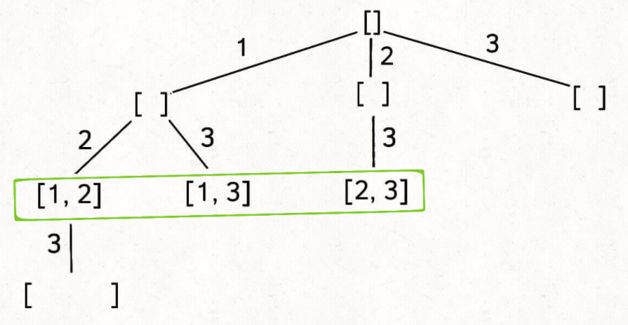
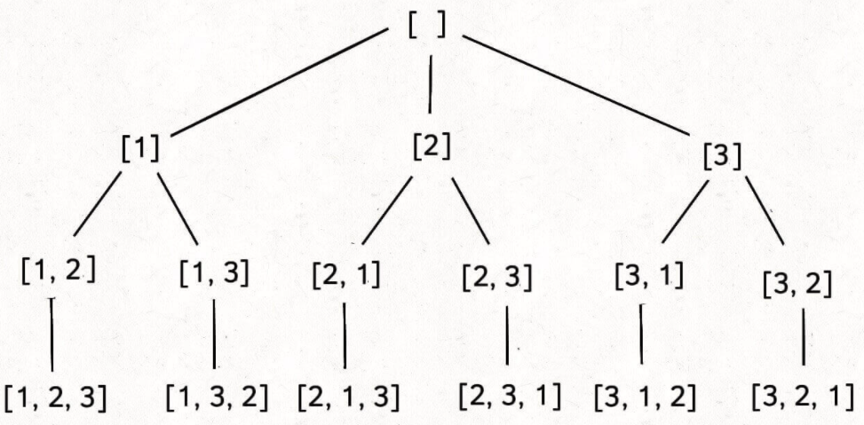

# 回溯算法，深扒一下子集的问题

#### **敲黑板** 关于子集的思考

> 子集问题贯穿所有题型，从纯粹找所有子集，到子序列问题，再到子串问题，其实根源上都是子集问题。可以这么理解，子序列问题是子集基础上加上`子集里遵循原序`的问题，而子串问题则是子序列问题基础上加上`子集里遵循原序并且元素是连续的`的问题。子串或者子序列，因为其原序的特殊性，因此在其穷举遍历的方法选择上，通常会更具有技巧性，而且通常会涉及到`动规`的一些遍历手法；关于子串问题呢，有时候`滑动窗口`真的也是其最优解。这篇帖子呢，主要就是想借助子集问题，看看这些子集相关的都涉及到那些思路技巧。
>
> 在说说子集问题的 bigO 的一些常识。纯穷举子集问题，其 bigO 肯定是 O(2^n)；涉及到子序列的时候呢，用动规的遍历技巧通常能达到 O(n^2)；再说说涉及到子串问题呢，比如说字符串切割啊之类的，其实本身已经是 O(n^2)的复杂度了，在用到一些动规啊或者滑动窗口之类的技巧，其复杂度其实可以缩到 O(n)或者 O(nlogn)内。
>
> 这篇文章通过`纯子集问题>>子序列问题>>子串问题`的顺序来写，以便日后温习。

#### **敲黑板** 关于子集的实例

> 你思考一下，子集有几种？这里我们先不学究的定义什么是集合，因为严格意义上集合里是不存在重复元素的，但是在刷题的时候，集合里存在重复元素的可能性是很常见的。给你一个集合，比如说[1,2,3]，它的子集通常以几种形式呢？
>
> 1. 所有的子数组：[], [1], [1,2], [1,2,3], [2], [2,3], [3]，因为子数组一定是连续的元素；
> 1. 所有的子序列/子集：[], [1], [1,2], [1,2,3], [2], [2,3], [3], **[1,3]**，因为子序列是可以不连续的元素组成的；
> 1. 所有的全排列（严格意义上，这不是子集了）：[1,2,3], [1,3,2], [2,1,3], [2,3,1], [3,2,1], [3,1,2]，因为子序列是可以不连续的元素组成的；
>
> 这里子序列的问题是个 O(2^n)的时间复杂度问题，我们看看用 java 的话怎么写出来：

```java
//写个数学版本的
public List<List<Integer>> getAllSubSequence(int[] nums) {
    List<List<Integer>> res =  new ArrayList<>();
    int count=1<<nums.length; //eg,如果n=3，那么count = 2^3 = 8
    for(int mark=0; mark<count; mark++) {
        List<Integer> temp = new ArrayList<>();
        for(int i=0; i<nums.length; i++){
            if(((1<<i)&mark)!=0)){ //说明nums里第i位置的元素被选中进子集
                temp.add(nums[i]);
            }
        }
        result.add(temp);
    }

    return temp;
}
```

以上数学解法怎么理解呢？

1. 长度为 n 的数组一共还有 2^n-1 个子序列；
1. 我们可以这么理解，子序列就是在原序列上取的，那么原序列被取到的话就是 1，否则为 0.

例如原序列`[1 2 3]`，子序列是 2，那么抽象的结果就是`[0 1 0]`；子序列是 1 3 ，抽象这是`[1 0 1]`；这最大的优点就是可以用二进制来表示，以下表格可以帮助你更好的理解这个做法。假设我们用 nums={1,2,3}这里例子: 下面表格的横向栏位可以用`1<<i`来模拟，比如说 001 就是`1<<0`结果的二进制表示，010 就是`1<<1`结果的二进制表示，100 就是`1<<2`结果的二进制表示；至于纵向的行数就更容易理解了，其实就是个计数器`[0...n]`的二进制表示。`(1<<i)&mark)!=0`就很容易判断矩阵里坐标位置的 nums[i]是否放进集合。

| &计算结果 | 001 | 010 | 100 |
| --------- | :-: | :-: | :-: |
| 000       |  0  |  0  |  0  |
| 001       |  1  |  0  |  0  |
| 010       |  0  |  1  |  0  |
| 011       |  1  |  1  |  0  |
| 100       |  0  |  0  |  1  |
| 101       |  1  |  0  |  1  |
| 110       |  0  |  1  |  0  |
| 111       |  1  |  1  |  1  |

以上解法更侧重数学思维，不过这题其实是个经典的回溯框架应用问题：

```java
class Solution {
    public List<List<Integer>> subsets(int[] nums) {
        List<List<Integer>> result=new ArrayList<>();
        List<Integer> path = new ArrayList<>();
        backtrack(path, nums, 0, result);
		return result;
    }

    private void backtrack(List<Integer> path, int[] nums, int startIndex, List<List<Integer>> result){
        result.add(new ArrayList<>(path));

        for(int i=startIndex; i<nums.length; i++){
            path.add(nums[i]);
            backtrack(path, nums, i+1, result);
            path.remove(path.size()-1);
        }
    }
}
```

> 我们说过了子序、子集问题的时间复杂度其实是 O(2^n)，是指数级的。那么有没有一个更快的算法让我们判断某个组合是不是一个集合的子集呢？请看这题[领扣 1263. 是子序列吗？](https://www.lintcode.com/problem/1263/)作为例子。
>
> 例如，给出一个字符串`abbacd`，我么能不能快速的判断`aac`是它的子序，而`bdc`不是它的子序呢？这题的暴力解法就是把字符串的所有子序列都找出来()，然后看有没有包含原题给出的。其实稍微想一下就知道一个优化办法就是：给出一个`startIndex`，就是看找到某个字符 c 在这个`startIndex`之后出现的第一个位置。

```java
public class Solution {
    /**
     * @param s: the given string s
     * @param t: the given string t
     * @return: check if s is subsequence of t
     */
    public boolean isSubsequence(String s, String t) {
        // Write your code here
        int start = -1;
        for(char c : s.toCharArray()){
            start = isExist(c, t, start);
            if(start==-1) return false;
        }

        return true;
    }

    private int isExist(char c, String t, int startIndex){
        for(int i=startIndex+1; i<t.length();i++){
            if(c == t.charAt(i)){
                return i;
            }
        }

        return -1;
    }
}
```

> 这题的 followup 也很巧妙：如果输入包含很多`S`串，例如为`[S1, S2, ..., Sk]`，其中`k >= 1B`，你想一个一个判断`T`是否包含这样的子序列。在这样的情形下，你会怎样修改你的代码呢？思路就是用空间换时间。
> 你可以 assume 字符都是小写，然后呢`abbacd`可以用一下的 2D 数组的数据结构存储：

```java
//abbacd =>
[
    [ 0, 1, 4,5,-1,-1,-1,-1,-1,-1,-1,-1,-1,-1,-1,-1,-1,-1,-1,-1,-1,-1,-1,-1,-1,-1],
    [ 3, 1, 4,5,-1,-1,-1,-1,-1,-1,-1,-1,-1,-1,-1,-1,-1,-1,-1,-1,-1,-1,-1,-1,-1,-1],
    [ 3, 2, 4,5,-1,-1,-1,-1,-1,-1,-1,-1,-1,-1,-1,-1,-1,-1,-1,-1,-1,-1,-1,-1,-1,-1],
    [ 3,-1, 4,5,-1,-1,-1,-1,-1,-1,-1,-1,-1,-1,-1,-1,-1,-1,-1,-1,-1,-1,-1,-1,-1,-1],
    [-1,-1, 4,5,-1,-1,-1,-1,-1,-1,-1,-1,-1,-1,-1,-1,-1,-1,-1,-1,-1,-1,-1,-1,-1,-1],
    [-1,-1,-1,5,-1,-1,-1,-1,-1,-1,-1,-1,-1,-1,-1,-1,-1,-1,-1,-1,-1,-1,-1,-1,-1,-1]
]
```

> 你发现了吗？这个字符串的空间变得很大，但是这时候你可以很容易的这个 N x 26 的矩阵里判断某个字符串是否是`abbacd`的子序列。比如说`aac`，你可以从前往后遍历`aac`的每个字符，当你处理第一个`a`时，你知道 a 在`aac`中的位置所以是 0，那么你就先去矩阵的第 0 行找有么有`a以及a的最早出现位置`，-> 你找到了结果是 0，那么你知道在遍历下一个字符的时候要从第 0 行之后的那一行进行搜索；这样的搜索算法的时间复杂度就从指数级变成了 O(N)级。
>
> 我们再继续深入，看看这个子序类题：[领扣 857. 最小的窗口子序列](https://www.lintcode.com/problem/857)，说实话这应该是子序里很难的问题了，属于动归类。子序类的动规题是一个系列，请看[这篇](./coding/dp/subsequence)以加深理解。我们先这里说说`最小的窗口子序列`的思路。原题是给定字符串 S 和 T，在字符串 S 中找到最小(连续的)子字符串 W（窗口），使得 T 是 W 的子序列。比如说 `S = "abcdebdde"`， `T = "bde"`，那么它最小的子序窗口应该是`"bcde"`，当然`bdde`也是答案，只不过当遇到长度相等的子序列时候，返回最左边的答案。这题吧，乍一看是懵逼的状态的，但是如果子序类动规题刷多了，如果判断出是子序类动规题，又是两个字符串作为输入，你几乎可以无脑的相信`肯定是两个指针i,j分别遍历两个子串`，`然后判断s1[i]==s2[j]时的逻辑`，`以及判断s1[i]!=s2[j]时的逻辑`。这题也不例外，只不过需要些理解上的技巧。
>
> 按动规的思路，想看看`d[i][j]`的定义是什么：`d[i][j]=index`表示 T[0…j] 是 S[index…i]的子序列；
>
> 按动规的思路，再看看`d[i][j]`的初始化该怎么做：`d[i][j]=index`表示 T[0…j] 是 S[index…i]的子序列；
>
> 1. dp[0][0] 相等为 0， 不等为-1
> 1. dp[i][0] 相等为 i, 不等为 dp[i-1][0]
> 1. dp[0][j] 都为-1 （i<j 是不可能包含的）
>    | (i,j) | a | b | c | d | e | b | d | d | e |
>    | ---- |:-:| :-:| :-:|:-:| :-:| :-:|:-:| :-:|:-:|
>    | b | -1 | 1 | 1 | 1 | 1 | 5 | 5 | 5 | 5 |
>    | d | -1 | X | X | X | X | X | X | X | X |
>    | e | -1 | X | X | X | X | X | X | X | X |
>
> 按动规的思路，再看看`d[i][j]`的状态转化方程：
>
> 1. 当`s[i] == t[j]`时, `d[i][j] = d[i-1][j-1]`
> 1. 当`s[i] != t[j]`时, `d[i][j] = d[i-1][j]` --> 相当于 j 指针不动，i 指针继续匹配，跳过了 S 中的 i 指向的字符
>    | (i,j) | a | b | c | d | e | b | d | d | e |
>    | ---- |:-:| :-:| :-:|:-:| :-:| :-:|:-:| :-:|:-:|
>    | b | -1 | 1 | 1 | 1 | 1 | 5 | 5 | 5 | 5 |
>    | d | -1 | -1 | -1 | 1 | 1 | 1 | 5 | 5 | 5 |
>    | e | -1 | -1 | -1 | -1 | 1 | 1 | 1 | 1 | 5 |

#### **刷题列表**

> 1. [78. 子集(中等)](#子集)
> 1. [77. 组合(中等)](#组合)
> 1. [46. 全排列(中等)](#全排列)
> 1. [90. 子集 II(中等)](#子集II)
> 1. [40. 组合总和 II(中等)](#组合总和II)
> 1. [47. 全排列 II(中等)](#全排列II)
> 1. [Karat 面试真题 - 矩阵内单词查找](#矩阵内单词查找)
> 1. [领扣 1723 网格中的最短路径](#网格中的最短路径)

### 子集

[78. 子集(中等)](https://leetcode.com/problems/subsets/)

> **思路** 最经典的子集问题，啥解法？回溯模板呗。这题经典到甚至可以直接**背诵默写**。这种子集/组合的题，虽然是 dfs 回溯解法，但是先用 bfs 思维把回溯树画出来。比如说如下
> 
> 有了这个嘛，你在算时间复杂度，是不是容易多了？不明白对吧？来看看哈，一层一层的扒皮：
>
> 1. 先看看手写直接撸的话怎么整。假设 S_0 是元素个数为 0 的子集，就是空集。在 S_0 基础上生成元素个数为 1 的所有子集 S_1，咋整？看下图：
>    
> 1. 同理，基于 S_1 基础上可以生成元素个数为 2 的所有子集 S_2，这里要**注意**，为了避免重复子集，我们通过保证元素之间的相对顺序不变来防止出现重复的子集。看下图：
>    
> 1. 这样就可以依次推出 S_3,S_4,S_5...，说道这里，交给计算机的话该怎么转化呢？注意这个特性：**如果把根节点作为第 0 层，将每个节点和根节点之间树枝上的元素作为该节点的值，那么第 s 层的所有节点就是 size 为 s 的所有子集。** 比如说，size 为 2 的子集就是这一层节点的值：
>    
> 1. 再进一步，如果想计算所有子集，那只要遍历这棵多叉树，把所有节点的值收集起来不就行了？

```js
var subsets = function (nums) {
  let res = [];
  backtrack(nums, [], 0, res);
  return res;
};
//使用 startIndex 参数控制树枝的生长避免产生重复的子集
const backtrack = (nums, path, startIndex, res) => {
  let n = nums.length;
  //if(startIndex > n ) return;

  res.push([...path]);

  //选择列表
  for (let i = startIndex; i < n; i++) {
    path.push(nums[i]);
    backtrack(nums, path, i + 1, res);
    path.pop();
  }
};
```

### 组合

[77. 组合(中等)](https://leetcode.com/problems/combinations/)

> **思路** 很经典的子集问题，组合和子集实际上等价的。问题可转化为：给你输入一个数组 nums = [1,2..,n] 和一个正整数 k，请你生成所有 size 为 k 的子集。比如说，size 为 2 的子集就是这一层节点的值：
> 
> 是不是跟子集问题一模一样？注意使用 startIndex 参数控制树枝的生长避免产生重复的子集。

```js
var combine = function (n, k) {
  let res = [];
  backtrack([], 1, n, k, res);
  return res;
};

const backtrack = (path, startIndex, n, k, res) => {
  if (path.length == k) {
    res.push([...path]);
    return;
  }

  for (let i = startIndex; i <= n; i++) {
    path.push(i);
    backtrack(path, i + 1, n, k, res);
    path.pop();
  }
};
```

### 全排列

[46. 全排列(中等)](https://leetcode.com/problems/permutations/)

> **思路** 最经典的排列问题，排列问题本身就是让你穷举元素的位置。组合/子集问题使用 start 变量保证元素 nums[start] 之后只会出现 nums[start+1..] 中的元素，通过固定元素的相对位置保证不出现重复的子集。在排列时候就玩不转了，需要借助额外的 used 数组来记录某个元素在当前路径中是否已经被用过。
> 

```js
var permute = function (nums) {
  let res = [];
  let used = Array(nums.length).fill(false);

  backtrack([], nums, res, used);

  return res;
};

const backtrack = (path, nums, res, used) => {
  if (path.length == nums.length) {
    res.push([...path]);
    return;
  }

  for (let i = 0; i < nums.length; i++) {
    if (used[i]) continue;

    path.push(nums[i]);
    used[i] = true;
    backtrack(path, nums, res, used);
    used[i] = false;
    path.pop();
  }
};
```

### 子集 II

[90. 子集 II(中等)](https://leetcode.com/problems/subsets-ii/)

> **思路** 元素要去重了，二话不说先排序啊。关于子集类（组合类）去重方法，其实方法有好几种，这里呢写出我觉得最好理解的一种。排序完了，重复的元素会堆到一起了，所以只要不是 startIndex(新路径起始点)位置的元素，如果和上一个元素同值，那说明这个当前元素不需要再放到组合里了，因为如下图所示之前那个同值元素已经 cover 这个组合的 case 了。解法就是在进入下一层递归前，检查`i>startIndex && nums[i]==nums[i-1]`。
> 

```js
var subsetsWithDup = function (nums) {
  nums.sort((a, b) => a - b);
  let res = [];
  backtrack([], nums, 0, res);
  return res;
};

const backtrack = (path, nums, startIndex, res) => {
  res.push([...path]);

  for (let i = startIndex; i < nums.length; i++) {
    if (i > startIndex && nums[i] == nums[i - 1]) continue;

    path.push(nums[i]);
    backtrack(path, nums, i + 1, res);
    path.pop();
  }
};
```

### 组合总和 II

[40. 组合总和 II(中等)](https://leetcode.com/problems/combination-sum-ii/)

> **思路** 元素要去重了，二话不说先排序啊。组合问题和子集问题是等价的，这题可以转化成`计算candidates中所有和为target的子集`。这题的去重方法跟[子集 II](#子集II)一模一样。

```js
var combinationSum2 = function (candidates, target) {
  candidates.sort((a, b) => a - b);
  let res = [];
  backtrack([], candidates, target, 0, res);
  return res;
};

const backtrack = (path, candidates, pathSum, startIndex, res) => {
  let n = candidates.length;

  if (pathSum == 0) {
    res.push([...path]);
    return;
  }

  for (let i = startIndex; i < n; i++) {
    if (candidates[i] > pathSum) break;
    if (i > startIndex && candidates[i] == candidates[i - 1]) continue;
    pathSum -= candidates[i];
    path.push(candidates[i]);
    backtrack(path, candidates, pathSum, i + 1, res);
    path.pop();
    pathSum += candidates[i];
  }
};
```

### 全排列 II

[47. 全排列 II(中等)](https://leetcode.com/problems/permutations-ii/)

> **思路** 元素要去重了，二话不说先排序啊。答案跟[全排列]()几乎一样，这里重点陈述一下去重部分的逻辑：当出现重复元素时，比如输入 `nums = [1,2,2',2'']`，2' 只有在 2 已经被使用的情况下才会被选择，同理，2'' 只有在 2' 已经被使用的情况下才会被选择，这就保证了`相同元素在排列中的相对位置保证固定`。关键在于`保证相同元素在排列中的相对位置保持不变`。这就是为啥你能看到 code 里有这个条件检查：`if(i>0 && nums[i]==nums[i-1] && !used[i-1])`。

```js
var permuteUnique = function (nums) {
  nums.sort((a, b) => a - b);
  let res = [];
  let used = Array(nums.length).fill(false);

  backtrack([], nums, res, used);
  return res;
};

const backtrack = (path, nums, res, used) => {
  if (path.length == nums.length) {
    res.push([...path]);
    return;
  }

  for (let i = 0; i < nums.length; i++) {
    if (used[i]) continue;

    if (i > 0 && nums[i] == nums[i - 1] && !used[i - 1]) continue;

    path.push(nums[i]);
    used[i] = true;
    backtrack(path, nums, res, used);
    used[i] = false;
    path.pop();
  }
};
```

### 矩阵内单词查找

[Karat 面试真题 - 矩阵内单词查找]()

> **题目描述** 这题其实是 leetcode 上[这题](https://leetcode.com/problems/word-search-ii/)的简单版
>
> After catching your classroom students cheating before, you realize your students are getting craftier and hiding words in 2D grids of letters. The word may start anywhere in the grid, and consecutive letters can be either **immediately below** or **immediately to the right** of the previous letter.
>
> Given a grid and a word, write a function that returns the location of the word in the grid as a list of coordinates. If there are multiple matches, return any one.
>
> Complexity analysis variables:
>
> 1. r = number of rows
> 1. c = number of columns
> 1. w = length of the word

```js
grid1 = [
    ['c', 'c', 't', 'n', 'a', 'x'],
    ['c', 'c', 'a', 't', 'n', 't'],
    ['a', 'c', 'n', 'n', 't', 't'],
    ['t', 'n', 'i', 'i', 'p', 'p'],
    ['a', 'o', 'o', 'o', 'a', 'a'],
    ['s', 'a', 'a', 'a', 'o', 'o'],
    ['k', 'a', 'i', 'o', 'k', 'i'],
]

word1 = "catnip"
word2 = "cccc"
word3 = "s"
word4 = "ant"
word5 = "aoi"
word6 = "ki"
word7 = "aaoo"
word8 = "ooo"

grid2 = [['a']]
word9 = "a"

find_word_location(grid1, word1) => [ (1, 1), (1, 2), (1, 3), (2, 3), (3, 3), (3, 4) ]
find_word_location(grid1, word2) =>
       [(0, 0), (1, 0), (1, 1), (2, 1)]
    OR [(0, 0), (0, 1), (1, 1), (2, 1)]
find_word_location(grid1, word3) => [(5, 0)]
find_word_location(grid1, word4) => [(0, 4), (1, 4), (2, 4)] OR [(0, 4), (1, 4), (1, 5)]
find_word_location(grid1, word5) => [(4, 5), (5, 5), (6, 5)]
find_word_location(grid1, word6) => [(6, 4), (6, 5)]
find_word_location(grid1, word7) => [(5, 2), (5, 3), (5, 4), (5, 5)]
find_word_location(grid1, word8) => [(4, 1), (4, 2), (4, 3)]
find_word_location(grid2, word9) => [(0, 0)]
```

!> **思路** 很典型的回溯算法，其实也是图的遍历问题。这题有两个地方要注意：1. 只能向下向右走，所以就不需要维护 visited 矩阵了，因为不可能走回头路的(类似二叉树了)；2. 题目保证给出的 word 肯定会出现在矩阵里至少一次。这题吧，我在面试的时候使用了回溯框架（`做选择`和`撤销选择`都放在了 for 循环内），但是面试后琢磨琢磨还是用图的遍历框架比较清晰(for 循环内`加入节点`和`撤销节点`)；这里就把两种解法都展示一下：

```js
const grid1 = [
  ["c", "c", "t", "n", "a", "x"],
  ["c", "c", "a", "t", "n", "t"],
  ["a", "c", "n", "n", "t", "t"],
  ["t", "n", "i", "i", "p", "p"],
  ["a", "o", "o", "o", "a", "a"],
  ["s", "a", "a", "a", "o", "o"],
  ["k", "a", "i", "o", "k", "i"],
];
const word1 = "catnip";
const word2 = "cccc";
const word3 = "s";
const word4 = "ant";
const word5 = "aoi";
const word6 = "ki";
const word7 = "aaoo";
const word8 = "ooo";

const grid2 = [["a"]];
const word9 = "a";
```

```js
/* 用回溯框架试试 */
var DIRS = [
  [1, 0],
  [0, 1],
];
var path = []; // 这里直接吧path设成了global variable
const find_word_location = (grid, word) => {
  let m = grid.length,
    n = grid[0].length;
  for (let i = 0; i < m; i++) {
    for (let j = 0; j < n; j++) {
      path = [];
      let found = traverse([], grid, i, j, word);
      if (found) return path;
    }
  }
};

const traverse = (wordPath, grid, i, j, word) => {
  let m = grid.length,
    n = grid[0].length;
  //base case
  if (wordPath.join("") == word) {
    console.log(wordPath);
    return true;
  }

  if (!word.startsWith(wordPath.join(""))) {
    return false;
  }

  if (wordPath.length > word.length) {
    return false;
  }

  //console.log(wordPath);

  for (const dir of DIRS) {
    let x = i + dir[0];
    let y = j + dir[1];
    //console.log(i, j, x, y);

    if (x < 0 || y < 0 || x >= m || y >= n) continue;

    path.push([i, j]);
    wordPath.push(grid[i][j]);

    if (traverse(wordPath, grid, x, y, word)) {
      return true;
    }

    path.pop();
    wordPath.pop();
  }

  return false;
};

console.log(find_word_location(grid1, word1));
```

```js
/* 用回溯框架试试 */
var DIRS = [
  [1, 0],
  [0, 1],
];
var path = []; // 这里直接吧path设成了global variable
const find_word_location = (grid, word) => {
  let m = grid.length,
    n = grid[0].length;
  for (let i = 0; i < m; i++) {
    for (let j = 0; j < n; j++) {
      path = [];
      let found = traverse([], grid, i, j, word);
      if (found) return path;
    }
  }
};

const traverse = (wordPath, grid, i, j, word) => {
  let m = grid.length,
    n = grid[0].length;

  wordPath.push(grid[i][j]);
  path.push([i, j]);

  if (wordPath.join("") == word) {
    console.log(wordPath);
    return true;
  }

  for (const dir of DIRS) {
    let x = i + dir[0];
    let y = j + dir[1];

    if (x < 0 || y < 0 || x >= m || y >= n) continue;

    if (wordPath.length > word.length) break;

    if (!word.startsWith(wordPath.join(""))) break;

    if (traverse(wordPath, grid, x, y, word)) return true;
  }

  wordPath.pop();
  path.pop();

  return false;
};
```

### 网格中的最短路径

[领扣 1723 网格中的最短路径](#网格中的最短路径)

> **思路** 这个题乍一看非常像动规，而且跟这题长得很像[K 站中转内最便宜的航班](./coding/memo/index?id=#K站中转内最便宜的航班)，都是有个限制条件 k。不过这题其实不是动规，因为 k 这个限制条件导致到达网格中的某个点的状态是很多个[[k, dis]]的组合，这样写起 code 来很不好写。这题直接用回溯会很容易理解，二者这个暴力的回溯算法已经是多项式级别的时间复杂度。

```java
public class Solution {
    /**
     * @param grid: a list of list
     * @param k: an integer
     * @return: Return the minimum number of steps to walk
     */
    private int m,n,minLen;
    private int[][] DIRS = {{-1,0},{1,0},{0,1},{0,-1}};
    public int shortestPath(int[][] grid, int k) {
        // write your code here
        m = grid.length;
        n = grid[0].length;
        minLen = Integer.MAX_VALUE;
        int count = 0;
        backtrack(count, grid, k, 0, 0);
        return minLen == Integer.MAX_VALUE?-1:minLen;
    }

    private void backtrack(int count, int[][] grid, int k, int i, int j) {

        if(i<0 || j<0 || i>=m || j>=n) return;
        if(grid[i][j]==-1) return;
        if(minLen==m+n-2) return; //已经最小

        if(grid[i][j]==1) k--;
        if(k<0) return;

        if(i==m-1 && j==n-1) {
            minLen = Math.min(minLen, count);
            return;
        }

        int temp = grid[i][j];
        grid[i][j] = -1;

        for(int[] dir : DIRS){
            int x = i + dir[0];
            int y = j + dir[1];

            backtrack(count+1, grid, k, x, y);
        }

        grid[i][j] = temp;

    }
}
```
