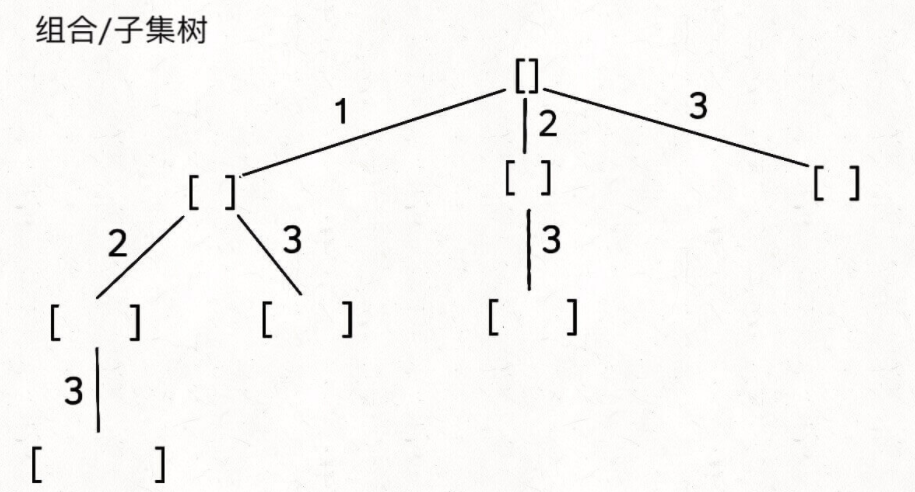

# 回溯与DFS遍历的细微差别

这篇来掰扯掰扯回溯与DFS遍历的细微差别。

### **明明都是窮舉遍歷**

到今天了（2022-10-15），我覺得腦子裡的對於DFS遍歷一個*圖*，真的就像是寫個for循環一樣。但是回溯backtracking中的遍歷其實與遍歷一幅圖的所有節點相比，還是有些不同的，這篇主要就是要把這事兒掰扯清楚。

> **還是那句話，你二叉樹吃的夠透的話，理解這個細微差別應該是不難的。**
> 我們先說二叉樹的**遍歷**框架：
```python
class Solution:
    def traverse(self, root: Optional[TreeNode]) -> None:
        if not root:
            return
        # 前序位置
        self.traverse(root.left)
        self.traverse(root.right)
        # 後序位置
```
> 二叉樹擴展為多叉樹：
```python
class Solution:
    def traverse(self, root: Optional[TreeNode]) -> None:
        if not root:
            return
        # 前序位置
        for child in root.children:
            self.traverse(child)
        # 後序位置
```
> 再擴展到*圖*：
```python
class Solution:
    def traverse(self, graph) -> None:
        # 這裡的graph假設還不是鄰接表
        graph.convert_to_adjacency_list()

        onPath = []
        visited = set()

        def traverse_node(node):
            nonlocal onPath
            nonlocal visited
            if node in visited:
                return
            visited.add(node)
            onPath.append(node) #加入節點路徑
            for neighbor in node.neighbors:
                traverse_node(neighbor)
            onPath.pop() #從節點路徑pop出來

        # graph裡沒有根節點概念，還有可能是多個森林
        for node in graph:
            traverse_node(node)
```
> 到這兒，其實都算是*線性*的應用DFS來窮舉遍歷圖上的**每個節點**，這裡的遍歷有個地方要注意：**怎樣免走回頭路**？二叉樹和多叉樹的時候，我們根本沒在乎回頭路這回事兒（因為他們都是單向的，只有父節點去子節點，而且一定沒有環），到了圖上才開始維護visited這個集合來協助免走回頭路，不止於此，我們還利用這個visited集合避免了因為有環造成的無限循環。

!> 回到本文的重點，你觀察一下上面的圖的遍歷框架，你發現我們維護了一個onPath的鏈錶，這個路徑是**從起初節點到此節點所有經過的節點集合**，所以你先做一個`onPath.append(node)`的操作，意思是**你要進入此節點了**，然後當你for循環遍歷完所有此節點的子節點時候，你做一個`onPath.pop()`，意思就是**你要離開此節點了**，細心地你發現了這個操作要**放在for循環外面**，因為你硬要說放到for循環裡面，其實你是庸人自擾的徒添了很多重複性操作。這是我想強調的**重點**：當你用回溯框架的時候，你的`入track`和`出track`的操作要放在for循環外面。因為**回溯算法的核心不是在遍歷所有節點，而是在遍歷所有樹枝**，那麼*回溯樹*裡的節點應該怎麼理解呢？

> 參照下圖子集問題的*回溯樹*，樹中節點到底是什麼呢？直接告訴你答案：**就是你在call這個backtrack()函數的執行過程，為了方便你可以近似於stacktrace裡的stack層**，然后节点执行过程中的重要任务就是**做选择**和**撤销选择**，for循環內的*前序位置*做选择**记录了你选择了某多叉树哪個樹枝**，for循環內的*后序位置*撤销选择**记录了你从多叉树的某个樹枝上回到了当前节点(callstack)**，所以这个**做选择**和**撤销选择**一定是在你`for`循环**选择列表**里边的，也就是在你暴力的去试每个樹枝的时候。


>下面是回溯框架模板：
```python
def backtrack(路径, 选择列表):
    if 满足结束条件:
        result.add(路径)
        return

    for 选择 in 选择列表:
        做选择
        backtrack(路径, 选择列表)
        撤销选择
```


