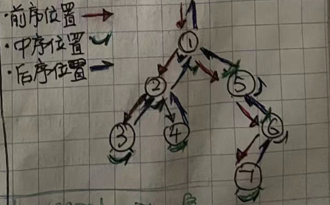
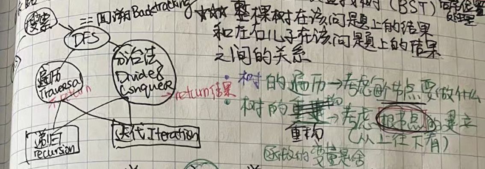

# 深度搜素：回溯，分治
##### 知识要点.
- [二叉树解题全靠套路](#二叉树解题全靠套路) 

#### **二叉树解题全靠套路**
**大学里的数据结构课只是告诉我们，前序中序和后序遍历二叉树的结果，所以我在之后很长的一段时间里一直觉得所谓`traversal`就是对应三种不同的`List<Integer`列表。直到去年(2021)底，我才在读了[这篇文章](https://labuladong.github.io/algo/2/19/22/)之后重新正确认识了`traversal`。其实前序中序后序遍历二叉树，实际上是代表过程中处理每个节点的三个`特殊时间点`，如下图所示：**



如图所示，每个节点都有`唯一`属于自己的前中后序位置，而且所有二叉树的问题，其实就是让你在前中后序位置注入巧妙地代码逻辑。

二叉树题目机会全是dfs的问题，而且递归的框架只有下面一个。从思路上说，二叉树的题目有两类思路：遍历法和分治法。遍历法就是说遍历一遍二叉树就能得出答案，具体到代码里就是traverse函数通常不用return一个结果；分治法是则不同，要通过分界问题计算答案，所以函数里要返回响应的`result`以便于应用。

如果进阶一点思考：如果你能够告诉我，快速排序就是个二叉树的前序遍历，归并排序就是个二叉树的后序遍历，那说明你悟透了所谓前中后序遍历的思想精髓了。

这里顺便提一嘴，对于算法里的许多文学词汇，其实听着挺高大上，不过他们之间其实都或多或少的有overlap，下面图展示了`搜索`，`BFS`, `DFS`, `回溯`，`遍历`，`分治`，`递归`，迭代等文学词汇的关系。



抽象一点讲，分治法代表的是一种自顶向下的思维，而遍历法代表的是自底向上的思维。扩展一下讲，遍历法可以延伸到图（或者隐式图）的`回溯遍历框架`，而分治法可以延伸到`动态规划框架`。与此同时，二叉树的结构一下特性让二叉树的题变得相对简单：
1. 二叉树的`选择列表`只有两项：左儿子和右儿子，所以不需要for循环处理；
2. 二叉树只有父节点指向子节点的指针，所以不存在`重复访问`的问题；
3. 二叉树的每个节点都最多只有1个父节点，所以`不存在重复字问题`的；
4. `最优子结构`的话，通常就是后序遍历的问题，因为最优子结构通常是比较左子树，右子树和自己为根的当前子树得到的；

最后，再提一下二叉树刷题的统一思路：看到遍历/分治类的题，仔细考虑每个节点需要做什么，在前中后哪个位置做最合适；看到重构树的问题，仔细考虑`根节点`怎么建立（自顶向下思维）。另一个刷题中常出现的错误是代码中出现了多次遍历树的代码，这个时候一定回头仔细仔细考虑是不是一次`后序遍历`就可以全部解决了？其实后序遍历的题应该算是二叉树中比较难的了，请看[这篇文章](./coding/tree/postorder)深化理解。

```js
// 所有二叉树的题都是下列模板的巧妙变形套用
const traverse = (TreeNode root) => {
    if (!root) {
        return; //如果是分治法，返回向右的空节点时候赋值
    }
    // 前序位置
    traverse(root.left);
    // 中序位置
    traverse(root.right);
    // 后序位置
}
```
