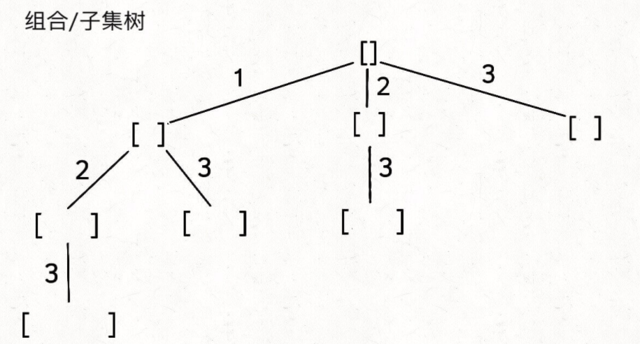

# 深度搜素：回溯，分治

#### **文章列表**

> 1. [关于穷举遍历](./coding/dfs/traversal)
> 1. [关于回溯](./coding/dfs/backtracking)
> 1. [关于矩阵](./coding/dfs/traversal)
> 1. [关于分治](./coding/dfs/divcon)

### **浅谈遍历的思维**

> 只要上过算法课的人，都会晓得深搜(DFS)和宽搜(BFS)。就这么说吧，搜索就是**穷举**遍历的过程，只不过有时候穷举遍历的过程中发现了可以`exit`的条件可以提前结束而已。宽搜的本质是面（或者说由点及面），属于`集体作战`。深搜的话属于一条线走到天黑，属于`单打独斗`。这两个概念如果你脑子里能够浮现出矩阵上的BFS或者DFS，你就能体会我讲的是什么了。
>
> **建议刷完二叉树的同学再来读这篇文章，会有更深刻的理解。**

> 东哥展示了 DFS 的思路和写法，我想借着这篇帖子同时展示一下**DFS**和**BFS**，以便日后容易复习理解。

!> 先上个结论：好多人觉得`DFS`更通用，`BFS`只是在无权有向图的最短路径类题里作用比较大，我个人觉得能用`BFS`的地方就别用`DFS`，因为你写出bug free的**BFS**的几率会更高。

> 刷二叉树相关问题的时候，一直强调二叉树的 90%的题都是DFS，是锻炼**递归思维**的最佳选择。这里再提一下二叉树的一些*优势*特点让它的 DFS 写起来容易：
>
> 1. 二叉树的`**选择列表**`只有两项：左儿子和右儿子，所以不需要`for`循环处理；
> 2. 二叉树只有父节点指向子节点的指针，所以不存在`重复访问`的问题；
> 3. 二叉树的每个节点都最多只有 1 个父节点，所以`不存在重复字问题`的；
>
> 二叉树的问题也有几道是层级遍历题，就是`BFS`。

> **更新(2022-10-10)** 在二叉树的时候，我说过你内心不要担心怎么如何完整的遍历一个二叉树(主要是我认为这就像 for 循环关键字一样，你应该是无脑的写出的)，而你的思考中的只放在两个问题上：
>
> 1.  把二叉树的每个节点看着**黑盒容器**，你想想面对每一个**黑盒**的时候你需要做什么；
> 1.  这个**做什么**应该啥时候做？前序、后序还是中序位置？
>
> 到了矩阵的遍历，或者更通用的图的遍历时候，遍历的框架也是 DFS 模板，只不过相较于二叉树里你只会从父节点去儿子节点方向遍历，矩阵的话面对每个节点你是要**上下左右**四个方向遍历，这就有可能**走回头路**了，所以为了避免`重复访问`的问题，你需要在访问某个节点的时候将这个节点做个标识`visited[i][j] = true`。

```js
// 二叉树遍历框架
// 所有二叉树的题都是下列模板的巧妙变形套用
const traverse = (TreeNode root) => {
    if (!root) {
        return; //如果是分治法，返回向右的空节点时候赋值
    }
    // 前序位置
    traverse(root.left);
    // 中序位置
    traverse(root.right);
    // 后序位置
}

// 二维矩阵遍历框架
const dfs = (grid, i, j, visited) => {
    let m = grid.length, n = grid[0].length;
    if (i < 0 || j < 0 || i >= m || j >= n) {
        // 超出索引边界
        return;
    }
    if (visited[i][j]) {
        // 已遍历过 (i, j)
        return;
    }
    // 进入节点 (i, j)
    visited[i][j] = true;
    // 前序位置
    dfs(grid, i - 1, j, visited); // 上
    dfs(grid, i + 1, j, visited); // 下
    dfs(grid, i, j - 1, visited); // 左
    dfs(grid, i, j + 1, visited); // 右
    // 后序位置
}
```

> 你品品，上面的二维矩阵的遍历框架是多么多么像是一个**单向**的四叉树！只不过就是多了个visited矩阵，因为平面二维矩阵上你每次都是上下左右方向找邻居的话，你的邻居也肯定把你当做邻居对吧？visited矩阵就是为了**免做回头路**。为了加深印象，你可以仔细阅读这篇[关于穷举遍历](./coding/dfs/traversal)。
> 
> 面对矩阵遍历类的题，跟二叉树的思考逻辑是一样的：
>
> 1.  把矩阵里的每个节点看做是**黑盒容器**，你想想面对每一个**黑盒**的时候你需要做什么；
> 1.  这个**做什么**应该啥时候做？前序还是后序位置（没有中序）？
>
> 既然矩阵也是图，我们不妨就延伸一下说说图吧。我们说过表达一个图有两种方式，分别是**邻接链表**和**邻接矩阵**。邻接矩阵表达的图的遍历，那你就可以套用上面的矩阵遍历的模板了，这里再说说邻接链表的遍历。**邻接链表**是一个单链表组，或者是一个`节点->单链表`映射，每个单链表代表了某个图中vertex节点的所有邻居。比较通用的框架就是扫描领接链表的每个键值，然后针对每个节点键去遍历它的*邻居们*，这里**注意**，首先图可能是无向的，所以你需要一个 visited 的缓存来记录你已经遍历过的节点，以免走回头路；其次呢图可能是多个孤岛，也就是说不是每个节点都有路径去到另一个节点，所以你要穷举邻接链表里的每个键值；最后一点，即使图是有向图，但图中可能有环，所以那个 visited 缓存会让你进入死循环。**敲黑板**了，邻接链表的遍历过程中你不止需要`visited`缓存，还需要维护一个`onPath`的变量，这个变量记录了从某一个**起始节点**(也即是键值对里的 key)连接到当前节点的路径上要经过的所有节点，维护这个`onPath`变量很实用，因为图里80%的题都是基于在这个`onPath`上做逻辑得到答案的。下面讲到*回溯*的时候，我会比较一下这个`onPath`和回溯里**做选择**和**撤销选择**的异曲同工之妙。

```js
// 记录被遍历过的节点
let visited = [];
// 记录从起点到当前节点的路径
let onPath = [];

/* 图遍历框架 */
const traverse = (graph, s) => {
  if (visited[s]) return;

  visited[s] = true;
  // 经过节点 s，标记为已遍历
  visited[s] = true;
  // 做选择：标记节点 s 在路径上
  onPath[s] = true;
  for (let neighbor of graph.neighbors(s)) {
    traverse(graph, neighbor);
  }
  // 撤销选择：节点 s 离开路径
  onPath[s] = false;
};
```

> 图论其实算法里比较高级也是比较难的一块，面试中直接考复杂图论的概率是很低的，图里的相关考察点多数集中在二分图和并查集这块，但是有一类*图*确实考察非常多的，那就是多叉树，多叉树的遍历的话那简直就是二叉树的双胞胎，直接看代码吧：

```python
# 多叉树遍历框架
def traverse(root):
    # 到叶子节点了
    if not root:
        return;

    # 前序位置
    for child in root.children:
        traverse(child)
    # 后序位置
```

> 多叉树的遍历跟二叉树一样，具有很强的方向性：
>
> 1. 多叉树的`**选择列表**`就是它的儿子们，用一个 for 循环处理；
> 2. 多叉树是有向图，只有父节点指向子节点的指针，所以不存在`重复访问`的问题；
> 3. 多叉树的每个节点都最多只有 1 个父节点，所以`不存在重复字问题`的；
>
> 虽说多叉树非常容易，但是怎么把原题抽象成多叉树这是比较考验一个人刷题经验的，所以以前上九章算法课的时候，其中一节专门讲解*隐式图*。说到这儿，我就不得不顺带出**回溯**框架来，因为回溯是多叉树遍历**应用**的一种形式，里面的技巧就是**在遍历过程中记录路径**。先说说回溯算法和通用多叉树DFS算法的细微差别是：**回溯算法是在遍历「树枝」，DFS遍历图算法是在遍历「节点」**。直接先看框架：

```python
def backtrack(路径, 选择列表):
    if 满足结束条件:
        result.add(路径)
        return

    for 选择 in 选择列表:
        做选择
        backtrack(路径, 选择列表)
        撤销选择
```

> 说白了就是递归里边外加`for`循环嘛。这个回溯框架的应用很广，但是就面试算法题来说，它对于排列组合以及子集问题特别常见。回溯肯定算是个*暴力穷举*算法，所以它看起来没有动规题那么得*聪明穷举*式的讨巧，不过当题目让你找的是**所有路径**的时候，我告诉你这基本上八九不离十的是个回溯算法题了。
>
> 举个例子来说，给你`[1,2,3]`这个数组，让你找出他所有的子集/组合，这题我在[子序概论](./coding/classic/sbusequence)里有详细的解释过，这里就在简略的提提套用**回溯框架**那一部分。回溯框架应用的难点在于怎么**把回溯树画出来**，这里先说结论：你可以把`backtrack(track, 选择列表)`函数本身看做被执行的节点，然后节点执行过程中的重要任务就是**做选择**和**撤销选择**，前序位置做选择**记录了你选择了某多叉树分支**，后序位置撤销选择**记录了你从多叉树的某个分支回到了当前层，严格来说这个层就是回溯树的节点，实际计算值这个节点代表了stack里的层**，所以这个**做选择**和**撤销选择**一定是在你`for`循环选择列表**里边**的，也就是在你暴力的去试每个分支的时候。如果你能把这个子集题抽象出如下图所示的*回溯树*来，剩下的真的就是套模板：
> 
>
> 回溯是穷举路径，深入理解这个思想请读这篇[关于回溯](./coding/dfs/backtracking)
