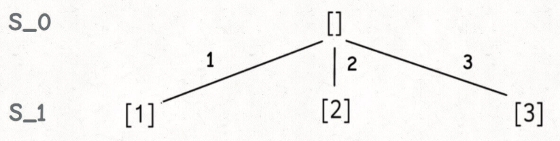
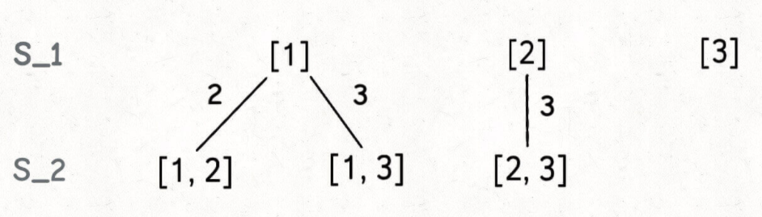
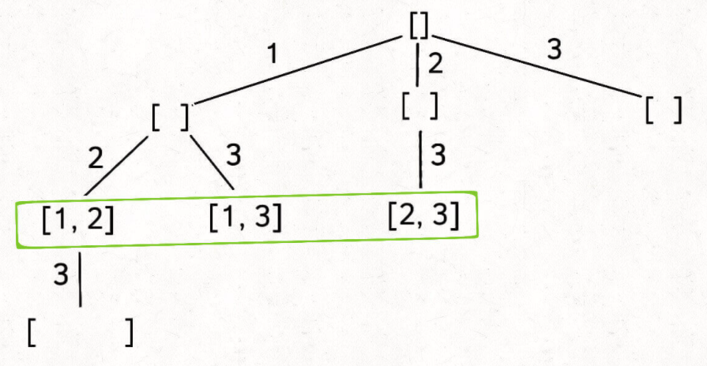
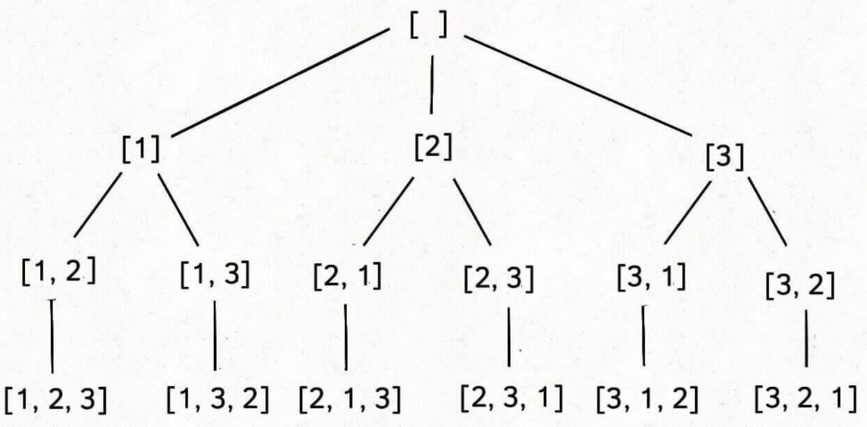
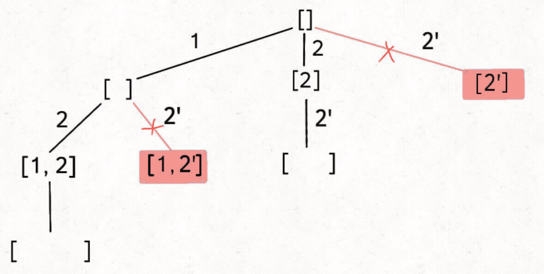

# 深扒一下子集的问题

#### **敲黑板** 关于子集的思考
> 子集问题贯穿所有题型，从纯粹找所有子集，到子序列问题，再到子串问题，其实根源上都是子集问题。可以这么理解，子序列问题是子集基础上加上`子集里遵循原序`的问题，而子串问题则是子序列问题基础上加上`子集里遵循原序并且元素是连续的`的问题。子串或者子序列，因为其原序的特殊性，因此在其穷举遍历的方法选择上，通常会更具有技巧性，通常会涉及到`动规`的一些遍历手法；关于子串问题呢，有时候`滑动窗口`真的也是其最优解。这篇帖子呢，主要就是想借助子集问题，看看这些子集相关的都涉及到那些思路技巧。
>
> 在说说子集问题的bigO的一些常识。纯穷举子集问题，其bigO肯定是O(2^n)；涉及到子序列的时候呢，用动规的遍历技巧通常能达到O(n^2)；再说说涉及到子串问题呢，比如说字符串切割啊之类的，其实本身已经是O(n^2)的复杂度了，在用到一些动规啊或者滑动窗口之类的技巧，其复杂度其实可以缩到O(n)或者O(nlogn)内。
>
> 这篇文章通过`纯子集问题>>子序列问题>>子串问题`的顺序来写，以便日后温习。

#### **刷题列表**
> 1. [78. 子集(中等)](#子集)
> 1. [77. 组合(中等)](#组合)
> 1. [46. 全排列(中等)](#全排列)
> 1. [90. 子集II(中等)](#子集II)
> 1. [40. 组合总和II(中等)](#组合总和II)
> 1. [47. 全排列II(中等)](#全排列II)

### 子集
[78. 子集(中等)](https://leetcode.com/problems/subsets/)

> **思路** 最经典的子集问题，啥解法？回溯模板呗。这题经典到甚至可以直接**背诵默写**。这种子集/组合的题，虽然是dfs回溯解法，但是先用bfs思维把回溯树画出来。比如说如下

有了这个嘛，你在算时间复杂度，是不是容易多了？不明白对吧？来看看哈，一层一层的扒皮：
> 1. 先看看手写直接撸的话怎么整。假设S_0是元素个数为0的子集，就是空集。在S_0基础上生成元素个数为1的所有子集S_1，咋整？看下图：

> 1. 同理，基于S_1基础上可以生成元素个数为2的所有子集S_2，这里要**注意**，为了避免重复子集，我们通过保证元素之间的相对顺序不变来防止出现重复的子集。看下图：

> 1. 这样就可以依次推出S_3,S_4,S_5...，说道这里，交给计算机的话该怎么转化呢？注意这个特性：**如果把根节点作为第 0 层，将每个节点和根节点之间树枝上的元素作为该节点的值，那么第 s 层的所有节点就是size为 s 的所有子集。** 比如说，size为 2 的子集就是这一层节点的值：

> 1. 再进一步，如果想计算所有子集，那只要遍历这棵多叉树，把所有节点的值收集起来不就行了？

```js
var subsets = function(nums) {
    let res = [];
    backtrack(nums, [], 0, res);
    return res;
};
//使用 startIndex 参数控制树枝的生长避免产生重复的子集
const backtrack = (nums, path, startIndex, res) => {
    let n = nums.length;
    //if(startIndex > n ) return;
    
    res.push([...path]);
       
    //选择列表
    for(let i = startIndex; i<n; i++){
        path.push(nums[i]);
        backtrack(nums, path, i+1, res);
        path.pop();
    }
}
```

### 组合
[77. 组合(中等)](https://leetcode.com/problems/combinations/)

> **思路** 很经典的子集问题，组合和子集实际上等价的。问题可转化为：给你输入一个数组 nums = [1,2..,n] 和一个正整数 k，请你生成所有size为 k 的子集。比如说，size为 2 的子集就是这一层节点的值：

是不是跟子集问题一模一样？注意使用 startIndex 参数控制树枝的生长避免产生重复的子集。

```js
var combine = function(n, k) {
    let res = [];
    backtrack([], 1, n, k, res)
    return res;
};

const backtrack = (path, startIndex, n, k, res) => {
    
    if(path.length ==k) {
        res.push([...path]);
        return;
    }
    
    for(let i=startIndex; i<=n; i++){
        path.push(i);
        backtrack(path, i+1, n, k, res)
        path.pop();
    }
}
```
### 全排列
[46. 全排列(中等)](https://leetcode.com/problems/permutations/)

> **思路** 最经典的排列问题，排列问题本身就是让你穷举元素的位置。组合/子集问题使用 start 变量保证元素 nums[start] 之后只会出现 nums[start+1..] 中的元素，通过固定元素的相对位置保证不出现重复的子集。在排列时候就玩不转了，需要借助额外的used数组来记录某个元素在当前路径中是否已经被用过。


```js
var permute = function(nums) {
    
    let res = [];
    let used = Array(nums.length).fill(false);
    
    backtrack([], nums, res, used);
    
    return res;
    
};

const backtrack = (path, nums, res, used) => {
     
    if(path.length==nums.length){
        res.push([...path]);
        return;
    }
    
    for(let i=0; i<nums.length; i++){
        if(used[i]) continue;
        
        path.push(nums[i]);
        used[i] = true;
        backtrack(path, nums, res, used);
        used[i] = false;
        path.pop();
    }
}
```

### 子集II
[90. 子集II(中等)](https://leetcode.com/problems/subsets-ii/)

> **思路** 元素要去重了，二话不说先排序啊。关于子集类（组合类）去重方法，其实方法有好几种，这里呢写出我觉得最好理解的一种。排序完了，重复的元素会堆到一起了，所以只要不是startIndex(新路径起始点)位置的元素，如果和上一个元素同值，那说明这个当前元素不需要再放到组合里了，因为如下图所示之前那个同值元素已经cover这个组合的case了。解法就是在进入下一层递归前，检查`i>startIndex && nums[i]==nums[i-1]`。


```js
var subsetsWithDup = function(nums) {
    nums.sort((a,b)=>a-b);
    let res = [];
    backtrack([], nums, 0, res);
    return res;
};

const backtrack = (path, nums, startIndex, res) => {
    
    res.push([...path]);
    
    for(let i=startIndex; i<nums.length; i++){
        if(i>startIndex && nums[i]==nums[i-1]) continue;
        
        path.push(nums[i]);
        backtrack(path, nums, i+1, res);
        path.pop();
    }
    
}
```

### 组合总和II
[40. 组合总和II(中等)](https://leetcode.com/problems/combination-sum-ii/)

> **思路** 元素要去重了，二话不说先排序啊。组合问题和子集问题是等价的，这题可以转化成`计算candidates中所有和为target的子集`。这题的去重方法跟[子集II](#子集II)一模一样。

```js
var combinationSum2 = function(candidates, target) {
    candidates.sort((a,b)=>a-b);
    let res = [];
    backtrack([], candidates, target, 0, res);
    return res;
};

const backtrack = (path, candidates, pathSum, startIndex, res) => {
    let n = candidates.length;
    
    if(pathSum == 0) {
        res.push([...path]);
        return;
    }
    
    for(let i=startIndex; i<n; i++){
        if(candidates[i]>pathSum) break;
        if(i>startIndex && candidates[i]==candidates[i-1]) continue;
        pathSum -= candidates[i];
        path.push(candidates[i]);
        backtrack(path, candidates, pathSum, i+1, res);
        path.pop();
        pathSum += candidates[i];
    }
    
}
```
### 全排列II
[47. 全排列II(中等)](https://leetcode.com/problems/permutations-ii/)

> **思路** 元素要去重了，二话不说先排序啊。答案跟[全排列]()几乎一样，这里重点陈述一下去重部分的逻辑：当出现重复元素时，比如输入 `nums = [1,2,2',2'']`，2' 只有在 2 已经被使用的情况下才会被选择，同理，2'' 只有在 2' 已经被使用的情况下才会被选择，这就保证了`相同元素在排列中的相对位置保证固定`。关键在于`保证相同元素在排列中的相对位置保持不变`。这就是为啥你能看到code里有这个条件检查：`if(i>0 && nums[i]==nums[i-1] && !used[i-1])`。

```js
var permuteUnique = function(nums) {
    nums.sort((a,b)=> a-b);
    let res = [];
    let used = Array(nums.length).fill(false);
    
    backtrack([], nums, res, used)
    return res;
};

const backtrack = (path, nums, res, used) => {
    
    if(path.length == nums.length) {
        res.push([...path]);
        return;
    }
    
    for(let i=0; i<nums.length; i++){
        if(used[i]) continue;
        
        if(i>0 && nums[i]==nums[i-1] && !used[i-1]) continue;
        
        path.push(nums[i]);
        used[i] = true;
        backtrack(path, nums, res, used)
        used[i] = false;
        path.pop();
    }
}
```
