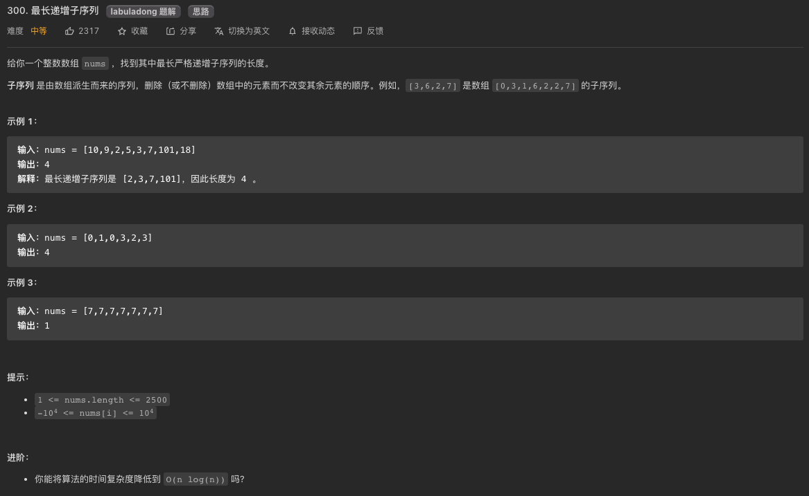

# 决策类(单子序)动规题型概论

**子序型动规的最大特点是给定一个数列`[1...n]`，`dp[i]`的值通常需要看前i的元素`[1...i-1]`的选与不选的决策来决定**

>深入思考一下决策类动规题(**2022-07-04**):
>1. 首先我承认一点，这个决策类动规的帖子主要面对的都是**单子序**类动规题，那我为什么还非得故弄玄虚的用决策类做这个总结呢？这里我说明一下，首先我想写个更高抽象层的文章，试图概括更通用的动规思想，而不是就模板而论模板。其次，我想写这篇**致敬暴力算法**，这其中包括**回溯框架**和**分治框架**，因为这两种算法让我们脑子里能快速的锁定所谓的**选择列表**，因为这直接涉及到动规题里最难的找**状态转化方程**部分。最后，我想告诉你，动规其实是统筹学的一个分支，在统筹学里，并没有我们所谓的**单子序类**，因为单子序思路只不过是统筹学里求最值的一种运算规则罢了。
>1. 今天我想补充主要是对动规三要素(**重复字问题**、**最优子结构**、**状态转化方程**)的加强，为了方便我会尽量借用**单子序**类的题目进行解释。
>1. 先来理解一下**重复子问题**这部分，比如说**爬楼梯**这个题目，`告诉你有n凳楼梯`，你每次可以`爬一步或者两步`，那你想想如果你爬一步的话，那就还剩n-1凳，爬两步的话，那就还剩n-2凳，这里你看看是不是问题在一直拆分的更小？怎么知道重复呢？因为还是n-2凳这个状态，可以是n-2(爬两步)过来的，也可以是n-1-1(爬一步，再爬一步)过来的，所以你看看这是不是就说明一定存在重复子问题了。这里更概括一点，对于输入是一个字符串，一个数组，或者一个数字(硬币目标金额啊，台阶总步数啊之类的)，这里切小的方式基本上都是**从左往右单向遍历**，使得剩余的元素`A[i+1...n]`还是个**子问题**。
>1. 再说一下所谓的**最优子结构**问题，这里我就借用一下单子序类的问题模板了。单子序类题目通常是给出一个集合A，A里存在n个元素，怎样做才能使符合**最优子结构**呢？也就是说怎么拆分问题能使得子问题之间是**相互独立**的？这里我负责的告诉你，答案很模板！我们只要保证**单向遍历**性，然后再遍历的每个第i个元素时候只从这两种选择里抉择：`跳或者不跳`！不过我话说的不要这么死，还有一种选择就是**如果我一定要选i位置是不能被跳的**，那么以第i元素结尾的子序列是怎么个状态？
>1. 最后说说**状态转化方程**，决策类的题都很直接：那就是通过看每个抉择(每个抉择的cost通常都会跟前i-1的元素所对应的最优值`dp[1...i-1]`的其中一个相关)的cost取其最优，也就是说遍历每个选择并计算其cost。**子序型动规的最大特点是给定一个数列`[0...n-1]`，`dp[i]`的值通常需要看前i的元素值`A[0...i-1]`的选与不选的决策来决定**
>
### **敲黑板** 关于决策类动规的思考
> **`决策`** ，英文是**Decsion Making**，其实对当前**i元素**`取或者不取`的决策。说到这里，你想的没错，**背包类knapsack**问题其实都是这类问题。不过从深层意义上来说，其实不止背包类动规是这个思想，其实所有**子序类**动规都是这种决策思想的应用，因为子序的决策就是在每个元素上做`跳或者不跳`的决策，而且**博弈类**的动规里，很多很多的题目也是基于这种思维的，因为博弈类的游戏规则里通常是给你**有限的几种选择**。下面举几个例子让你体会一下这种`取或不取`的妙处：
> 1. **爬楼梯题目I**[70. 爬楼梯](https://leetcode.com/problems/climbing-stairs/)：给你n凳楼梯，你每次可以`爬一凳`，也可以`爬两凳`，问你从第0凳开始爬，到达第n凳的方法有几种。因为你有爬一凳还是爬两凳的选择，这决定了每一凳楼梯都有被跳过的可能，这个能理解吗？比如说一共3凳楼梯，你可以选择一凳一凳的走三步，也可以先爬两凳然后再爬一凳，当然也可以先爬一凳再爬两凳，这就一共有三种到达第三凳爬法。这个过程中第一凳或者第二凳是可能在某种爬法里**被跳过**的对不对？从状态转换方程上来说，那就是当年想到达**第i凳**的时候，它其实让你求爬到`第i-1凳`和爬到`第i-2凳`的方法数之和(因为只有从第i-2凳迈两步到达第i凳或者从第i-1凳迈一步到达第i凳这两种可能)。这里的思路跟**LIS最长递增子序**是一致的，你要这么想：**第i凳是不能被跳过的情况下，前面有哪几凳能跳到第i凳上？**，所以你可以得出`dp[i] = dp[i-1] + dp[i-2]`;
>       * 当然你换一种思路理解不用`取或者不取`的决策也是合理：一共n凳，n就是**状态**嘛；状态的颗粒度是多少？很明显就是整数1；那么在状态的最小base case，这个状态值是一眼就能看出来的对吧？爬到第一凳有几种方法？1种嘛，就是`爬一凳`，那么爬到第二凳有几种方法呢？2种嘛，一是一步一步爬，二是一次`爬一凳`；那**选择呢**？更加清楚：**直接到达第i凳是的方法只有两种选择：1. 从第i-1凳上爬一凳，2. 从第i-2凳上爬两凳**；
> 1. **爬楼梯题目II**[746. 使用最小花费爬楼梯](https://leetcode.com/problems/min-cost-climbing-stairs/)：还是给你n凳楼梯，你也是每次可以爬一凳，也可以爬两凳，但是这回你每到达一凳台阶，你就会被扣掉一些分数。而且这次你可以从第1凳开始爬，也可以从第2凳开始爬，那么问题就是：如果到达第n+1凳（第n凳上面的楼顶），你最少要被扣掉多少分？思路和上一题基本上一模一样：
>       * 你有`爬一凳还是爬两凳`的选择，这决定了每一凳楼梯都有**被跳过**的可能，也就是这题转化成了找出一个子序列是这个子序列的和是最小的。比如说每凳要被扣得分数是这么一个数组`[10， 15， 20]`，让你到达到楼顶（第4凳），你怎么走扣掉的分数最小？用肉眼撒摸一下，你可能发现我从第二凳开始一下迈两步达到楼顶只被扣15分是最小的。现在，从子序类动规的状态转换方程上来说，那就是当年想到达**第i凳**的时候，**如果这个第i凳是不能被跳过的情况下，前面有哪几凳能跳到第i凳上？** 你其实要看看爬到`第i-1凳`和爬到`第i-2凳`的被扣得分数那个比较小对吧？（因为只有从`第i-2凳`迈两步到达第i凳或者从`第i-1凳`迈一步到达第i凳这两种可能，所以要选被扣得分数少的）。所以你可以得出`dp[i] = Math.min(dp[i-1],dp[i-2])+points[i]`;
>       * 理论上，爬楼梯题目I和II思路是一模一样的，**状态**自变量就是i指针，说白了就是爬到第i凳嘛；**选择**只有两个：跳一凳或者跳两凳；**状态转化**也是只看前两个的dp状态值。这里就体现了**明确dp函数或者dp数组定义**的重要性。
> 1. **解码方法I**[91. 解码方法](https://leetcode.com/problems/decode-ways/)：题目是这样的，给你一条包含字母`A-Z`的消息通过以下映射进行了**编码**，比如说`{'A' -> "1"`，`'B' -> "2"`，...，`'Z' -> "26"}`，现在给出你一个数字字符串，比如说`226`，让你求这个`数字编码`一共有几种**解码方法**。就这个例子来讲，`226`可以表示`BBF (因为2,2,6)`，也可以表示`VF (因为22,6)`，还可以表示`BZ (因为2,26)`。讲到这儿，聪明的你应该想到了给之前爬楼梯跳一凳还是跳两凳是不是特别相似？因为你发现你的**选择**只有可能的两种：1. `一码的数字`，2. 或者`两码的数字`。说是有*可能的*两种，因为在你选择`跳一凳`还是`跳两凳`时候是有限制条件的：
>       * 如果选择你跳两凳，有可能数值超过了`26`，在映射里找不到对应值，这说明你是不能这么跳的。
>       * 如果你选择跳一凳，结果这凳的值是`0`，在映射里也找不到对应值，说明你也是不能这么跳的。
> 到这里了，你能否可以得出这个状态转化方程？`dp[i] += dp[i-1](如果不是“0”); `, `并且 dp[i] += dp[i-2](如果s.substring(i-2,i)的值是在[10,26]区间里)`;
> 1. **Word Break I**：上一个题目是在`跳一凳`还是`跳两凳`的**选择**过程中加了额外限制，现在这个例子Word Break那就可以说加了更多额外限制，这次不让你跳一凳还是跳两凳了，这题是说你能跳几凳是取决于你跳过的这些元素能否组成一个**合法的单词**。比如说给你了一个单词集合`['cat','cats','and','sand','dog']`,然后再给你一个字符串`s="catsanddog"`，现在问你这个字符串(`s="catsanddog"`)能否用集合里单词进行有效切分成。这个乍一看似乎并没有那么明显的属于子序类动规题，但是你细品，再细品，这个很像某些手游里的*吃金币*设计环节，比如说有些*金币*吃了可以让你`跳3步`，有些吃了可以让你`跳5步`，这里的_金币_就是单词集合里的那些单词，你只要`match`到其中一个，你就相当于*吃了金币*可以合法的跳了。比如说，假设我现在处在第0个位置上，我可以吃一个`"cat"`金币跳到`‘t’`这个位子上，也可以吃一个`"cats"`金币跳到`‘s’`这个位子上；类似的，假设我现在处在`‘t’`这个位子上，我可以再吃一个`"and"`金币跳到`‘d’`这个位子上，然后接着再吃一个`"dog"`金币跳到`‘g’`这个位子上；所以思路与前几题是一模一样的，就是**当你第i凳上时候，如果这凳是不能被跳过的情况下，前面有哪几凳能跳到第i凳上？**，讲到这儿，聪明如你是否可以理解这是一个`子序类`动规问题了？你能否可以得出这个状态转化方程？`dp[i]=dp[j]并且wordDict.contains(s.substring(j,i)`，这里`j`是指i之前的所有的位置(当然你可以剪枝一下，只遍历字典里最长单词的长度)，你可以这样**穷举j** -> `0...i-1`;
> 1. **丑数II**:[264. 丑数II](https://leetcode.cn/problems/ugly-number-ii/)，这题呢，不算子序题，但是很形象的展示了**蛙跳**的概念，不同于**Fibnacci数组**，这个丑数数组不是通过两数相加来的，而是要比较`2,3,5`的这三个数的倍数去最小得来的。所以就相当于三只青蛙站在不同的荷叶上，分别只能跳2,3,5步，看哪只青蛙跳的最近。这里一个隐含的意思就是，你的dp数组维护的是丑数值，但是同时你也得用另外三个变量(`t2`,`t3`,`t5`)维护三只青蛙目前所在的位置。
> 1. **打家窃舍I**：上一个`word break`题目涉及了通过吃金币决定跳几凳的限制，这次我们再来看看在**跳凳**过程中的其他限制方式；这题核心和跳凳是没区别的，只不过爬楼梯的时候你只有跳一凳还是跳两凳的选择，但是这个**打家窃舍**的跳凳过程其实也是类似于跳一凳还是跳两凳的**选择**，因为你琢磨一下，到`第i天`的时候，你其实有两个选择，选择1是`今天不抢`，这就意味着你的收益是**继承昨天**来的；选择2是`今天抢`，这就意味着你的收益是**继承前天**来的；到这里了，你可能会问，为什么不能是**继承大前天或者大大前天**呢？这题的巧妙之处就在于每个房子里的价值都是**非负整数**，这样就说每次不抢的连续房子不会超过两个。这能理解吗？举个例子：假设房子里价值数组是这样的`[1,3,2,1,100,1,1,10]`，聪明的你肯定会这么抢房子：[**1**,3,**2**,1,**100**,1,1,**10**]；那如果房子里价值数组是这样的`[1,3,2,1,100,1,1,1，10]`呢？聪明的你肯定会这么抢房子：[**1**,3,**2**,1,**100**,1,**1**,1,**10**]对吧？你肯定不会把那个3个连续的1一起跳了吧？所以呢这题的状态转化方程就是这样的`dp[i]=Math.max(dp[i-1], dp[i-2]+nums[i-1]`，这里注意索引偏移; 
>       * 前面几道题呢，我们其实遵循的核心思路是**当你一定选择第i凳时候，回头看`[0...i-1]`里能跳到第i凳的所有可能**，但是到了这题，我们的思路变成了**当你一定选择第i凳时候，你看看选择跳或者不跳当前第i凳的两种选择，这里种选择的cost通常会与之前`[0...i-1]`个状态中的一个相关**
>       * 这里留给你一个思考题，如果房子的价值有可能是负数呢？这种情况下你会怎么做？
>       * 再思考一下，每天的`抢与不抢`的选择实际上是决定于前一天**抢没抢**那个状态的对吧？那你能否用类似买股票那样的**状态机**思路来解答这道题呢？等下我们会讲这种解法。
>       * 阅读[这里](#打家窃舍I)加深你的理解；
> 1. **最大子数组**：这个题从名字是来说不像是`子序类`动规题，但是思想上这其实也是很类似的。题目是说如果给你一个数组`[-2,1,-3,4,-1,2,1,-5,4]`，让你求和最大的子数组(连续的元素)。这里的答案应该是`6`，因为这个子树组`[4,-1,2,1]`和最大。这里思路跟**LIS最长递增子序列**有点类似，我们要用到子序类动规的另一种思想，那就是：我们在第i个位置上看问题，如果我们一定要选i位置在最终答案里（也就是说第i个元素是不能被跳的），那么以i元素结尾的最大和子数组是多少？到这里，我们其实所做的判断就是**要不要放弃之前的preSum而从当前i位置重新开始**，也就是说`取或不取`之前`[0...i-1]`个元素组成的最大和。这里再提一下，这题不能用`滑动窗口`的思路，因为你并不能保证增加或者减少窗口长度会让你的值变大，因为数组里存在负数。这题的状态转化方程式: `dp[i]=nums[i-1]+dp[i-1]>0?dp[i-1]:0`，你很容易发现这里的dp[i]取决于dp[i-1]而已，所以你可以压缩成空间O(1)的解法。
> 1. **乘积最大子数组**：
> 1. **买卖股票的最佳时间I**：在讨论打家劫舍题目时候，我们留了个思考题，我们说那么涉及了每天都有两种选择，那就是`抢或者不抢`，但是呢每天的`抢与不抢`的选择实际上是决定于前一天**抢没抢**那个状态的对吧？这里我们就给出**状态机**的解法。
>       * 如果是可以用一个二维dp数组`dp[n+1][2]`来解答的，用1表示抢，0表示不抢；
>       * 那么状态转移方程可以这么写：
>           * `dp[i][0]=Math.max(dp[i-0][0], dp[i-1][1])`: 就是说第i天没抢的可能性有两种：一是第i-1天也没抢，二是第i-1天抢了，二者取其大;
>           * `dp[i][1]=nums[i-1]+dp[i-1][0]`: 就是说第i天要抢的话，肯定是说第i-1没抢；
>       * 举个例子进一步说明一下：假设房子里的价值是这样的`[10,1,9,19,9,7]`，也么根据状态转移方程我们可以得出这个结果数组：`[[0,0],[0,10],[10,1],[10,19],[19,29],[29,28],[29,36]]`，然后答案就是`Math.max(29, 36)`; 你脑子里能否一步步的闪出这个二维状态数组？如果你可以，恭喜你，你已经理解什么叫做**状态机**了。
>       * 回到这个买股票的题，也是利用这种所谓的状态机思维，假设股票的价格是这样的`prices = [7,1,5,3,6,4]`，用1表示持有股票，0表示不持有股票；那么状态转移方程可以这么写：
>           * a) 第i天不持有股票的状态：`dp[i][0]=max(昨天就不持有dp[i-1][0]，昨天持有今天卖dp[i-1][1]+prices[i])`；
>           * b) 第i天持有股票的状态应该是这样的`dp[i][1]=max(昨天就不持有dp[i-1][1]，昨天不持有今天买dp[i-1][0]-prices[i])`；
>           * 你脑子里能否一步步的闪出这个二维状态数组`[[0, -INF], [0,-7],[0,-1],[4,-1],[4,-1],[5,-1],[5,-1]]`？答案就是dp[n][0]，aka最后一天不持有股票，所以答案是5。这里还有一个重点要解释一下，那就是base case初始状态：
>           * 假设在第`-1`天，也就是说股市还没开始，那么不持有股票的状态应该是这样的`dp[-1][0]=0`,这个很容易理解吧？股市没开始，**利润肯定为零**。
>           * 那么在第`-1`天（股市还没开始）持有股票的利润是多少呢？理论上这个状况是不可能出现的，但是为了方便计算，我们应该赋一个值：`dp[-1][1]=-infinity`,因为要求最大利润吗，所以当股市没开始时有股票的不可能情况就赋一个最小值吧：**利润为负无穷**。
>           * 小结一下就是，这里不只看能跳几凳了，而是跳的过程中要保持两种(买和卖)不同状态下的最优解；
>           * 阅读[这里](#买卖股票最佳时间)加深你的理解；
> 1. 现在来个单序列动规里最最最经典的**LIS最长子序列**。给你一个数组`[10,11,1,2,3,4]`，让你找出最长的**strickly increasing subsequence**的最长个数。这个问题是咋个决策法呢？之前一直说子序列说明中间是可以跳元素的，跳嘛，还是序，说明原序是维持的。这题咋跳呢？题目说了，**严格的升序子序**嘛，所以跳不跳的决策取决于是不是比当前第i个元素小。这里呢，我试图讲解一下单序列动规题的一个共性。之前讲的几道案例里，都是在处理第i个元素的时候，回头看看i-1时的状态或者再看看i-2时的状态就能推出当前i的状态了。这题LIS就不能只看前几个状态了，而是要在求第i个状态时候要回头看看之前所有的第0个到第i-1个状态。这里我就先写个结论，以后有时间再补补细节：
>       * 所有单序列子序动规问题，都是从左往右(即从0...n)思考的，`dp[i]`代表的是子问题的最优解，比如说*最大步数，最大和，最大面积*等等；
>       * 再找动态转化方程时候，要这么思索：`dp[i]`表示第i个位置的最优解，这个状态一定取决于整个或部分前`[0...i-1]`个状态值；也有可能是在前i个位置里，第i个元素一定被选择的答案（这个时候不要管`0...i-1`是如何拿到的，可能是跳过了其中的一些元素）
>       * 现在说说**状态转化方程**时候的选择思路：当前第i个元素是否被之前的位置跳过来替换掉？会更大，会更小？跳跃的规则和限制是啥？是不是最多跳两步呢还是隔天才能跳呢？还是相邻的不能同时选？还是要冷静几天才能再选择？是不是要放弃之前的`preSum`从当前i位置*重新开始*？还是要吃个金币一跳好几步？
>       * 说了这么多，我们回到LIS这题上来，在每个第i的位置要这么考虑：**如果我一定要选i位置是不能被跳的**，那么以第i元素结尾的最长的子序列是多长？这个怎么求？那就是遍历之前的`[0...i-1]`个元素，如果比当前第i位置的元素值小，那么说明`dp[i] = dp[j]+1 当(nums[i]>nums[j])时`；这样遍历完前`[0...i-1]`个位置的元素值以及其`dp值`，是不是就能找到第i未知的dp值了？这就是我们熟悉的**数学归纳法**。这种思路的时间复杂度是O(n^2)对吧？
>       * 在当前大环境下（2022-06-13），程序员内卷，而且各公司又不咋找人，面试中给出O(n^2)的解法是不能保证会过的。我在面Snowflake时候就碰到了这题，这题的最优解是O(n*logn)时间复杂度的。
> 1. **跳跃游戏**：我们这个帖子花了好长的篇幅一种在讨论所谓的**跳凳**过程，也就是找到合适子序列的过程，现在再来一个更直白的**跳凳**问题`跳跃游戏`。题目说给出一个数列`[2,3,1,1,4]`，每个元素值代表着你可以跳跃的最大长度，问你从第一位开始最少可以跳几次到达最后一个位置。这题你应该一眼就看出来了，是个实实在在的动规题。假设你倒着来遍历，倒数第一个1的位置跳到4可以用一跳完成，倒数第二个1需要用两步才能完成，到了元素3那个位置，你也可以1步跳到4因为3表示最大可以跳3步，而到了最起初2个这个位置，你可以跳到3也可以跳到倒数第二个1，但是跳到3显然更合适，因为到了3再用一跳就可以到目标了，说了这些那么你脑子里应该很快地得出这个结果数组`[2,1,2,1,0]`，这就是动态规划的经典思路，就是在每一个第i元素上遍历这个i元素可以跳跃的距离，在这些跳跃距离内选最优。最后补一句，这题的最优解是通过贪心算法来达到O(n)复杂度。

------------------------------------------------------------------------------------------------------------------------
> 问题描述多数是张这个样子的：`Given a set of values`, `find an answer with an option to chooose or ignore the current value`；
>
> 这类题的一个很重要思想就是，你通常有两个选择：`取`或者`不取`，这样你就要在这两种选择找最优的一种。不过再**说一点**，就是这个每个value上的两种选择可能会有限制，我会在股票买卖的问题系列里展示这个限制；
>

### 打家窃舍I
> 先来看看经典的问题[198. 打家劫舍]()，这个问题的一个关键特性是每个房子里的都有**正数**的价值，然后题解要求抢最大值得价值，所以每抢一个房子，对答案肯定是增加价值的。假设房子的价值是这个数列`[10,1,9,19,9,7]`，我们用脑回路过一下这个`取`或者`不取`思想；
> 1. 如果没有任何房子，那能抢到的最大价值一定是`0`；--> 把这个结果存在dp[0]上；
> 1. 如果只有一个房子，那能抢到的最大价值一定是那个唯一房子里的价值`values[i]`；--> 把这个结果存在dp[1]上；
> 1. 如果有两个房子，你该怎么计算呢？当你迭代到`i=1`这个位置上（values数列里的第二个元素），你怎么判断能抢到的最大价值呢？两个元素似乎也是直截了当，就是在`values[0]和values[1]`取最大值，如果values[0]>values[1]，那么我们就决定`不取i=1`这个元素，反之`取i=1`；--> 把这个结果存在dp[2]上；
> 1. 如果有三个房子，你又该怎么计算呢？当你迭代到`i=2`这个位置上（values数列里的第三个元素），你怎么判断能抢到的最大价值呢？三个元素似乎就有点复杂了，比如说例子中的前三个元素`[10,1,9]`，决定用不用`i=2`这个位置上的元素，要看`dp[1]+这个元素值`和`dp[2]`的大小关系，dp[3]的值应该是他们俩个中取max；
> 1. 你找出规律了没？其实算dp[i]的值，只需要比较`dp[i-2]+values[i-1]`和`dp[i-1]`的大小关系。
>
> 到这里，我们就有答案了，你有点感觉了没？这就是`取`或者`不取`在每个value上的应用。


### 背包问题里的`放入背包`或者`不放入背包`

### 买卖股票最佳时间
> 我们来尝试这道题[121. Best Time to Buy and Sell Stock](https://leetcode.com/problems/best-time-to-buy-and-sell-stock/)来解释里面的`取`或者`不取`思想。这题的详细解释请看[这篇帖子](./coding/dp/stock.md)。这里重点讲讲`取`或者`不取`思想。
> 
> 假设股票的价格是这样的`prices = [7,1,5,3,6,4]`；我用1表示持有股票，0表示不持有股票；
> 1. 假设在第`-1`天，也就是说股市还没开始，那么不持有股票的状态应该是这样的`dp[-1][0]=0`,这个很容易理解吧？股市没开始，**利润肯定为零**。
> 1. 那么在第`-1`天（股市还没开始）持有股票的利润是多少呢？理论上这个状况是不可能出现的，但是为了方便计算，我们应该赋一个值：`dp[-1][1]=-infinity`,因为要求最大利润吗，所以当股市没开始时有股票的不可能情况就赋一个最小值吧：**利润为负无穷**。
> 1. 时间来到第`0`天，也就是说股市开始的第一天，那么今天不持有股票的状态应该是这样的`dp[0][0]=max(昨天就不持有dp[-1][0]，昨天持有今天卖dp[-1][1]+prices[i])`；类似的，今天持有股票的状态应该是这样的`dp[0][1]=max(昨天就不持有dp[-1][1]，昨天不持有今天买dp[-1][0]-prices[i])`；所以在股市开始的第一天，dp的最佳状态是这样的：`dp[0][0]=max(0, -infinity+prices[0])=0`, `dp[0][1]=max(-infinity, 0-prices[0])=-7`；
> 1. 你感受到了吗？这里的`不取`显然就是不买也不卖，而`取有两种取法`，一种是买，另一种是卖。所以我们要在遍历过程中维护两种不同类型的`取`或者`不取`选择；
>
> 你大脑里能否展现出如下迭代结果：`[[0, -INF], [0,-7],[0,-1],[4,-1],[4,-1],[5,-1],[5,-1]]`，答案就是dp[n][0]，aka最后一天不持有股票，所以答案是5；今天的最佳状态，至于昨天的最佳状态相关；

```java
class Solution {
    public int minCostClimbingStairs(int[] cost) {
        int n= cost.length;
        int[] dp = new int[n];
        dp[0] = cost[0];
        dp[1] = cost[1];

        for(int i=2; i<n; i++){
            dp[i] = Math.min(dp[i-1], dp[i-2])+cost[i];
        }

        return Math.min(dp[n-2],dp[n-1]);
    }
}
```

### 博弈问题里的`选一个`或者`选两个`的选择
> 博弈类动规的经典题[领扣394. 硬币排成线](https://www.lintcode.com/problem/394/)，看先手能不能拿到最后一枚硬币。这里`取`或者`不取`的思想对应的是`选一个`或者`选两个`的选择，也是二维的选择，所以思路上有点类似。
>

------------------------------------------------------------------------------------------------------------------------
### **刷题列表**
1. [70. 爬楼梯](#爬楼梯)https://leetcode.com/problems/min-cost-climbing-stairs/
1. [53 最大子数组](#最大子数组)
1. [300 最长递增子序](#最长递增子序)
1. [354 套娃问题](#套娃问题)
1. [516 最长回文子序](#最长回文子序)
1. [1312 构造回文的最小插入次数](#构造回文的最小插入次数)
1. [115. 不同的子序列](#不同的子序列)
1. [857. 领扣-最小的窗口子序列](https://www.lintcode.com/problem/857)

### 最大子数组
[53 最大子数组](https://leetcode.com/problems/maximum-subarray/)


?> **[思路]** 这题严格说不是子序问题，而是连续子数组，但是子数组在概念上其实是子序列的一个子集。因为是连续子数组。但是这题不能用`滑动窗口`，因为你并不能保证增加或者减少窗口长度会让你的值变大，因为数组里存在负数。暴力解法的话，就是两个for循环嘛(i: 0...n-1 --> j: i..n-1)，然后打擂台找最大值。但是这题其实是O(n)就能解决的。解决子串问题吧，就要谨记**连续**这个词，所以整着遍历数组，看看以这个数结尾的子串最大和是多少？这是不是就好找多了？就是看看这个nums[i]和上一个dp[i-1]的正负关系嘛。

```js
var maxSubArray = function(nums) {

    let dp = Array(nums.length);
    dp[0] = nums[0];
    for(let i=1; i<dp.length; i++){
        //看看是nums[i]本身大还是和上一个dp值连起来大
        dp[i] = Math.max(nums[i], nums[i]+dp[i-1]);
    }

    //for循环一遍找最大值
    let res = -Number.MAX_VALUE;
    for(let i=0; i<dp.length; i++){
        res = Math.max(res, dp[i]);
    }

    return res;
};
```
```java
class Solution {
    //这题不能用滑动窗口，因为扩大或者缩小窗口并不能保证子窗口和增大（因为有负数）
    public int maxSubArray(int[] nums) {
        //用暴力法，i--> 0...n-1; j-->i...n-1 => O(n^3)
        //暴力法的一个小优化，可以用一个presum前缀和组，加快两个点[i...j]之间的和计算
        
        //优化解法是动规。subArray的特性是元素必须是连续的
        int n = nums.length;
        if(n==0) return 0;
        int[] dp = new int[n];
        dp[0] = nums[0];
        int res = dp[0];
        for(int i=1; i<n; i++){
            dp[i] = Math.max(dp[i-1]+nums[i], nums[i]);
            res = Math.max(dp[i], res);
        }
        return res;
    }
}
```


### 最长递增子序
[300 最长递增子序](https://leetcode.com/problems/longest-increasing-subsequence/)


?> **[思路]** 这题是子序动规里最经典的问题了(LIS)，而且这题的衍生题目也很多。最长增子序LIS咋整？先理解子序。就是说子序可以是不连续元素的组合，但是元素之间的原序（前后序）还是要维持的。所以要计算第i个位置的最长LIS，如果已经知道前i-1个元素每个的LIS，能否计算出来？答案是能的，因为只要遍历[0...i-1]区间里比nums[i]值小的元素，并把他们的LIS值加1（因为这个nums[i]比它大），再然后就是从这些值里找最大值, 这就是高中学的数学归纳法(mathmatical induction)。所以两个坐标指针i和j，用j指针遍历dp[0...i-1]。

```js
var lengthOfLIS = function(nums) {
    //LIS问题是经典的数学归纳法(mathmatical induction)的案例，一维dp数列找答案，然后再遍历dp数列找最终答案
    let dp = Array(nums.length).fill(1); //每个元素至少是一个单独的增子序
    //base case
    //dp[0] = 1;
    for(let i=1; i<nums.length; i++){
        for(let j=0; j<i; j++){
            if(nums[i]>nums[j]) dp[i] = Math.max(dp[i], dp[j]+1);
        }
    }
    
    //for循环一下dp数组找最大值
    let res = 1;
    for(let i=1; i<dp.length; i++){
        res = Math.max(res, dp[i]);
    }
    return res;
};
```

?> **[思路]** 上边的解法的时间复杂度是O(n^2)，还不是最佳解法，最佳解法实际上是O(n*logn)，用二分法。我在面Snowflake电面时候被问蒙了。二分法思路的一个核心思想就是维护一个subSeq的数组，这个subSeq数组思想上非常像单调递增栈，只不过这个“栈”只有在比最大元素大的时候才增长，当第i个元素值不大于“栈”里目前最大元素的时候，这时候的思想就是，找到**比这个第i个元素值大的最小值**。这里的思路你可以这么想：你想每次都能腾出点更多的空间，好使下一个i+1个元素可以被插入到这个subSeq的数组。最后这个subSeq数组实际上就是维护了最长的可能LIS，subSeq数组就应该是LIS的答案。举个例子，`[10, 11, 1,2,3]`，subSeq是最起初是`[10]`,遇到11，因为11是最大的，那就增加一个元素变成`[10, 11]`，然后遇到1，因为1不是最大，那就用二分法在subSeq数组中`去找比1大的最小元素`然后用1去replace那个元素，数组就变成了`[1, 11]`，类似的遇到2这个元素时候，数组就变成了`[1, 2]`，遇到3这个元素时候，数组就变成了`[1, 2，3]`。
```java
class Solution {
    private int[] subSeq;
    private int lastPos = 0;
    public int lengthOfLIS(int[] nums) {
        subSeq = new int[nums.length];
        subSeq[0] = nums[0];
        int res = 1;
        for(int i=1; i<nums.length; i++){
            replaceElement(nums[i]);
            res = Math.max(res, lastPos+1);
        }
        
        return res;
    }
    
    //二分法找到比target大于等于的最小值
    private void replaceElement(int target){
        if(target>this.subSeq[lastPos]) {
            this.subSeq[++lastPos] = target;
            return;
        }
        
        int left=0, right=this.lastPos;
        while(left<right){
            int mid = left +(right-left)/2;
            if(this.subSeq[mid]==target){
                return;
            } else if(this.subSeq[mid]>target){
                right = mid;
            } else {
                left = mid + 1;
            }
        }
        
        this.subSeq[left] = target;
    }
}
```

> **补充** 需要二分法时候，java里是有现成的API可以用的，而且不止数组有，集合也有；分别是，Arrays.binarySearch(arr1, targetNum)和Collections.binarySearch(list1, targetNum)；这里有一点要注意：前提是数组或者集合是有序的。
```java
class Solution {
    public int lengthOfLIS(int[] nums) {
        //类似于递增单调栈的概念
        int n = nums.length;
        int[] resultArray = new int[n];
        resultArray[0] = nums[0];
        int lastPos = 0;
        
        for(int i=1; i<n; i++){
            if(resultArray[lastPos]<nums[i]){
                lastPos++;
                resultArray[lastPos]=nums[i];
            } else {
                int pos = Arrays.binarySearch(resultArray, 0, lastPos+1, nums[i]);
                //System.out.println(pos+"|"+nums[i]);
                if(pos<0) pos = -(pos+1);
                resultArray[pos]=nums[i];
            }
        }
            
        return lastPos+1;
    }
}

//version 2: 用list
class Solution {
    public int lengthOfLIS(int[] nums) {
        //类似于递增单调栈的概念
        int n = nums.length;
        List<Integer> resultList = new ArrayList<>();
        
        for(int num : nums){
            if(resultList.isEmpty() || resultList.get(resultList.size()-1)<num){
                resultList.add(num);
            } else {
                int pos = Collections.binarySearch(resultList, num);
                if(pos<0) pos = -(pos+1);
                resultList.set(pos,num);
            }
        }
            
        return resultList.size();
    }
}
```

### 套娃问题
[354 套娃问题](https://leetcode.com/problems/russian-doll-envelopes/)
?> **[思路]** 这题就是是最长增子序(LIS)问题外加一层皮。
```java
class Solution {
    public int maxEnvelopes(int[][] envelopes) {
        //套娃问题，是LIS的一个升级版
        Arrays.sort(envelopes, (a,b)-> {
            if(a[0]==b[0]) return b[1]-a[1];
            return a[0]-b[0];
        });
        
        int[] nums = new int[envelopes.length];
        for(int i=0; i<envelopes.length; i++){
            nums[i] = envelopes[i][1];
        }
        
        return getLIS(nums);
    }
    
    private int[] subSeq;
    private int lastPos = 0;
    public int getLIS(int[] nums) {
        subSeq = new int[nums.length];
        subSeq[0] = nums[0];
        int res = 1;
        for(int i=1; i<nums.length; i++){
            replaceElement(nums[i]);
            res = Math.max(res, lastPos+1);
        }
        
        return res;
    }
    
    //二分法找到比target大于等于的最小值
    private void replaceElement(int target){
        if(target>this.subSeq[lastPos]) {
            this.subSeq[++lastPos] = target;
            return;
        }
        
        int left=0, right=this.lastPos;
        while(left<right){
            int mid = left +(right-left)/2;
            if(this.subSeq[mid]==target){
                return;
            } else if(this.subSeq[mid]>target){
                right = mid;
            } else {
                left = mid + 1;
            }
        }
        
        this.subSeq[left] = target;
    }
    
}
```

