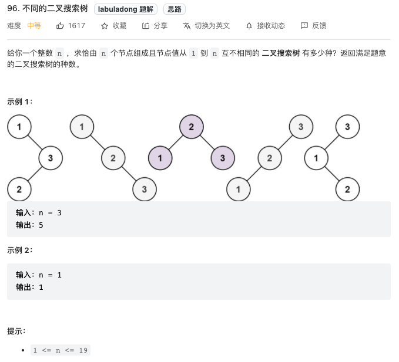
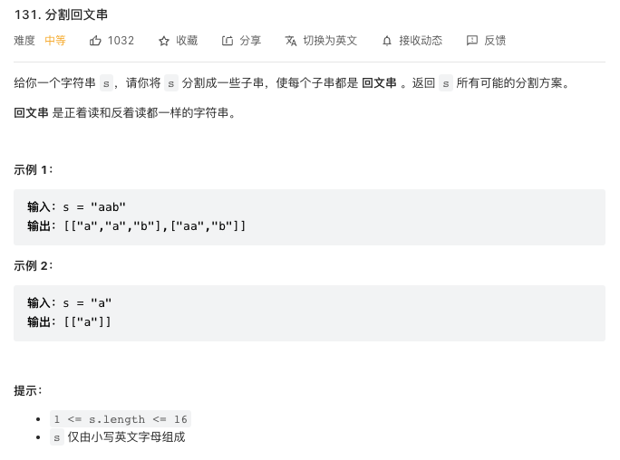

# 动态规划纲领

1. [何为动规](#何为动规) 
1. [九章动规模板](#九章动规模板) 
#### 知识要点.
- [坐标型动规](./coding/dp/indices.md) 
- [子序类动规](./coding/dp/subsequence.md) 
- [背包类动规](./coding/dp/knapsack.md) 
- [博弈类动规](./coding/dp/gametheory.md) 
- [区间型动规](./coding/dp/interval.md)
- [股票买卖系列](./coding/dp/stock.md)
- [不知道哪一类](./coding/dp/unknown.md)

### **何为动规**
**听说动规，这类题确实挺玄学，我刷到今天了(2022.03.15)了，依旧觉得有些题目拿来，知道是动规题，但是对状态转移方程依旧是存在于某种程度的运气。玄学的东西，需要的刷到一定量的题了，然后温故而知新，不定时总结感悟刷过的题，顿悟的过程是很痛苦的。**

**这里提一下记忆化搜索和动规。从本质上讲，这两个是完全一个东西，都是对最优子结构问题处理方式。记忆化搜索是自顶而下的一种思维，而传统的动态规划则是一种自底向上的思维方式。具体到解题上，我个人通常是先试着记忆化搜索的思路，如果在思索过程中能够很快地转变成自底向上的思维方式，就用动规写法。不是每道题都能将记忆化搜索转化成动规思维，尤其是题中的起点或者终点不容易确定的时候**

从算法本质的连接上来说，`二叉树的分治` --> `分治深搜` --> `记忆化搜索` --> `动态规划`。但是别被这些看似高大上的文学词汇迷惑了，其实不外乎多刷题，看能不能最短时间里瞅出一下几个特性：
1. 肯定需要`穷举`，但是暴力穷举不是多项式级别时间复杂度(O(2^n), O(n!)等)；
1. 问题存在 **`重复子问题`** ，这个其实通过一段时间的锻炼，是很容易看出来的
1. 细化问题的拆解，把问题能够拆解成具备 **`最优子结构`** 的问题。这里提到了一个`dp函数的定义`问题，一个比较好的路子就是照着原题的语义思考，能定义出dp函数是基础，找到 **`状态转移方程`** 就是一个玄学问题了。说到“照着原题的语义思考”，其实这个思路在遇到背包问题的时候就不太实用了，因为`背包问题的难点`就是在于怎么把问题转化成一个背包问题。
1. 最后，在解动规问题过程中，还有一项挺考验一个人的基本功，那就是找 **`base case`** ，这个呢也没啥通用规则，就是题刷多了自然能随机应变。

我会针对5大类面试中常考的动规题型分别进行总结，但是进入那里之前，我在啰嗦几句。在刷二叉树的时候，我们遇到过这个问题 [96. 不同的二叉搜索树（简单)](https://leetcode.com/problems/unique-binary-search-trees/)，温故而知新嘛，就用这个问题来总结一下动规。


这题吧，好的不得了，因为这不是纯找数列规律题嘛。文学上来说这题属于子序类动规。先别管那么高大上的词汇，先来温习一下高中数学吧。我们先定义两个函数：
1. **`dp(n)`**: 是说给一数列[1...n]，能得到多少个二叉搜索树；
1. **`f(i,n) & 1<=i<=n`** ：以数字i为根，能得到多少个二叉搜索树；
1. 通过以上两个函数，我们不难发现其实主要是对`f(i,n)`中的i和n进行合理的遍历，这两变量就是所谓的`状态`；
1. 动规的问题中，其实还有一块要注意，就是所谓的`选择`。这里选择比较明确，就是将(i,n)两变量按照每步为1的节奏遍历，以穷举完 **`1<=i<=n`** ；
1. 上边两个函数的关系就是：`dp(n) = f(1, n) + f(2, n) + ... + f(n, n)`;这就是所谓的`状态转移方程`；
1. 动规问题都是穷举嘛，但是穷举必须有出口啊。这就是所谓的`base case`，这里的base case是dp(0)=1，dp(1)=1；

```js
var numTrees = function(n) {
    let dp = Array(n+1).fill(0);
    //base case
    dp[0] = 1;
    dp[1] = 1;
    dp[2] = 2;
    for(let i=3; i<n+1; i++){
        for(let j=1; j<=i; j++){
            dp[i] += dp[j-1] * dp[i-j];
        }
    }
    return dp[n];
};
```

我温故温上瘾了，再来一个例子来展示一下所谓`动态`规划的思维。看看这题[131. 分割回文串（中等)](https://leetcode.com/problems/palindrome-partitioning/)


这题吧，我不想展示整题的解法，而是想提一下判断字符子串是否为回文的一个写法。

回文串的问题在leetcode上有好几个，但是所有回文串题的解法都遵循一个原则：**由中间向两边扩散**。来借这题剖析一下回文：
1. **由中间向两边扩散** 分别用两个指针(i,j)表示左右，这两变量(i,j)就是所谓的`状态`；
1. 所谓的`选择`嘛，这里很容易理解：就是让遍历完所有i和j，以穷举 **`0<=i<=n` && `0<=j<=n`** n为字符串长度；
1. 所谓`状态转移方程`吧，很巧妙，就是：`当s.charAt(i)==s.charAt(j)时，dp(i，j)= dp(i+1，j-1)`，否则就一定不是回文串；
1. 最后说是`base case`：当i==j时候，dp（i，j）== true这个好理解，因为单个字符一定是回文串，当i>j时候，dp（i，j）== true这个怎么理解呢？i>j时，说明子串是个空字串，空字串也是回文串！

> **敲黑板** 这里展示一下怎么以动规的方式写一个字符串里回文子串的位置：
  a b a b d
a T F T F F
b T T T F F
a T T T F F
b T T T T F
d T T T T T  

```js
const getIsPalindrom = (s) => {
    let n = s.length;
    let dp = [...Array(n)].map(x=>Array(n).fill(true));
    for(let i=n-2; i>=0; i--){
        for(let j=i+1; j<n; j++){
            if(i<j){
                if(s.charAt(i)==s.charAt(j)){
                    dp[i][j] = dp[i+1][j-1]; 
                } else {
                    dp[i][j] = false;
                }
                    
            } 
        }
    }
    
    return dp;
    
}
```
```java
public boolean[][] getIsPalindrom(String s) {
    int n = s.length();
    boolean[][] dp = new boolean[n][n];
    for (boolean[] row: dp)
        Arrays.fill(row, true);
    
    for(int i=n-2; i>=0; i--){
        for(int j=i+1; j<n; j++){
            if(i<j){
                if(s.charAt(i)==s.charAt(j)){
                    dp[i][j] = dp[i+1][j-1]; 
                } else {
                    dp[i][j] = false;
                }
                    
            } 
        }
    }
    
    return dp;
    
}
```

### 九章动规模板
> 使用场景：
> 1. 求方案总数(90%) 
> 1. 求最值(80%) 
> 1. 求可行性(80%) 

> 不适用场景：
> 1. 求所有具体方案(99%) 
> 1. 输入数据无序(背包问题除外，60-70%) 
> 1. 暴力算法已经是多项式时间复杂度(80%) 

> 动规四要素(对比递归四要素)
> 1. 状态State <--> 递归的定义
> 1. 状态转化方程Function <--> 递归的拆解
> 1. base case初始化 <--> 递归的出口
> 1. 答案Answer <--> 递归的调用

> 复杂度
> 1. 时间复杂度: `O(状态总数 * 每个状态的处理耗费)`，等于`O(状态总数 * 决策数)`
> 1. 空间复杂度: `O(状态总数)` 如果不适应滚动数组；如果使用滚动数组优化, n 是被滚动掉的那一个维度，就是`O(状态总数 / n)`


https://www.zhihu.com/question/291280715/answer/1007691283
https://leetcode.com/discuss/general-discussion/491522/dynamic-programming-questions-thread
https://leetcode.com/discuss/general-discussion/458695/dynamic-programming-patterns