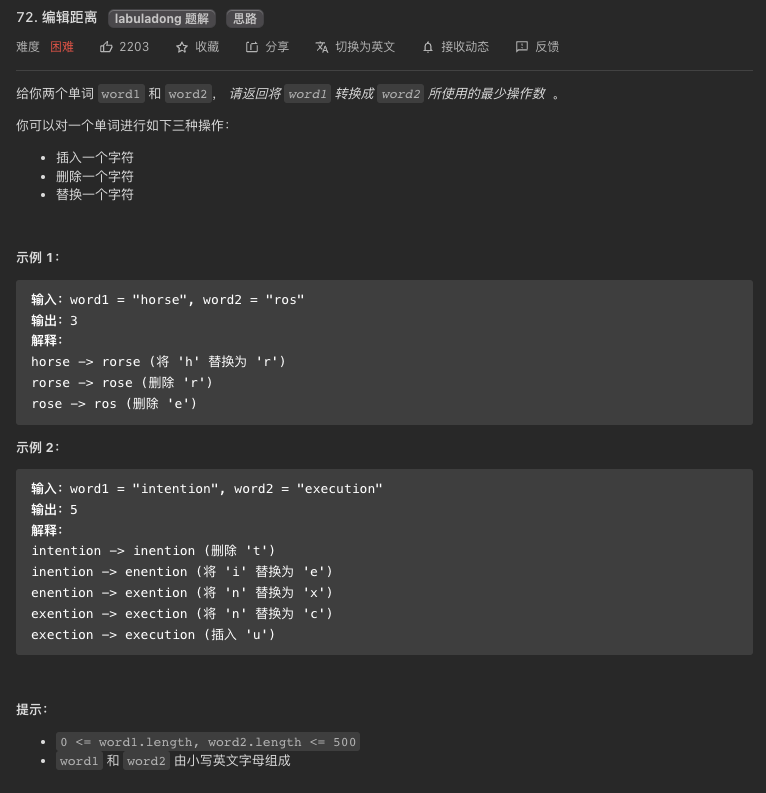
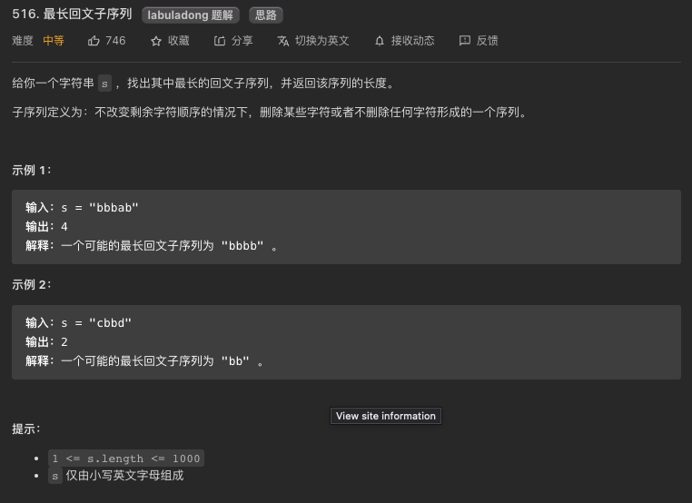
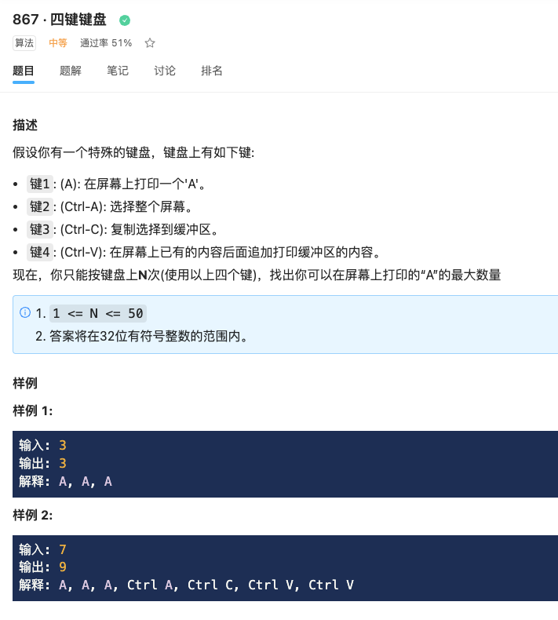

# 子序型动规

**子序型动规的最大特点是给定一个数列[1...n]，dp[i]的值通常需要看前i的元素[1...i-1]的特征来决定**

?> 借着本文希望能体将子序型的动规问题扒扒皮，找出共性和解题套路来。

!> **敲黑板** 子序和子串的区别提到好几次了，子序可以是不连续的元素组合，但是原序是要保持的，所以说像半个组合类问题；子串是连续的元素，通常子串数都是O(n^2)这个级别。

### **刷题列表**
1. [53 最大子数组](#最大子数组)
1. [72 编辑距离](#编辑距离)
1. [300 最长递增子序](#最长递增子序)
1. [354 套娃问题](#套娃问题)
1. [1143 最长公共子序](#最长公共子序) 
1. [712 两字符串的删除和](#两字符串的删除和)
1. [583 两字符串的删除](#两字符串的删除)
1. [516 最长回文子序](#最长回文子序)
1. [1312 构造回文的最小插入次数](#构造回文的最小插入次数)
1. [651. 四键键盘（中等）](#四键键盘) 

### 最大子数组
[53 最大子数组](https://leetcode.com/problems/maximum-subarray/)


?> **[思路]** 这题严格说不是子序问题，因为是连续子数组。但是这题不能用`滑动窗口`，因为你并不能保证增加或者减少窗口长度会让你的值变大，因为数组里存在负数。暴力解法的话，就是两个for循环嘛(i: 0...n --> j: i..n)，然后打擂台找最大值。但是这题其实是O(n)就能解决的。解决子串问题吧，就要谨记连续这个词，所以整着遍历数组，看看以这个数结尾的子串最大和是多少？这是不是就好找多了？就是看看这个nums[i]和上一个dp[i-1]的正负关系嘛。

```js
var maxSubArray = function(nums) {

    let dp = Array(nums.length);
    dp[0] = nums[0];
    for(let i=1; i<dp.length; i++){
        //看看是nums[i]本身大还是和上一个dp值连起来大
        dp[i] = Math.max(nums[i], nums[i]+dp[i-1]);
    }

    //for循环一遍找最大值
    let res = -Number.MAX_VALUE;
    for(let i=0; i<dp.length; i++){
        res = Math.max(res, dp[i]);
    }

    return res;
};
```

### 编辑距离
[72 编辑距离](https://leetcode.com/problems/edit-distance/)



?> **[思路]** 这题是子序动规里很经典的问题，但是也是让人看了就蒙的hard题。这题的思路和自顶向下的解法在[**这里**](./coding/memo/index?id=编辑距离)已经给出，这里给出自底向上的写法。但是说实话，我个人能写出这个自底而上的解法完全是因为能先写出这个记忆化搜索的解法。

```js
var minDistance = function(word1, word2) {
    let m = word1.length, n = word2.length;
    let dp = [...Array(m+1)].map(x=>Array(n+1).fill(0));

    //base case
    for(let j=0; j<n+1; j++) {
        dp[0][j] = j;
    }
    for(let i=0; i<m+1; i++) {
        dp[i][0] = i;
    }

    //状态转化
    for(let i=1; i<m+1; i++) {
        for(let j=1; j<n+1; j++) {
            //注意索引偏移
            if(word1.charAt(i-1) == word2.charAt(j-1)){
                dp[i][j] = dp[i-1][j-1];
            } else {
                dp[i][j] = Math.min(dp[i][j-1], dp[i-1][j], dp[i-1][j-1])+1;
            }
        }
    }
    
    return dp[m][n];
};
```


### 最长递增子序
[300 最长递增子序](https://leetcode.com/problems/longest-increasing-subsequence/)


?> **[思路]** 这题是子序动规里最经典的问题了(LIS)，而且这题的衍生题目也很多。最长增子序LIS咋整？先理解子序。就是说子序可以是不连续子序的组合，但是原序（前后序）还是要维持。所以要计算第i个位置的最长LIS，如果已经知道前i-1个元素每个的LIS，能否计算出来？答案是能的，因为只要遍历[0...i-1]区间里比nums[i]值小的元素，并把他们的LIS值加1（因为这个nums[i]比它大），再然后就是从这些值里找最大值, 这就是高中学的数学归纳法(mathmatical induction)。所以两个坐标指针i和j，用j指针遍历dp[0...i-1]。
```js
var lengthOfLIS = function(nums) {
    //LIS问题是经典的数学归纳法(mathmatical induction)的案例，一维dp数列找答案，然后再遍历dp数列找最终答案
    let dp = Array(nums.length).fill(1); //每个元素至少是一个单独的增子序
    //base case
    //dp[0] = 1;
    for(let i=1; i<nums.length; i++){
        for(let j=0; j<i; j++){
            if(nums[i]>nums[j]) dp[i] = Math.max(dp[i], dp[j]+1);
        }
    }
    
    //for循环一下dp数组找最大值
    let res = 1;
    for(let i=1; i<dp.length; i++){
        res = Math.max(res, dp[i]);
    }
    return res;
};
```

### 套娃问题
[354 套娃问题](https://leetcode.com/problems/russian-doll-envelopes/)

### 最长公共子序
[1143 最长公共子序](https://leetcode.com/problems/longest-common-subsequence/)

```js
var memo = [];
var longestCommonSubsequence = function(text1, text2) {
    memo = [...Array(text1.length)].map(x=> Array(text2.length).fill(0));
    return dp(text1, 0, text2, 0);
};

const dp = (s1, i, s2, j) => {

    //base case
    if(i==s1.length || j==s2.length) return 0;

    if(memo[i][j]) return memo[i][j];

    let res = 0;
    if(s1[i] == s2[j]) {
        res = 1+dp(s1, i+1, s2, j+1);
    }
    else {
        res = Math.max(
            dp(s1, i+1, s2, j),
            dp(s1, i, s2, j+1)
        );
    }
    memo[i][j] = res;
    return memo[i][j];
}
```

### 两字符串的删除和
[712 两字符串的删除和](https://leetcode.com/problems/minimum-ascii-delete-sum-for-two-strings/) 

### 两字符串的删除
[583 两字符串的删除](https://leetcode.com/problems/delete-operation-for-two-strings/)

### 最长回文子序
[516 最长回文子序](https://leetcode.com/problems/longest-palindromic-subsequence/)



?> **[思路]** 这题是一个非常好的题，虽然严格意义上并不是子序类动规。不过这题求的子序，那就姑且归类在这篇里吧。解法很动规，还是先用自顶而下的记忆化搜索法解释吧，因为比较容易理解。当`s[i]==s[j]`时, 简单啊，答案就是`2 + dp(s, i+1, j-1)`。当`s[i]!=s[j]`时, 就三种情况了，分别是
1. 最长子回文序列里含有s[i];
1. 最长子回文序列里含有s[j];
1. 最长子回文序列里既不含有s[i]也不含有s[j];
?> 第三种情况可以不考虑，因为我们再找最长回文子序。自底而上的写法也是一个道理。

```js
var memo = [];
//自顶而下的记忆化搜索法
var longestPalindromeSubseq = function(s) {
    memo = [...Array(s.length)].map(x=> Array(s.length).fill(0));
    return dp(s,0,s.length-1);
};

const dp = (s, i, j) => {

    //base case
    if(i==j) return 1;
    if(i>j) return 0;

    if(memo[i][j] != 0) {
        return memo[i][j];
    }
    if(s[i]==s[j]) {
        memo[i][j] = 2 + dp(s, i+1, j-1);
    } 
    else {
        memo[i][j] = Math.max(
           dp(s, i+1, j),
           dp(s, i, j-1)
        );
    }

    return memo[i][j];
}
```

```js
//自底而上的dp数组法
var longestPalindromeSubseq = function(s) {
    let n = s.length;
    let dp = [...Array(n)].map(x=> Array(n).fill(0));

    //base case
    for(i=0; i<n; i++) {
        dp[i][i] = 1; //单个字符肯定是回文
    }

    //base case
    for(i=n-2; i>=0; i--) {
        for(j=i+1; j<n; j++){
            if(s.charAt(i) == s.charAt(j)){
                dp[i][j] = dp[i+1][j-1] + 2; 
            }
            else {
                dp[i][j] = Math.max(dp[i][j-1], dp[i+1][j]); 
            }
        }
        
    }

    return dp[0][n-1];
};
```


### 构造回文的最小插入次数
[1312 构造回文的最小插入次数](https://leetcode.com/problems/longest-palindromic-subsequence/)

### 四键键盘
[651. 四键键盘（中等）](https://www.lintcode.com/problem/867/) 



?> **[思路]** 这题是一个具有很强技巧性的问题。首先，看道题，几乎很快能确认是个动规问题，一是个明确的选择列表带四个选项，其次是求最值。照着这个思路，先思考一下这动规题的状态吧。其实有三个变量是状态，按键i次后屏幕上已显示的输出的A的数量（a_num），还剩余的按键次数（N-i次)，粘贴板上的缓存（copy），既然每步都有四个选择，那就遍历这三个变量然后择优呗。这其实就是暴力算法的雏形。只不过这个暴力算法过不了leetcode，及时你用memo记忆化搜索也过不了。然后就深入在思考一下，其实这题的答案肯定是这样的，当N比较小时候，就直接`按A键`，直到N比较大是再按这个规律去按键：`Ctrl-A，Ctrl-C，Ctrl-V，Ctrl-V，Ctrl-V...` 既然是这样，那怎么如果你已经直到了前`i-1`次操作能得到的最大输出A的数量，你能导出第i次操作的输出A最大值吗？答案是能的，又是高中学的数学归纳法(mathmatical induction)，你问你只要留出两步操作给`Ctrl-A，Ctrl-C`，剩下的就一直`Ctrl-V，Ctrl-V，Ctrl-V...`好了，那么`Ctrl-V`时粘贴板上的最大值是多少呢？这个不一定是最后一个dp[i-2]哟，举个例子，当N=7时，dp[3]的值应该是4，就是说屏幕上输出是`AAAA`，然后最后三遍留给复制粘贴操作，最后屏幕上输出是`AAAAAAAA`，也就是说dp[6]是8. 实际上dp[6]应该是9，因为可以在屏幕上输出是`AAA`时开始复制粘贴，这样就可以粘贴两次最后屏幕上输出是`AAAAAAAAA`（9个A）。既然不能直接用dp[i-2]，那么就遍历所有之前的dp[j]好了，这个j要从即开始遍历呢？答案是2，因为需要留两步操作给`Ctrl-A，Ctrl-C`。现在回头想想，其实解题思路跟[最长递增子序](#最长递增子序)题差不多，都用了数学归纳法。

```java
public class Solution {
    /**
     * @param N: an integer
     * @return: return an integer
     */
    public int maxA(int N) {
      int[] dp = new int[N];
      dp[0]=1;
      for(int i=1; i<N; i++) {
        dp[i] = dp[i-1]+1; //选择按A键，cover N比较小的状况
        for(int j=2; j<i; j++){
          // 全选 & 复制 dp[j-2]，连续粘贴 i - j 次
          // 屏幕上共 dp[j - 2] * (i - j + 1) 个 A
          dp[i] = Math.max(dp[i], dp[j - 2] * (i - j + 1));
        }
      }
      return dp[N-1];
    }
}
```