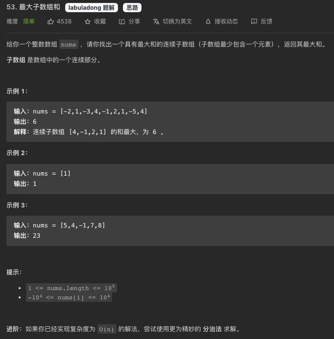
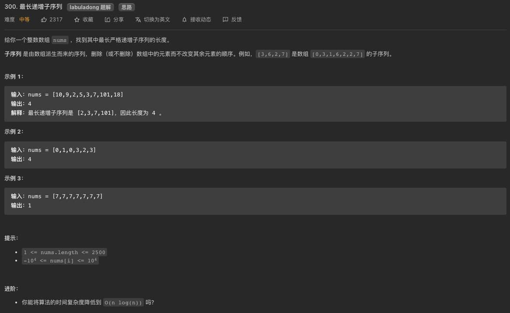

# 子序型动规

**子序型动规的最大特点是给定一个数列`[1...n]`，`dp[i]`的值通常需要看前i的元素`[1...i-1]`的选与不选的决策来决定**

?> 借着本文希望能体将子序型的动规问题扒扒皮，找出共性和解题套路来。
> 1. **敲黑板** 其实锁定一个问题是动规问题其实是不算难的，如果你确定了一个问题是个类似子序类动规问题，又是两个字符串作为输入，你几乎可以**无脑的相信**其解法`肯定是两个指针i,j分别遍历两个子串`，而且通常都是**从左往右**遍历，然后判断**s1[i]==s2[j]**时的逻辑，以及判断**s1[i]!=s2[j]**时的逻辑。
> 2. **敲黑板** 子序和子串的区别提到好几次了，子序可以是不连续的元素组合，但是原序（元素之间的位置相对关系）是要保持的，所以说像半个组合类问题；子串是连续的元素，通常子串数都是O(n^2)这个级别。

### 双子序类问题模板
> 1. **状态**：就是i和j，分别作为指针指向两个字符串s1和s2；
>       * dp[i][j]定义：`s1[0...i-1]`和`s2[0...j-1]`直接能否满足某种关系
> 1. **选择**：选择也很直白：当前字符是否要被跳过；这里肯定是要两种情况分别处理：
>       * 当s1[i]和s2[j]相等时，选择都不跳过；
>       * 当s1[i]和s2[j]不相等时，选择跳过其中一个，取其优；
> 1. **状态转移**：
> 1. **base case**：无他，看两个子串为空的时候的逻辑推理，一个子串为空的时候的逻辑推理

>深入思考一下双子序(**2022-07-04**):
>
>1. 双子序问题的**重复子问题**是啥？双子序基本上的输入的就是两个字符串(偶尔是两个数组)，让你找**子序**。两个输入的字符串嘛，就是两个”有序“集合，那么可以对这两个”有序“有序集合怎么切小法呢？这里直接给出答案吧，因为特别的套路！那就是你把其中一个字符串缩小，最小可以到空字符串。为了方便，我们把这两个”有序“集合称之为S1和S2吧。**重复子问题***的搜索方式一定是把其中一个字符串的长度缩短，比如说S1有m个字符，那么我们缩短S1成子问题的方式就是`S1[0..i]`且`0<=i<m`，同理我们可以S2成子问题的方式就是`S2[0..j]`且`0<=j<n`(S2有n个字符)，总和这两个维度，这就是你**拆分**成`m*n`个子问题的方式！现在想一下，最极端的**base case**就是S1是个空字符串(`i==-1`)并且S2也是个空字符串(`j==-1`)。
>1. 我们说过，找**最优子结构**的过程其实就是证明你的状态转换方程正确性的过程，所以我们的重点应该是怎么证明用你切小的**子问题**里求局部最优，并且这些局部最优是**互相独立**并能够**roll up**到最终的大问题的最优值的。这里重点说一下**互相独立**的方面：给你的是两个集合S1和S2，让你求的是`子序列`相关的问题，那么就必须要能保证我求解的在两个**子集**(`S1[0..i-1]`和`S2[0..j-1]`)里的`局部最值`是不会影响更大范围的**子集**(`S1[0..i]`和`S2[0..j]`)的，这个怎么做到呢？答案就是**同时单向性**遍历这两个集合，这样你就可以当你站在`S1[i]`和`S2[j]`这两个元素(`所形成的坐标点`)时，你只需要面对四种选择：`选择跳过S1[i]`，`选择跳过S2[j]`，`选择跳过S1[i]和S2[j]`，或者`选择不跳过S1[i]也不跳过S2[j]`，这4种选择就可以让你做到两个**子集**(`S1[0..i]`和`S2[0..j]`)的选择是不会影响后面更大的两个子集的决策。这就是`子序列`类题的优美之处，因为你只要保证一个**单向性**遍历，那么你面对的选择只有`跳`或者`不跳`，这就能使你还是维持原序的。
>1. 上面我们通过找**最优子结构**的解释，我们清楚地知道我们的思路要保证两个基本特性：1. **同时单向性**遍历两个集合`S1[i]`和`S2[j]`；2. 保证只做这四种选择中的一个：`选择跳过S1[i]`，`选择跳过S2[j]`，`选择跳过S1[i]和S2[j]`，或者`选择不跳过S1[i]也不跳过S2[j]`；有了这个基础，我觉得**状态转化方程**就变成背诵默写题了，因为双子序类动规题的状态转化方程真的是非常非常套路。具体答案我们上边也提到过，这里再重复一次：
>       - **状态**：就是`i`和`j`，分别作为指针指向两个字符串s1和s2；与之对应的函数就是`dp(i,j)`，或者用dp数组dp[i][j];
>       - **选择**：选择也很直白：当前字符是否要被跳过；这里肯定是要两种情况分别处理：
>           * 当`S1[i]`和`S2[j]`相等时，选择都不跳过；
>           * 当`S1[i]`和`S2[j]`不相等时，选择跳过其中一个，取其优；
>
> 到这儿了，我再告诉你一个基于目前刷过的题的一个特性：双子序动规题，全部都是只看那四种选择，所以`dp[i][j]`只可能是基于`dp[i-1][j-1]`、`dp[i-1][j]`或者`dp[i][j-1]`这三个数值，所以说你可以将二维dp数组压缩为一维，这样空间复杂度就降维打击为O(1)了。

### **刷题列表**
1. [1143 最长公共子序](#最长公共子序) 
1. [712 两字符串的删除和](#两字符串的删除和)
1. [583 两字符串的删除](#两字符串的删除)
1. [72 编辑距离](#编辑距离)
1. [97. 交错字符串](#交错字符串)  
1. [10. 正则表达式匹配（困难）](#正则表达式匹配) 
1. [44. 通配符匹配（困难）](#通配符匹配) 


### 最大子数组
[53 最大子数组](https://leetcode.com/problems/maximum-subarray/)



?> **[思路]** 这题严格说不是子序问题，而是连续子数组，但是子数组在概念上其实是子序列的一个子集。因为是连续子数组。但是这题不能用`滑动窗口`，因为你并不能保证增加或者减少窗口长度会让你的值变大，因为数组里存在负数。暴力解法的话，就是两个for循环嘛(i: 0...n-1 --> j: i..n-1)，然后打擂台找最大值。但是这题其实是O(n)就能解决的。解决子串问题吧，就要谨记**连续**这个词，所以整着遍历数组，看看以这个数结尾的子串最大和是多少？这是不是就好找多了？就是看看这个nums[i]和上一个dp[i-1]的正负关系嘛。

```js
var maxSubArray = function(nums) {

    let dp = Array(nums.length);
    dp[0] = nums[0];
    for(let i=1; i<dp.length; i++){
        //看看是nums[i]本身大还是和上一个dp值连起来大
        dp[i] = Math.max(nums[i], nums[i]+dp[i-1]);
    }

    //for循环一遍找最大值
    let res = -Number.MAX_VALUE;
    for(let i=0; i<dp.length; i++){
        res = Math.max(res, dp[i]);
    }

    return res;
};
```
```java
class Solution {
    //这题不能用滑动窗口，因为扩大或者缩小窗口并不能保证子窗口和增大（因为有负数）
    public int maxSubArray(int[] nums) {
        //用暴力法，i--> 0...n-1; j-->i...n-1 => O(n^3)
        //暴力法的一个小优化，可以用一个presum前缀和组，加快两个点[i...j]之间的和计算
        
        //优化解法是动规。subArray的特性是元素必须是连续的
        int n = nums.length;
        if(n==0) return 0;
        int[] dp = new int[n];
        dp[0] = nums[0];
        int res = dp[0];
        for(int i=1; i<n; i++){
            dp[i] = Math.max(dp[i-1]+nums[i], nums[i]);
            res = Math.max(dp[i], res);
        }
        return res;
    }
}
```


### 最长递增子序
[300 最长递增子序](https://leetcode.com/problems/longest-increasing-subsequence/)


?> **[思路]** 这题是子序动规里最经典的问题了(LIS)，而且这题的衍生题目也很多。最长增子序LIS咋整？先理解子序。就是说子序可以是不连续元素的组合，但是元素之间的原序（前后序）还是要维持的。所以要计算第i个位置的最长LIS，如果已经知道前i-1个元素每个的LIS，能否计算出来？答案是能的，因为只要遍历[0...i-1]区间里比nums[i]值小的元素，并把他们的LIS值加1（因为这个nums[i]比它大），再然后就是从这些值里找最大值, 这就是高中学的数学归纳法(mathmatical induction)。所以两个坐标指针i和j，用j指针遍历dp[0...i-1]。

```js
var lengthOfLIS = function(nums) {
    //LIS问题是经典的数学归纳法(mathmatical induction)的案例，一维dp数列找答案，然后再遍历dp数列找最终答案
    let dp = Array(nums.length).fill(1); //每个元素至少是一个单独的增子序
    //base case
    //dp[0] = 1;
    for(let i=1; i<nums.length; i++){
        for(let j=0; j<i; j++){
            if(nums[i]>nums[j]) dp[i] = Math.max(dp[i], dp[j]+1);
        }
    }
    
    //for循环一下dp数组找最大值
    let res = 1;
    for(let i=1; i<dp.length; i++){
        res = Math.max(res, dp[i]);
    }
    return res;
};
```

?> **[思路]** 上边的解法的时间复杂度是O(n^2)，还不是最佳解法，最佳解法实际上是O(n*logn)，用二分法。我在面Snowflake电面时候被问蒙了。二分法思路的一个核心思想就是维护一个subSeq的数组，这个subSeq数组思想上非常像单调递增栈，只不过这个“栈”只有在比最大元素大的时候才增长，当第i个元素值不大于“栈”里目前最大元素的时候，这时候的思想就是，找到**比这个第i个元素值大的最小值**。这里的思路你可以这么想：你想每次都能腾出点更多的空间，好使下一个i+1个元素可以被插入到这个subSeq的数组。最后这个subSeq数组实际上就是维护了最长的可能LIS，subSeq数组就应该是LIS的答案。举个例子，`[10, 11, 1,2,3]`，subSeq是最起初是`[10]`,遇到11，因为11是最大的，那就增加一个元素变成`[10, 11]`，然后遇到1，因为1不是最大，那就用二分法在subSeq数组中`去找比1大的最小元素`然后用1去replace那个元素，数组就变成了`[1, 11]`，类似的遇到2这个元素时候，数组就变成了`[1, 2]`，遇到3这个元素时候，数组就变成了`[1, 2，3]`。
```java
class Solution {
    private int[] subSeq;
    private int lastPos = 0;
    public int lengthOfLIS(int[] nums) {
        subSeq = new int[nums.length];
        subSeq[0] = nums[0];
        int res = 1;
        for(int i=1; i<nums.length; i++){
            replaceElement(nums[i]);
            res = Math.max(res, lastPos+1);
        }
        
        return res;
    }
    
    //二分法找到比target大于等于的最小值
    private void replaceElement(int target){
        if(target>this.subSeq[lastPos]) {
            this.subSeq[++lastPos] = target;
            return;
        }
        
        int left=0, right=this.lastPos;
        while(left<right){
            int mid = left +(right-left)/2;
            if(this.subSeq[mid]==target){
                return;
            } else if(this.subSeq[mid]>target){
                right = mid;
            } else {
                left = mid + 1;
            }
        }
        
        this.subSeq[left] = target;
    }
}
```

> **补充** 需要二分法时候，java里是有现成的API可以用的，而且不止数组有，集合也有；分别是，Arrays.binarySearch(arr1, targetNum)和Collections.binarySearch(list1, targetNum)；这里有一点要注意：前提是数组或者集合是有序的。
```java
class Solution {
    public int lengthOfLIS(int[] nums) {
        //类似于递增单调栈的概念
        int n = nums.length;
        int[] resultArray = new int[n];
        resultArray[0] = nums[0];
        int lastPos = 0;
        
        for(int i=1; i<n; i++){
            if(resultArray[lastPos]<nums[i]){
                lastPos++;
                resultArray[lastPos]=nums[i];
            } else {
                int pos = Arrays.binarySearch(resultArray, 0, lastPos+1, nums[i]);
                //System.out.println(pos+"|"+nums[i]);
                if(pos<0) pos = -(pos+1);
                resultArray[pos]=nums[i];
            }
        }
            
        return lastPos+1;
    }
}

//version 2: 用list
class Solution {
    public int lengthOfLIS(int[] nums) {
        //类似于递增单调栈的概念
        int n = nums.length;
        List<Integer> resultList = new ArrayList<>();
        
        for(int num : nums){
            if(resultList.isEmpty() || resultList.get(resultList.size()-1)<num){
                resultList.add(num);
            } else {
                int pos = Collections.binarySearch(resultList, num);
                if(pos<0) pos = -(pos+1);
                resultList.set(pos,num);
            }
        }
            
        return resultList.size();
    }
}
```

### 套娃问题
[354 套娃问题](https://leetcode.com/problems/russian-doll-envelopes/)
?> **[思路]** 这题就是是最长增子序(LIS)问题外加一层皮。
```java
class Solution {
    public int maxEnvelopes(int[][] envelopes) {
        //套娃问题，是LIS的一个升级版
        Arrays.sort(envelopes, (a,b)-> {
            if(a[0]==b[0]) return b[1]-a[1];
            return a[0]-b[0];
        });
        
        int[] nums = new int[envelopes.length];
        for(int i=0; i<envelopes.length; i++){
            nums[i] = envelopes[i][1];
        }
        
        return getLIS(nums);
    }
    
    private int[] subSeq;
    private int lastPos = 0;
    public int getLIS(int[] nums) {
        subSeq = new int[nums.length];
        subSeq[0] = nums[0];
        int res = 1;
        for(int i=1; i<nums.length; i++){
            replaceElement(nums[i]);
            res = Math.max(res, lastPos+1);
        }
        
        return res;
    }
    
    //二分法找到比target大于等于的最小值
    private void replaceElement(int target){
        if(target>this.subSeq[lastPos]) {
            this.subSeq[++lastPos] = target;
            return;
        }
        
        int left=0, right=this.lastPos;
        while(left<right){
            int mid = left +(right-left)/2;
            if(this.subSeq[mid]==target){
                return;
            } else if(this.subSeq[mid]>target){
                right = mid;
            } else {
                left = mid + 1;
            }
        }
        
        this.subSeq[left] = target;
    }
    
}
```

### 最长公共子序
[1143 最长公共子序](https://leetcode.com/problems/longest-common-subsequence/)


?> **[思路]** 这题是子序动规里经典的问题了(LCS)，而且这题的衍生题目也很多，这篇文章会展示两个。。

```js
var memo = [];
var longestCommonSubsequence = function(text1, text2) {
    memo = [...Array(text1.length)].map(x=> Array(text2.length).fill(0));
    return dp(text1, 0, text2, 0);
};

const dp = (s1, i, s2, j) => {

    //base case
    if(i==s1.length || j==s2.length) return 0;

    if(memo[i][j]) return memo[i][j];

    let res = 0;
    if(s1[i] == s2[j]) {
        res = 1+dp(s1, i+1, s2, j+1);
    }
    else {
        res = Math.max(
            dp(s1, i+1, s2, j),
            dp(s1, i, s2, j+1)
        );
    }
    memo[i][j] = res;
    return memo[i][j];
}
```
```java
//记忆化搜索
class Solution {
    private int[][] memo;
    public int longestCommonSubsequence(String text1, String text2) {
        //又是两个字符串作为输入，你几乎可以**无脑的相信**其解法`肯定是两个指针i,j分别遍历两个子串`，而且通常都是**从左往右**遍历，然后判断**s1[i]==s2[j]**时的逻辑，以及判断**s1[i]!=s2[j]**时的逻辑。
        memo = new int[text1.length()][text2.length()];
        for(int[] row : memo){
            Arrays.fill(row, -1);
        }
        return dp(text1, text1.length()-1, text2, text2.length()-1);
    }
    
    //返回s1[i...]和s2[j...]直接长的LCS
    private int dp(String s1, int i, String s2, int j){
        
        //base case
        if(i<0 || j<0) return 0;
        
        if(memo[i][j] != -1) return memo[i][j];
        
        int res = 0 ;
        if(s1.charAt(i)==s2.charAt(j)){
            res = 1+dp(s1, i-1, s2, j-1);
        } 
        else{
            //取最优
            res = Math.max(
                dp(s1, i-1, s2, j),
                dp(s1, i, s2, j-1)
            );
        }
        
        memo[i][j] = res;
        return res;
    }
}
```

### 两字符串的删除和
[712 两字符串的删除和](https://leetcode.com/problems/minimum-ascii-delete-sum-for-two-strings/)


```js
var memo = [];
var minimumDeleteSum = function(s1, s2) {
    memo = [...Array(s1.length)].map(x=>Array(s2.length).fill(-1));
    let s1Arr = s1.split('').map(x=>x.charCodeAt(0));
    let s2Arr = s2.split('').map(x=>x.charCodeAt(0));
    return dp(s1Arr, 0, s2Arr, 0);
};

const dp = (s1, i, s2, j) => {
    
    //base case
    if(i==s1.length) {
        let res=0;
        for(;j<s2.length;j++){
            res += s2[j];
        }
        return res;
    }
    
    if(j==s2.length) {
        let res=0;
        for(;i<s1.length;i++){
            res += s1[i];
        }
        return res;
    }
    
    if(memo[i][j]!=-1) return memo[i][j];
    //状态转化
    let res = 0;
    if(s1[i]==s2[j]) {
        res = dp(s1, i+1, s2, j+1);
    }
    else {
        res = Math.min(
            dp(s1, i, s2, j+1) + s2[j], 
            dp(s1, i+1, s2, j) + s1[i]
        );
    }
    
    memo[i][j]=res;
    return res;
}
```

### 两字符串的删除
[583 两字符串的删除](https://leetcode.com/problems/delete-operation-for-two-strings/)


```js
var minDistance = function(word1, word2) {
    let m = word1.length, n=word2.length;
    let dp = [...Array(m+1)].map(x=>Array(n+1));
    
    //先找公共子序
    //base case
    for(let j=0; j<=n; j++){
        dp[0][j] = 0;
    }
    for(let i=0; i<=m; i++){
        dp[i][0] = 0;
    }
    
    //状态转化
    for(let i=1; i<=m; i++){
        for(let j=1; j<=n; j++){
            if(word1[i-1]==word2[j-1]){
                dp[i][j] = dp[i-1][j-1]+1;
            }
            else {
                dp[i][j] = Math.max(dp[i-1][j], dp[i][j-1]);
            }
        }
    }
    
    return (m-dp[m][n]) + (n-dp[m][n]);
    
};
```


### 编辑距离
[72 编辑距离](https://leetcode.com/problems/edit-distance/)


?> **[思路]** 这题是子序动规里很经典的问题，但是也是让人看了就蒙的hard题。这题的思路和自顶向下的解法在[**这里**](./coding/memo/index?id=编辑距离)已经给出，这里给出自底向上的写法。但是说实话，我个人能写出这个自底而上的解法完全是因为能先写出这个记忆化搜索的解法。

```js
var minDistance = function(word1, word2) {
    let m = word1.length, n = word2.length;
    let dp = [...Array(m+1)].map(x=>Array(n+1).fill(0));

    //base case
    for(let j=0; j<n+1; j++) {
        dp[0][j] = j;
    }
    for(let i=0; i<m+1; i++) {
        dp[i][0] = i;
    }

    //状态转化
    for(let i=1; i<m+1; i++) {
        for(let j=1; j<n+1; j++) {
            //注意索引偏移
            if(word1.charAt(i-1) == word2.charAt(j-1)){
                dp[i][j] = dp[i-1][j-1];
            } else {
                dp[i][j] = Math.min(dp[i][j-1], dp[i-1][j], dp[i-1][j-1])+1;
            }
        }
    }
    
    return dp[m][n];
};
```

### 最长回文子序
[516 最长回文子序](https://leetcode.com/problems/longest-palindromic-subsequence/)


?> **[思路]** 这题是一个非常好的题，虽然严格意义上并不是子序类动规。不过这题求的子序，那就姑且归类在这篇里吧。解法很动规，还是先用自顶而下的记忆化搜索法解释吧，因为比较容易理解。当`s[i]==s[j]`时, 简单啊，答案就是`2 + dp(s, i+1, j-1)`。当`s[i]!=s[j]`时, 就三种情况了，分别是
1. 最长子回文序列里含有s[i];
1. 最长子回文序列里含有s[j];
1. 最长子回文序列里既不含有s[i]也不含有s[j];
?> 第三种情况可以不考虑，因为我们再找最长回文子序。自底而上的写法也是一个道理。

```js
var memo = [];
//自顶而下的记忆化搜索法
var longestPalindromeSubseq = function(s) {
    memo = [...Array(s.length)].map(x=> Array(s.length).fill(0));
    return dp(s,0,s.length-1);
};

const dp = (s, i, j) => {

    //base case
    if(i==j) return 1;
    if(i>j) return 0;

    if(memo[i][j] != 0) {
        return memo[i][j];
    }
    if(s[i]==s[j]) {
        memo[i][j] = 2 + dp(s, i+1, j-1);
    } 
    else {
        memo[i][j] = Math.max(
           dp(s, i+1, j),
           dp(s, i, j-1)
        );
    }

    return memo[i][j];
}
```

```js
//自底而上的dp数组法
var longestPalindromeSubseq = function(s) {
    let n = s.length;
    let dp = [...Array(n)].map(x=> Array(n).fill(0));

    //base case
    for(i=0; i<n; i++) {
        dp[i][i] = 1; //单个字符肯定是回文
    }

    //base case
    for(i=n-2; i>=0; i--) {
        for(j=i+1; j<n; j++){
            if(s.charAt(i) == s.charAt(j)){
                dp[i][j] = dp[i+1][j-1] + 2; 
            }
            else {
                dp[i][j] = Math.max(dp[i][j-1], dp[i+1][j]); 
            }
        }
        
    }

    return dp[0][n-1];
};
```
```java
class Solution {
    
    private int[][] memo;
    
    public int longestPalindromeSubseq(String s) {
        int n = s.length();
        memo = new int[n][n];
        
        return dp(s, 0, n-1);
    }
    
    //自顶而下 记忆化搜索
    private int dp(String s, int i, int j){
        //base case
        if(i==j) return 1;
        if(i>j) return 0;
        
        if(memo[i][j] != 0) return memo[i][j];
        
        if(s.charAt(i)==s.charAt(j)) {
            memo[i][j] = 2 + dp(s, i+1, j-1);
        } 
        else {
            memo[i][j] = Math.max(
               dp(s, i+1, j),
               dp(s, i, j-1)
            );
        }

        return memo[i][j];
        
    }
}
```
```java
class Solution {
    
    //自底而上
    public int longestPalindromeSubseq(String s) {
        int n = s.length();
        int[][] dp = new int[n][n]; //都初始化为0
        
        //base case
        for(int i=0; i<n; i++){
            dp[i][i] = 1; //字符串本身必定是回文
        }
        
        //状态转化，斜着遍历(从下往上，再从左往右)
        for(int i=n-2; i>=0; i--){
            for(int j=i+1; j<n; j++){
                if(s.charAt(i) == s.charAt(j)){
                    dp[i][j] = dp[i+1][j-1] + 2; 
                }
                else {
                    dp[i][j] = Math.max(dp[i][j-1], dp[i+1][j]); 
                }
            }
        }
        return dp[0][n-1];
    }
    
    
}
```

### 构造回文的最小插入次数
[1312 构造回文的最小插入次数](https://leetcode.com/problems/minimum-insertion-steps-to-make-a-string-palindrome/)


?> **[思路]** 这题是一个严格意义上并不是子序类动规问题。与[最长回文子序](#最长回文子序)也很有关系，解法也很类似，甚至有种解法可以直接加层皮互相解。你琢磨琢磨，`把一个字符串变成回文串的最少操作次数`是不是可以先找`这个字符串的最长回文子序`，然后把那些不在`最长回文子串`的字符进行添加一个同字符操作就可以了？关于回文串，我觉得有必要专门写一篇文章来总结一下思路。

```js

var minInsertions = function(s) {
    let n = s.length;
    let dp = [...Array(n)].map(x=>Array(n).fill(0));

    //base case
    //dp[i][i] = 0;

    //状态转化
    for(let i=n-2; i>=0; i--) {
        for(let j=i+1; j<n; j++) {
            if(s[i]==s[j]){
                dp[i][j] = dp[i+1][j-1];
            }
            else {
                dp[i][j] = Math.min(dp[i+1][j], dp[i][j-1])+1;
            }
        }
    }

    return dp[0][n-1];
};
```

### 四键键盘
[651. 四键键盘（中等）](https://www.lintcode.com/problem/867/) 


?> **[思路]** 这题是一个具有很强技巧性的问题。首先，看道题，几乎很快能确认是个动规问题，一是因为在遍历每个第i个键时你明确有四个选择，其次是这题要求求最值。照着这个思路，先思考一下这动规题的状态吧。其实有三个变量是**状态**，按键i次后屏幕上已显示的输出的A的数量`a_num`，还剩余的按键次数`N-i`次，粘贴板上的缓存`copy`，既然每步都有四个选择，那就遍历这三个变量然后择优呗。这其实就是暴力动规算法的雏形。只不过这个暴力动规算法过不了leetcode，即使你用memo记忆化搜索也过不了。然后就继续深入思考一下，其实这题的答案肯定是这样的，当N比较小时候，就直接`按A键`，直到N比较大是再按这个规律去按键：`Ctrl-A，Ctrl-C，Ctrl-V，Ctrl-V，Ctrl-V...` 既然是这样，那怎么如果你已经知道了前`i-1`次操作能得到的最大输出A的数量，你能导出第i次操作的输出A最大值吗？答案是能的，又是高中学的数学归纳法(mathmatical induction)，你只要留出两步操作给`Ctrl-A，Ctrl-C`，剩下的就一直`Ctrl-V，Ctrl-V，Ctrl-V...`。好了，那么`Ctrl-V`时粘贴板上的最大值是多少呢？这个不一定是最后一个dp[i-3]哟，举个例子，当`N=7`时，dp[3]的值应该是4，就是说屏幕上输出是`AAAA`，然后最后3个操作可以留给复制粘贴操作，最后屏幕上输出是8个A`AAAAAAAA`，也就是说dp[6]是**8**. 实际上dp[6]最优解应该是**9**，怎么做到的呢？因为`dp[2]=3`，这时候你将剩余的4个操作进行`选择``复制``粘贴``粘贴`，这样就可以粘贴两次最后屏幕上输出是`AAAAAAAAA`（9个A）。既然不能直接用dp[i-3]，那么就遍历所有之前的i-1个`dp[j]`就好了；这个`j`要从哪儿开始遍历呢？答案是**2**，因为需要留两步操作给`Ctrl-A，Ctrl-C`，你就可以这么写了：`for(int j=2; j<i; j++)`，要注意哟，你现在站在`第i个`操作键上，而你遍历的是前`i-1`个键，所以你需要看的是`dp[j-2]`的值，然后一直粘贴粘贴粘贴... 现在回头想想，其实解题思路跟[最长递增子序](#最长递增子序)题差不多，都用了数学归纳法。

```java
public class Solution {
    /**
     * @param N: an integer
     * @return: return an integer
     */
    public int maxA(int N) {
      int[] dp = new int[N];
      dp[0]=1;
      for(int i=1; i<N; i++) {
        dp[i] = dp[i-1]+1; //选择按A键，cover N比较小的状况
        for(int j=2; j<i; j++){
          // 全选 & 复制 dp[j-2]，连续粘贴 i - j 次
          // 屏幕上共 dp[j - 2] * (i - j + 1) 个 A
          dp[i] = Math.max(dp[i], dp[j - 2] * (i - j + 1));
        }
      }
      return dp[N-1];
    }
}
```

### 不同的子序列
[115. 不同的子序列](https://leetcode.com/problems/distinct-subsequences/) 
?> **[思路]** 又是两个字符串，原题有要求出个数，这个时候就要往动态规划上的思路来看问题了。俩字符串该咋整？先直接想无脑的写出`dp(s1, i, s2, j)`吧。到这儿，我们继续模板思路，dp的定义是啥呢？试一下这个`dp[i][j]`**表示s2的前j个字符s2[0...j-1] (连续的)**在s1前i个字符`s1[0...i-1]`以子序的形式出现多少次，aka就是原题要求的结果，我们根据子序型动规的套路把它子问题化了，状态就是i，j。到这儿了，该思考思考动规的状态转化方程了，还是模板思路，两个字符串的子序类动规，要考虑的就是两个字符**相等和不相等**的情况，**不相等时候**通常考虑包不包含s1[i]和包不包含s2[j]的两种情况。不过这题呢不需要考虑**包不包含s2[j]的情况了**，因为原题的定义式一定得包含(子串)。那你是否能套路的得出这个状态转化方程呢？s1[i]==s2[j]时`dp[i][j]=dp[i-1][j-1]+dp[i-1][j]`，s1[i]！=s2[j]时`dp[i][j]=dp[i-1][j]`。这个怎么理解呢？就是说任何字符，我们都**最多**有两种选择。假设s1[i]！=s2[j]，那没办法，只能让s1移到下一位，因为字符s1[i]肯定不能用嘛，用了就没法让s2是s1的子序了；s1[i]==s2[j]时`，那我们就有两种选择了，选择1就像俩字符不match时候选择不用字符s1[i]对吧？选择2呢就是选择用这个s1[i]字符，那么i和j就有同时右移一位。最后呢，按照动规的模板思路，思考一下base case。其实很简单，那就是dp[i][0]=1，因为s2为空字符串，就是一种s1的子序列。相应的，dp[0][j]=0，因为s1为空字符串，那么s2的长度大于s1肯定不是子序列。
```java
class Solution {
    public int numDistinct(String s, String t) {
        int m=s.length(), n=t.length();

        int[][] dp = new int[m+1][n+1];

        for(int i=0; i<=m; i++)
            dp[i][0] = 1;

        for(int i=1; i<=m; i++)
            for(int j=1; j<=n; j++){
                if(s.charAt(i-1)==t.charAt(j-1))
                    dp[i][j] = dp[i-1][j-1] + dp[i-1][j];
                else 
                    dp[i][j] = dp[i-1][j];
            }

        return dp[m][n];
    }
}
```
```java
//记忆化搜索写法
class Solution {

    int[][] memo;
    public int numDistinct(String s, String t) {
        int m=s.length(), n=t.length();
        memo = new int[m+1][n+1];
        for(int i=0; i<=m; i++)
            Arrays.fill(memo[i], -1);
        return dp(s,0,t,0);
    }

    private int dp(String s, int i, String t, int j){

        //base case
        if(j>=t.length()) return 1;
        if(i>=s.length()) return 0;

        if(memo[i][j] != -1) return memo[i][j];
        int res = dp(s,i+1,t,j);
        if(s.charAt(i)==t.charAt(j))
            res += dp(s,i+1,t,j+1);
        //memo[i][j] = res;
        return memo[i][j] = res;
    }
}
```

### 交错字符串
[97. 交错字符串](https://leetcode.com/problems/interleaving-string/) 
> **[思路]** 这题不是两个字符串，而是三个，懵逼了吧？不过呢，思路是和两个字符串是一模一样的。原题要求出个数，往动态规划上的思路看问题了是第一步，不过子序类动规题刷多了，其实看个并不难。题目说看看`s3`是否是由`s1`和`s2`**交错**组成的。该咋整？先直接想无脑的写出`dp(s1, i, s2, j)`吧。到这儿，我们继续模板思路，dp的定义是啥呢？我们先无脑的试试照着原题语义来：`dp[i][j]`表示s3的前i+j个字符是否是由`s1[0...i-1]`和`s2[0...j-1]`交错组成的。那你是否能思考一下这题的状态转化方程呢？dp[i][j]是不是true，应该由两种情况来决定？
> 1. 情况一：dp[i-1][j]是true，并且s3[i+j-1]==s1[i-1]。就是说只有当s3的第i+j个字符和s1的第i个字符相等，并且dp[i-1][j]也是true（也就是说，s3的前`i+j-1`个字符是否是由`s1[0...i-2]`和`s2[0...j-1]`交错组成的）;
> 1. 情况二：dp[i][j-1]是true，并且s3[i+j-1]==s2[j-1]。就是说只有当s3的第i+j个字符和s2的第j个字符相等，并且dp[i][j-1]也是true（也就是说，s3的前`i+j-1`个字符是否是由`s1[0...i-1]`和`s2[0...j-2]`交错组成的）;
> 理解完了状态转化方程，再来看看base case吧。
> 1. 情况一：dp[0][0]是true，啥意思呢？两个空字符串一定能交错组成s3这个空字符串;
> 1. 情况二：dp[i][0]]是否为true，取决于s3[i-1]是否等于s1[i-1]并且dp[i-1][0]是否为true。因为这时候s2是空字符串，没有所谓交错，完全取决于s1;
> 1. 情况三：dp[0][j]]是否为true，取决于s3[j-1]是否等于s2[j-1]并且dp[0][j-1]是否为true。因为这时候s1是空字符串，没有所谓交错，完全取决于s2;
| (i,j) |  | d | b | b | c | a | 
| ---- |:-:| :-:| :-:|:-:| :-:| :-:|
|      | T | F | F | F | F | F | 
| a    | T | F | F | F | F | F | 
| a    | T | T | T | T | T | T |
| b    | F | T | T | F | T | F | 
| c    | F | F | T | T | T | T | 
| c    | F | F | F | T | F | T | 
所以`aadbbcbcac`是由`dbbca`和`aabcc`交错组成的。

> 到这儿了，就直接看代码吧：
```java
class Solution {
    public boolean isInterleave(String s1, String s2, String s3) {
        int m=s1.length(), n=s2.length();
        if(m+n!=s3.length()) return false;
        
        boolean[][] dp = new boolean[m+1][n+1];

        dp[0][0] = true;
        for(int i=1; i<=m; i++)
            dp[i][0] = dp[i-1][0] && s3.charAt(i-1)==s1.charAt(i-1);

        for(int j=1; j<=n; j++)
            dp[0][j] = dp[0][j-1] && s3.charAt(j-1)==s2.charAt(j-1);
        
        for(int i=1; i<=m; i++)
            for(int j=1; j<=n; j++)
                dp[i][j] = (dp[i-1][j] && s3.charAt(i+j-1)==s1.charAt(i-1))
                        || (dp[i][j-1] && s3.charAt(i+j-1)==s2.charAt(j-1));

        return dp[m][n];
    }
}
```
```java
//你可以这么写：检查i>0 && (p.charAt(j-1) == '.' || s.charAt(i-1) == p.charAt(j-1))
class Solution {
    public boolean isMatch(String s, String p) {
        int m=s.length(), n=p.length();
        boolean dp[][] = new boolean[m+1][n+1];

        for(int i=0; i<=m; i++) 
            for(int j=0; j<=n; j++){
                if(i==0 && j==0){
                    dp[i][j] = true; //空字符串可以匹配空字符串；
                    continue;
                }
                if(j==0){
                    dp[i][j] = false; //空字符串的pattern，不肯能匹配任何s；
                    continue;
                }
                if(p.charAt(j-1) == '*') {
                    dp[i][j] = dp[i][j-1]; 
                    continue;
                }
                
                if(i>0 && (p.charAt(j-1) == '.' || s.charAt(i-1) == p.charAt(j-1))){
                    //看下一位字符是否是‘*’
                    if(j<n && p.charAt(j) == '*'){
                         //匹配0个字符或者多个
                        dp[i][j] |= dp[i][j-1] || dp[i-1][j];
                    }
                    else {
                        //匹配单字符
                        dp[i][j] |= dp[i-1][j-1];
                    }
                }
                else {
                    //看下一位字符是否是‘*’
                    if(j<n && p.charAt(j) == '*'){
                        //匹配0个字符
                        dp[i][j] |= dp[i][j-1];
                    } else {
                        dp[i][j] = false;
                    }
                }

                /*
                if(p.charAt(j-1) != '*'){
                    //要看s[i]是否p[j]理论上相等
                    if(i>0 && (p.charAt(j-1) == '.' || s.charAt(i-1) == p.charAt(j-1)))
                        dp[i][j] = dp[i-1][j-1];
                } 
                else {
                    //要看匹配0个字符还是多个字符
                    //1. 相当于匹配0个字符
                    if(j-2>=0) dp[i][j] |= dp[i][j-2]; 
                    //2. 根据s[i]和p[j]是否理论上相等来决定是否可以匹配多个字符
                    if(i>0 && j>=2) dp[i][j] |= dp[i-1][j] && (p.charAt(j-2) == '.' || s.charAt(i-1) == p.charAt(j-2)); 
                }
                */

            }
        return dp[m][n];
    }
}
```

### 正则表达式匹配
[10. 正则表达式匹配（困难）](https://leetcode.com/problems/regular-expression-matching/) 
> **[思路]** 这是一道经典的不能经典的子序类问题了，比起[编辑距离]()这种经典题，这题不止经典而且实用。为啥这是个子序类问题呢？如果你有点儿懵逼，也不要太计较，听我娓娓道来。如果你还记得[双子序类问题模板](#双子序类问题模板)的经典状态转移方法，那里说状态转移方程需要看`s1[i]`和`s2[j]`是否相等而分别处理。正则表达式的核心概念就是有万能匹配符，所以这里`s1[i]`和`s2[j]`**是否相等**就需要一些特殊操作了。`s1[i]`和`s2[j]`**是否相等**在有通配符的情况下改如何处理呢？
> 1. 如果literally`s1[i]`==`s2[j]`，太棒了，这时候看`dp(s1,i+1,s2,j+1)`就行了；
> 1. 如果s2[j]字符是`'.'`，这也是变相的说明`s1[i]`==`s2[j]`，依旧很棒不是吗？也是看`dp(s1,i+1,s2,j+1)`就行了；
> 1. 如果s2[j]字符是`'*'`，这就是传说中的**wild card外卡**了，这里就要分两种情况来讨论了，这两种情况也正是为什么正则算是子序类动规问题的核心：
>       * 可以匹配s1里的**0个字符**；也就是说可以用`dp(s, i, p, j+2)`，这里注意j是指在`'*'`前面的那个字符，j+2意思是把`c*`这个pattern一起跳过了；
>       * 可以匹配s1里的**1个或者多个字符**；也就是说可以用`dp(s, i+1, p, j)`，意思是j不动，跳过当前s1[i]这个字符；
>       * 这里能否跳0个或者多个，要先看是否能否达到理论上的`s1[i]`==`s2[j]`；
>
> 如果你想看记忆化搜索的写法，请看[这里](./coding/memo/index?id=正则表达式匹配)。这里扯了一堆，而且多数用的记忆化搜索时候的一些语法逻辑来解释的，下面看看自底而上的迭代写法长啥样吧：
```java
class Solution {
    public boolean isMatch(String s, String p) {
        int m=s.length(), n=p.length();
        boolean dp[][] = new boolean[m+1][n+1];

        for(int i=0; i<=m; i++) 
            for(int j=0; j<=n; j++){
                if(i==0 && j==0){
                    dp[i][j] = true; //空字符串可以匹配空字符串；
                    continue;
                }
                if(j==0){
                    dp[i][j] = false; //空字符串的pattern，不肯能匹配任何s；
                    continue;
                }

                if(p.charAt(j-1) != '*'){
                    //要看s[i]是否p[j]理论上相等
                    if(i>0 && (p.charAt(j-1) == '.' || s.charAt(i-1) == p.charAt(j-1)))
                        dp[i][j] = dp[i-1][j-1];
                } 
                else {
                    //要看匹配0个字符还是多个字符
                    //1. 相当于匹配0个字符
                    if(j-2>=0) dp[i][j] |= dp[i][j-2]; 
                    //2. 根据s[i]和p[j]是否理论上相等来决定是否可以匹配多个字符
                    if(i>0 && j>=2) dp[i][j] |= dp[i-1][j] && (p.charAt(j-2) == '.' || s.charAt(i-1) == p.charAt(j-2)); 
                }

            }
        return dp[m][n];
    }
}
```

### 通配符匹配
[44. 通配符匹配（困难）](https://leetcode.com/problems/wildcard-matching/) 
> **[思路]** 又是一道经典题，跟[正则表达式匹配](#正则表达式匹配)几乎是一模一样的思路，请见上题加深理解。还是理论上的相等：1. `s1[i]==s2[j]`；2. s2[j]字符是`'？'`；不过这题会出现连续`'*'`的情况，要预处理连续的`'*'`成一个`'*'`，要不放在状态转化时候处理起来很麻烦。
```java
class Solution {
    public boolean isMatch(String s, String p) {
        // remove consecutive * 
        StringBuilder sb = new StringBuilder();
        for(int i=0; i<p.length(); i++){
            if(i>0 && p.charAt(i)=='*' && p.charAt(i-1)=='*')
                continue;
            sb.append(p.charAt(i));
        }

        p = sb.toString();
        //System.out.println(p);

        int m=s.length(), n=p.length();
        boolean[][] dp = new boolean[m+1][n+1];
        dp[0][0] = true;
        for(int j=1; j<=n; j++)
            dp[0][j] = dp[0][j-1] && p.charAt(j-1)=='*';
        
        for(int i=1; i<=m; i++)
            for(int j=1; j<=n; j++){
                if(p.charAt(j-1) == '?' || s.charAt(i-1) == p.charAt(j-1)){
                    dp[i][j] = dp[i-1][j-1];
                } else {
                    if(p.charAt(j-1)=='*'){
                        //匹配0个或者多个
                        // j-1：as if ths '*' doesn't exist --> match 0 char
                        // i-1：as if ths s.charAt(i-1) doesn't exist --> match 1+1+1+1... char
                        dp[i][j] = dp[i][j-1] || dp[i-1][j]; 
                    } else {
                        dp[i][j] = false;
                    }
                    
                }
            }
        

        return dp[m][n];
    }
}
```
