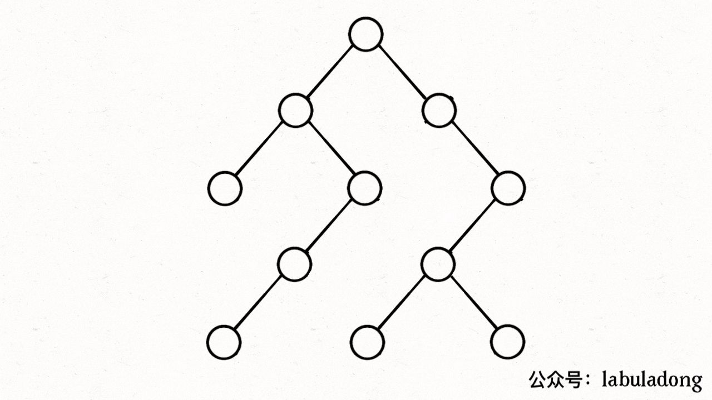

# 图论基础

**引言** 图真的没啥高深的，本质上就是个高级点的多叉树而已，适用于树的 DFS/BFS 遍历算法，全部适用于图。关于图，面试中通常用邻接表和邻接矩阵来实现。

> 比如说下图：
>
> 
>
> 它的邻接链表和邻接矩阵可以是：
> 
> 
>
> 对于邻接表，好处是占用的空间少。你看邻接矩阵里面空着那么多位置，肯定需要更多的存储空间。但是，邻接表无法快速判断两个节点是否相邻。
>
> 在常规的算法题中，邻接表的使用会更频繁一些，主要是因为操作起来较为简单。
>
> 由于有向图的边有方向，所以有向图中每个节点「度」被细分为入度（indegree）和出度（outdegree），比如下图：
>
> 

> **各种数据结构被发明出来无非就是为了遍历和访问，所以「遍历」是所有数据结构的基础。**
>
> 先来说说多叉树吧，多叉树的特性决定了它是一个有向图，而且多叉树是说只有父节点指向子节点的指针，所以遍历的时候是`不会走回头路的`。话不多说，直接看看多叉树的遍历框架吧：
```js
/* 多叉树遍历框架 */
const traverse = (root) => {
    if(!root) return;

    for(const child of root.children){
        traverse(child);
    }
}
```
> 有了这个作为铺垫，那就看看怎么遍历图吧。图和多叉树最大的区别是，图是可能包含环的，你从图的某一个节点开始遍历，有可能走了一圈又回到这个节点。所以，如果图包含环，遍历框架就要一个`visited`数组进行辅助，以免进入死循环。
```js
// 记录被遍历过的节点
let visited = [];
// 记录从起点到当前节点的路径
let onPath = [];

/* 图遍历框架 */
const traverse = (graph, s) => {
    if(visited[s]) return;

    visited[s] = true;
    // 经过节点 s，标记为已遍历
    visited[s] = true;
    // 做选择：标记节点 s 在路径上
    onPath[s] = true;
    for (let neighbor of graph.neighbors(s)) {
        traverse(graph, neighbor);
    }
    // 撤销选择：节点 s 离开路径
    onPath[s] = false;
}
```

> 上述 GIF 描述了递归遍历二叉树的过程，在`visited`中被标记为`true`的节点用灰色表示，在`onPath`中被标记为`true`的节点用绿色表示，这下你可以理解它们二者的区别了吧。
>
>
>