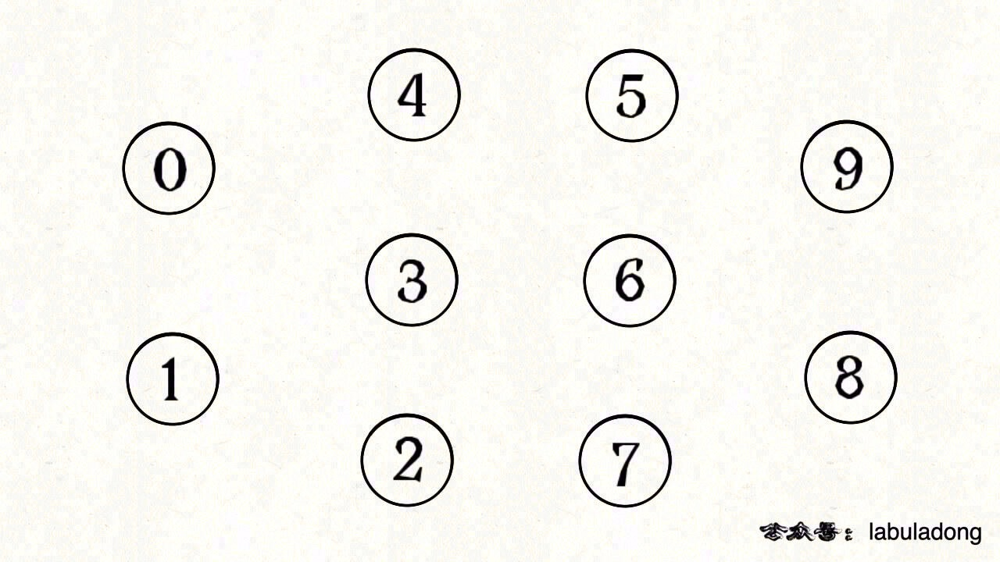
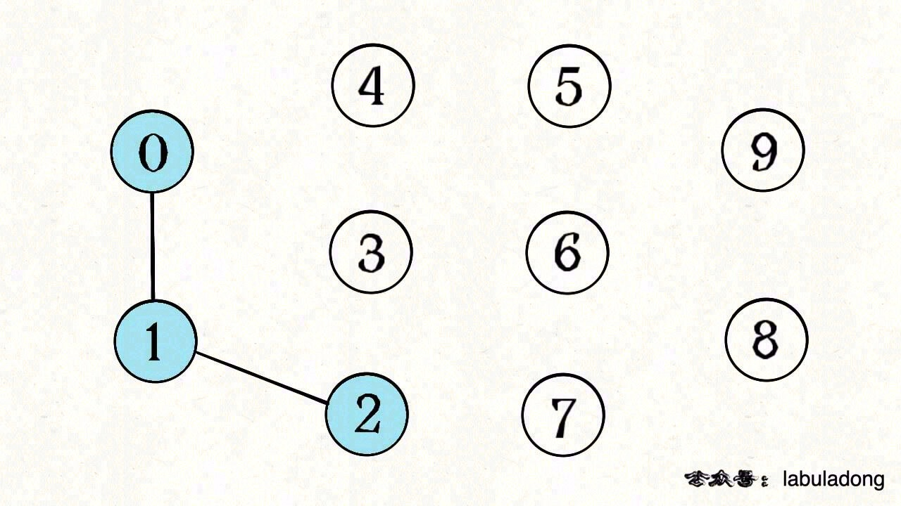
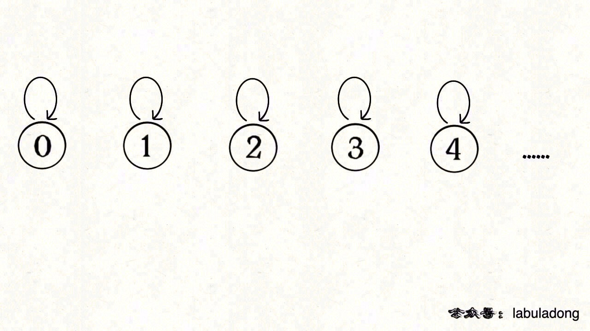
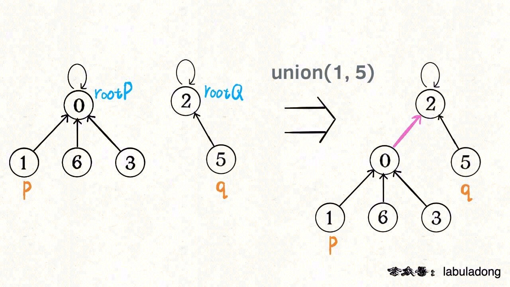
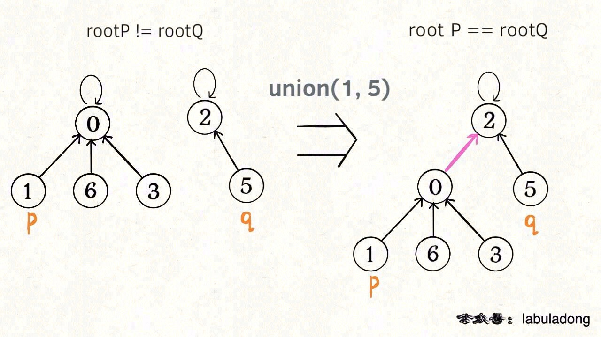
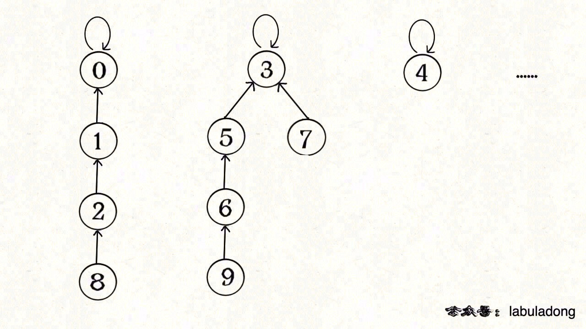

# 并查集 Union-Find

**UnionFind应用更新(2023-10-06)** 并查集UnionFind主要解决图论中`动态连通性`的问题，这个所谓的`动态连通性`问题，其实在面试题中的应用非常多，这个更新主要就是正对面试中的一些具体问题来的：
> 最近看了这篇[大神文章](http://toughcoder.net/blog/2022/09/08/disjoint-set-data-structure/)，深有感触，扯着热度扯两句自己对于UnionFind的理解。这部分用几个实际的例题，来阐述一下UnionFind这个数据结构的优雅！
>
> 1. 给你一个同义词集合，比如说：`synonyms = [('main', 'primary'),('main', 'first'),('first', 'primary'),('first', 'initial'),('rating', 'score'), ('count', 'number')]`，然后很快的你发现这些近义词各成一派，比如说`('main', 'primary', 'first', 'initial')`是一组的，`('rating', 'score')`是另一组。到这儿你是否感觉到**disjoint**的性质了？如果题里需要经常问某两个词是否为近义词，这时候其实就是**find**函数了。
>
>       - 其实find不止是能快速判断两个词是否为近义词，而且而且**一个近义词组里会有同一个祖师爷root**，这样的话如果你需要保证一个近义词组总是返回同一个代表，那root就最合适不过了！
>       - 你当然可以用一个邻接链表来维护这个近义词组，就比如说：`synonyms_adjacency_list = {'main': ['primary', 'first'], 'primary': ['main', 'first'], 'first': ['main', 'primary', 'initial'],'initial': ['first'], ...}`，然后DFS遍历这个邻接链表，会很容易得到`[{'main', 'primary', 'first', 'initial'}, {...}]`，然后当你需要选择一个代表出来的时候，你可以把这个集合sort一下然后取第一个元素。
> 1. 再来个经典的，[200. 岛屿数量](https://leetcode.com/problems/number-of-islands/)，这题我是很熟悉了，因为这是带我走进奇妙的BFS算法的第一道题。当然了，后来发现DFS来遍历这个“矩阵图”似乎更容易一些。今天呢，我们就说说这题的**disjoint**性。给你一个矩阵，比如说`grid = [
  ["1","1","0","0","0"],
  ["1","1","0","0","0"],
  ["0","0","1","0","0"],
  ["0","0","0","1","1"]
]`, 0代表水，1代表陆地，让你求岛屿的数量。
>
>       - 岛屿嘛，至少说明两个岛直接是被水分开的，这一下就找到**disjoint**性了对不对？
>       - 通常在并查集数据结构里，维护一个count函数，来记录一共有多少个**disjoint set**，这不一下就得到答案了吗？
>       - 那怎么初始化这个**disjoint set**呢？简单啊，一共以后M*N个节点，那就遍历这M*N个节点，当遇到`'1'`时候，就把节点的parent设成自己（注意二维坐标转成一维坐标），然后怎么union呢？再遍历这个M*N个节点呗，然后遇到`'1'`时只需要往右和往下看看自己的邻居是不是也是1就union；
>       - 这题告诉我们，**disjoint set**里维护一个count来表示一共有多少个集合是很有用的。
> 1. 继续延伸一个，[695. 岛屿的最大面积](https://leetcode.com/problems/max-area-of-island/)，这里跟上题思路很类似，不过这次问的不是**disjoint set**里有几个集合，而是**disjoint set**里的集合中那个最大或者人数最多。这就需要我们维护一个所谓的rank，中文叫**秩**，别那么玄乎，就是一个单独的disjoint set里有多少个元素。
>       - 怎么维护呢这个**秩**呢？初始化的时候，每个元素自称一派，所以数量肯定是1，然后union连个元素的时候，就是把左子树和右子树的元素数量相加呗。
> 1. 来个稍微带点难度的了，[128. 最长连续序列](https://leetcode.com/problems/longest-consecutive-sequence/)，这题乍看上去跟**disjoint set**不沾边，最容易想到的还是用BFS方法来做，那就是把元素都放进一个set里，然后变量每一个元素（遍历到了就拿走），BFS的neighbor就是元素的数字+1或者-1是否在集合里。那怎么往**disjoint set**上思考呢？
>       - 假设给你`nums =[100,4,200,1,3,2，101]`，如果你把这个集合分散成`[{100， 101},{4,1,3,2},{200}]`，这样答案是否就显而易见了？这不正是**disjoint set**吗？那怎么维护这个**disjoint set**呢？
>       - 把元素都放进一个set里，然后遍历。遇到100就看看101和99在不在集合里，如果在那就union，不在就略过；最后**disjoint set**就只有`[{100， 101}, {4,1,3,2}]`，union时候记得维护rank**秩**，最大的**秩**就是答案
> 1. 来个难度加加的吧，[399. 除法求值](https://leetcode.com/problems/evaluate-division/)，这题算是困难级别的了：
>       - 给你输入：equations = [["a","b"],["b","c"]], values = [2.0,3.0], queries = [["a","c"],["b","a"],["a","e"],["a","a"],["x","x"]]
>       - 意思是：`a / b = 2.0, b / c = 3.0`，那么问你`a / c = ?, b / a = ?, a / e = ?, a / a = ?, x / x = ?`，结果是`[6.0, 0.5, -1.0, 1.0, -1.0 ]`
>       - 这题你应该很快意识到是个“图的遍历”的题，根本的含义是**看能否从一个节点找到另一个节点**，这个能理解对吧？
>       - “图的遍历”嘛，直接无脑去思考DFS呗。`a / b = 2.0`表示什么？说明a->b有路径，加权值为2.0，反过来b->a也有路径，加权值为2.0的倒数，也就是0.5... 就按这个思路建图，用过hashmap搞定建图，再用DFS来搜索路径，这个应该是很经典了。
>       - 怎么用**disjoint set**的思路解题呢？这里就必须提到这点：**并查集可以维护有向加权图和带权**，因为有点复杂，我们一步一步来拆解：
>           - `a / b = 2.0`可以这么来表达：顶点a→b，权重是2.0，这样的话可以用`parent[a]=b，weight[a]=2.0`来表示;
>           - 并查集的特点是让每个节点元素都直接与其根节点关联，由此来提高查询和合并的效率，所以必须要解决通过节点与根节点的关系，然后根据节点跟root节点的比重，可以得出两个节点的比重。比如，`a / b = 2.0, c / b = 3.0`，即`parent[a]=b, weight[a]=2.0; parent[c]=b, weight[c]=3.0`，这就说明`a / c = 2b / 3b = weight[a] / weight[c]`，也就是2.0/3.0;
>           - 线性的路径合并时也有技巧：比如说给你`a / b = 2.0, b / c = 3.0, c / d = 4.0`，顶点关系是**a→b→c→d**，经过路径压缩后，会变成`parent[a]=parent[b]=parent[c]=d`,即**a→d**的合并权重是2.0×3.0×4.0=24.0
>           - 合并和求出缺失权重：比如说给你`a / b = 2.0, d / c = 3.0`，这是两个集合 `parent[a]=b，parent[d]=c` 是disjoint的，现在再给你`a / d = 4.0`，两个集合union起来了，这时候需要把b的parent设成c即`parent[b]=c`，这样一来就变成了a→b→c 和a→d→c，a有两条路径可达c，显然这两条路径的权重应该一样，那么便有`2.0*x=3.0×4.0`，即b→c的权重为6.0，

**并查集应用** 并查集主要解决图论中`动态连通性`的问题，可以用来算Kruskal算法的最小扩展树，用在编译器判断同一个变量的不同引用，或者用在社交网络中的朋友圈计算等等。

!> **总结** 何谓动态连通性？假设给你10个点，他们互不相连，如下图：
> 
> 因为任意两个不同的点都不连通，所以它的`连通分量`就是10.
> 
> 如果现在调用`union(0, 1)`，那么 0 和 1 被连通，连通分量降为 9 个； 再调用`union(1, 2)`，这时 0,1,2 都被连通，调用`connected(0, 2)`也会返回 true，连通分量变为 8 个。

> **Union-Find**要实现两个API，一个是Union，一个是connected：
```js
class UnionFind {
    constructor(){

    }
    
    union(p, q) {
        /* 将 p 和 q 连接 */
    }

    connected(p, q) {
        /* 判断 p 和 q 是否连通 */
    }

    count() {
        /* 返回图中有多少个连通分量 */
    }

}
```
> 这里所说的「连通」是一种等价关系，也就是说具有如下三个性质：
> 1. 自反性：节点 p 和 p 是连通的。
> 1. 对称性：如果节点 p 和 q 连通，那么 q 和 p 也连通。
> 1. 传递性：如果节点 p 和 q 连通，q 和 r 连通，那么 p 和 r 也连通。

> 怎么用森林来表示连通性呢？我们设定树的每个节点有一个指针指向其父节点，如果是根节点的话，这个指针指向自己。比如说刚才那幅 10 个节点的图，一开始的时候没有相互连通，就是这样：
> 
>
> 用数组来具体实现这个森林:
```js
class UnionFind {
    constructor(n){
        // 一开始互不连通
        this.count = n;
        this.parent = Array(n);
        // 父节点指针初始指向自己
        for (int i = 0; i < n; i++)
            parent[i] = i;
    }
    
    union(p, q) {
        /* 将 p 和 q 连接 */
    }

    connected(p, q) {
        /* 判断 p 和 q 是否连通 */
    }

    count() {
        /* 返回图中有多少个连通分量 */
        return this.count;
    }

}
```
!> **如果某两个节点被连通，则让其中的（任意）一个节点的根节点接到另一个节点的根节点上**：
 
**如果节点 p 和 q 连通的话，它们一定拥有相同的根节点**：
 
我们加一个函数`find`来协助找个节点的root：
```js
class UnionFind {
    constructor(n){
        // 一开始互不连通
        this.count = n;
        this.parent = Array(n);
        // 父节点指针初始指向自己
        for (int i = 0; i < n; i++)
            parent[i] = i;
    }
    
    union(p, q) {
        /* 将 p 和 q 连接 */
    }

    find(x) {
        /* 返回某个节点 x 的根节点  */
        // 根节点的 parent[x] == x
        while(parent[x] != x){
            x= parent[x];
        }
        return x;
    }

    connected(p, q) {
        /* 判断 p 和 q 是否连通 */
        let rootP = find(p);
        let rootQ = find(q);
        return rootP == rootQ;
    }

    count() {
        /* 返回图中有多少个连通分量 */
        return this.count;
    }

}
```

> 至此，Union-Find 算法就基本完成了。是不是很神奇？竟然可以这样使用数组来模拟出一个森林，如此巧妙的解决这个比较复杂的问题！find 主要功能就是从某个节点向上遍历到树根，其时间复杂度就是树的高度。我们可能习惯性地认为树的高度就是 logN，但这并不一定。logN 的高度只存在于平衡二叉树，对于一般的树可能出现极端不平衡的情况，使得「树」几乎退化成「链表」，树的高度最坏情况下可能变成 N。
 
> 所以说上面这种解法，find , union , connected 的时间复杂度都是 O(N)。这个复杂度很不理想的，你想图论解决的都是诸如社交网络这样数据规模巨大的问题，对于 union 和 connected 的调用非常频繁，每次调用需要线性时间完全不可忍受。

?> 问题的关键在于，如何想办法避免树的不平衡呢？**其实我们并不在乎每棵树的结构长什么样，只在乎根节点**。这里的技巧就是`路径压缩`。直接上最后答案把，建议背诵!
 
```js
class UnionFind {
    constructor(n){
        // 一开始互不连通
        this.count = n;
        this.parent = Array(n);
        // 父节点指针初始指向自己
        for (int i = 0; i < n; i++)
            this.parent[i] = i;
    }
    
    union(p, q) {
        /* 将 p 和 q 连接 */
        let rootP = find(p);
        let rootQ = find(q);
        
        if (rootP == rootQ)
            return;
        
        this.parent[rootQ] = rootP;
        // 两个连通分量合并成一个连通分量
        this.count--;
    }

    find(x) {
        /* 返回某个节点 x 的根节点  */
        // 根节点的 parent[x] == x
        // 这行代码进行路径压缩
        if (this.parent[x] != x){
            this.parent[x] = find(this.parent[x]);
        }
        return this.parent[x];
    }

    connected(p, q) {
        /* 判断 p 和 q 是否连通 */
        let rootP = find(p);
        let rootQ = find(q);
        return rootP == rootQ;
    }

    count() {
        /* 返回图中有多少个连通分量 */
        return this.count;
    }
```

?> **总结** Union-Find 算法的核心逻辑，总结一下我们优化算法的过程：
1. 用 parent 数组记录每个节点的父节点，相当于指向父节点的指针，所以 parent 数组内实际存储着一个森林（若干棵多叉树）。
1. 用 size 数组记录着每棵树的重量，目的是让 union 后树依然拥有平衡性，保证各个 API 时间复杂度为 O(logN)，而不会退化成链表影响操作效率。
1. 在 find 函数中进行路径压缩，保证任意树的高度保持在常数，使得各个 API 时间复杂度为 O(1)。使用了路径压缩之后，可以不使用 size 数组的平衡优化。
