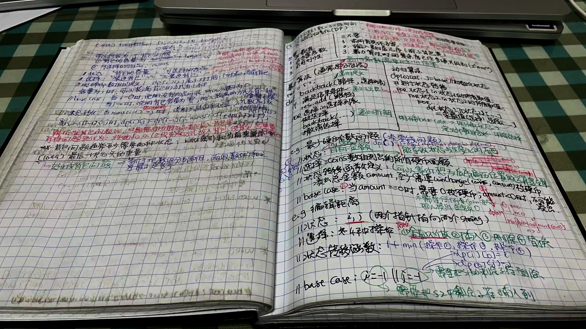

# 刷刷刷

不止不觉中刷题已经半年有余了，这时候是时候记录一下所有面过的公司了:
1. **Meta**: 基本上就是没准备好，面E6给E5也是说明Recruiter不是很给力啊！
1. **Noom**: 也算是自己为了面Meta而练手的，不过说实话他们的面试流程还是很不错的；
    * 电面1轮2轮循序渐进，1轮出个简单算法题，类似于两层循环嵌套，2轮叫做Problem Solving，其实主要是面了个**外排序**；
    * onsite两轮挂了，主要就是没准备好OODesign和System Design；
1. **Narvar**: 当时也是纯练手，offer给的包也不理想，base 215，bonus 10%, RSU太少40k左右
    * 3轮：都特别直接了当
1. **Amazon**:
    * 第一次是个EKS的相关职位，而且头一次被一个Principle电面了，着实有点激动，但确实没准备好。不过那个Principle还是给了好评说适合SA；
    * 第二次面的是AWS的CloudFront，电面还挺正常，但是onsite兼职糟糕极了！不好算法，只考OODesign；
1. **Google**: 电面1过了，电面2挂了；
1. **Slack**: 这个公司给一个code review的PR，说实话不是很喜欢这种面试方式！
1. **Wayfair**: 电面给了个滑动窗口题，很顺利；然后是跟Hiring Manager，叫`Peter Kapner`，这哥们儿**纯傻逼**一个，给我的提示就是不要跟这种人谈的太高屋建瓴。
1. **Instacart**: 电面就挂了，着实有点意外。
1. **Microsoft**: 
    * 第一次是Viva的一个职位，说实话面的很不错，只不过他们可能是本来对外招也就是走走流程，最后内部调人了；
    * 第二次面的是Teams的职位，电面挂了；总的感觉Microsoft的面试很不规则，也不系统；
1. **Ripple**:
1. **Snowflake**: 两轮电面都不错，只不过hiring slowdown了；
1. **Rippling**:
1. **Uber**:
1. **Oracle**:
1. **Robinhood**: 没开始面呢，就hiring slowdown了；
1. **Convoy**:

