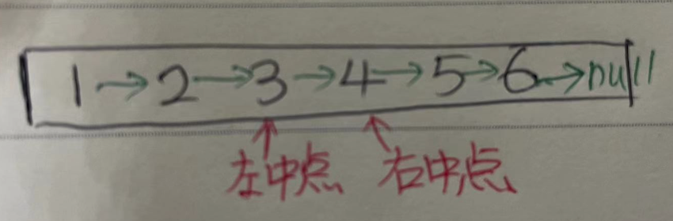

# 关于链表的一些小技巧
##### 本文主要总结刷链表题时候用的一些小技巧.
- [找链表中点](#找链表的中点)  
- [dummy虚拟头结点](#dummy虚拟头结点)  
- [迭代遍历反转链表](#迭代遍历反转链表)
- [刷题列表(16道)](#刷题列表)

#### **找链表`中点`**
**关于中点，当链表长度为偶数的时候，其实有两个意义的`中点`，如下图所示：**


```js
// 左中点右中点完全是while循环的条件决定
const getListLeftMid = (head) => {
    let slow=head, fast=head;
    while (fast.next && fast.next.next) { //这里循环接收停止的节点是左中点
        slow=slow.next;
        fast=fast.next.next;
    }
    // slow停止在左中点上
    return slow;
}

const getListRightMid = (head) => {
    let slow=head, fast=head;
    while (fast && fast.next) { //这里循环接收停止的节点是右中点
        slow=slow.next;
        fast=fast.next.next;
    }
    // slow停止在右中点上
    return slow;
}
```

#### **`dummy虚拟`头结点**
**与其写好多的if条件检查头指针是否为空，不如直接init一个虚拟的dummy节点，然后返回时候用dummy.next**

[21.合并两个链表](https://leetcode.com/problems/merge-two-sorted-lists/)
```js
var mergeTwoLists = function(list1, list2) {
    let p=list1, q=list2;
    let dummy = new ListNode(-1); //两个链表，说不定有哪个为空
    let prev = dummy;
    while(p && q) {
        if(p.val<q.val){
            prev.next = p;
            prev=p;
            p=p.next;
        }
        else {
            prev.next = q;
            prev=q;
            q=q.next;
        }
    } 
    
    if(p) prev.next=p;
    if(q) prev.next=q;
        
    return dummy.next; //记得返回dummy.next哟
}
```
####  **`迭代`遍历反转链表**

[25.K个一组翻转链表](https://leetcode.com/problems/reverse-nodes-in-k-group)
```js
/** 反转区间 [a, b) 的元素，注意是左闭右开 */
const reverse = (a, b) => {
    let pre, cur, nxt; //三个节点，前，当，后
    pre = null; cur = a; nxt = a;
    while (cur != b) {
        //重点：更新时候一定要按照**前，当，后**的顺序去更新，要不需要借助额外参数
        nxt = cur.next;
        cur.next = pre;
        pre = cur;
        cur = nxt;
    }
    // 返回反转后的头结点
    return pre;
}
```
**Caution** : Please adopt one of the above in your project, otherwise it might bring some unexpected complications. I have personally tried mixing `async-redis` and `bluebird` to promisify redis comms, which leads to scenarios like `only native reids client works`.

####  **刷题列表**

[61.旋转链表](https://leetcode.com/problems/rotate-list/) **`Notes`** 迭代可解题，但是记得如果k大于链表长度，用取模进行递归唷.

[86.切割链表](https://leetcode.com/problems/partition-list/) **`Notes`** 迭代可解题，也不用额外的两个不同的q来维护，要原地修改.

[143.重排序链表](https://leetcode.com/problems/reorder-list/) **`Notes`** 先找中点，再分割成两个链表，然后对第二个链表反转，最后把两个两边进行合并操作.

[19.删除倒数第k个节点](https://leetcode.com/problems/remove-nth-node-from-end-of-list/) **`Notes`** 两个指针，第一个先走k步，然后第二个开始走，这样第一个指针到达终点需要n-k步，这时候第二个到达倒数第k个点.

[141.链表环](https://leetcode.com/problems/linked-list-cycle/) **`Notes`** 快慢指针找环.

[142.链表环II](https://leetcode.com/problems/linked-list-cycle-ii/) **`Notes`** 找环开始的位置，非常有技巧性，请参阅[这里](https://labuladong.github.io/algo/2/18/17/).

[206.反转链表](https://leetcode.com/problems/reverse-linked-list/) **`Notes`** 迭代反转，递归翻转呢？非常有技巧性.
```js
/**
 * @param {ListNode} head
 * @return {ListNode}
 */
var reverseList = function(head) {
    if(!head || !head.next) return head;
    
    let last = reverseList(head.next);
    //后序遍历
    head.next.next = head; //重点：这里是技巧
    head.next=null
    
    return last;
};
```
[92.反转链表II](https://leetcode.com/problems/reverse-linked-list-ii/) **`Notes`** 用递归写非常有意思，请参阅[这里](https://labuladong.github.io/algo/2/18/18/).

[234.回文链表](https://leetcode.com/problems/palindrome-linked-list/) **`Notes`** 迭代可解题，但是用递归更有意思.

[876.链表中点](https://leetcode.com/problems/middle-of-the-linked-list/) **`Notes`** 经典快慢双指针.

[83.删除链表重复元素](https://leetcode.com/problems/remove-duplicates-from-sorted-list/) **`Notes`** 双指针，以前以后，很有技巧性.
```js
var deleteDuplicates = function(head) {
    
    if (!head) return null;
    let fast=head, slow=head;
    while(fast){
        if(slow.val != fast.val) {
            slow.next = fast;
            slow = slow.next;
        }
        
        fast = fast.next;
    }
    
    // 断开与后面重复元素的连接
    slow.next = null;
    return head;
};
```

[25.K个一组翻转链表](https://leetcode.com/problems/reverse-nodes-in-k-group)

[24.两两交换节点](https://leetcode.com/problems/swap-nodes-in-pairs/) **`Notes`** 两个指针，第一个先走k步，然后第二个开始走，这样第一个指针到达终点需要n-k步，这时候第二个到达倒数第k个点.

[21.合并两链表](https://leetcode.com/problems/merge-two-sorted-lists/) **`Notes`** 用不着heap.

[23.k路归并有序链表](https://leetcode.com/problems/merge-k-sorted-lists/) **`Notes`** 用heap，或者两两合并，或者递归形式两两合并.

[160.两链表交点](https://leetcode.com/problems/intersection-of-two-linked-lists/) **`Notes`** 把两个链表连起来，请参阅[这里](https://labuladong.github.io/algo/2/18/17/).

