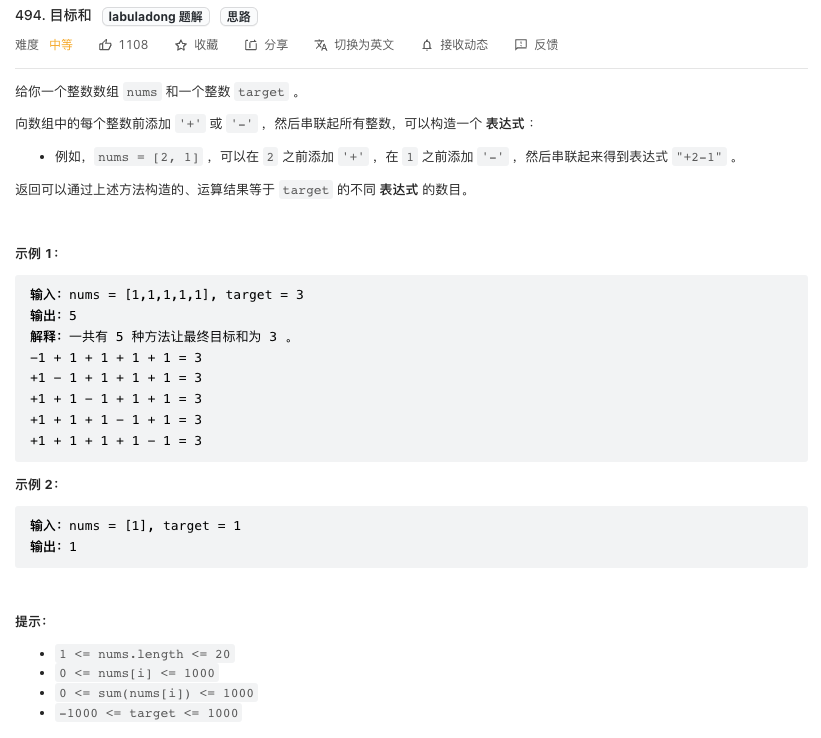
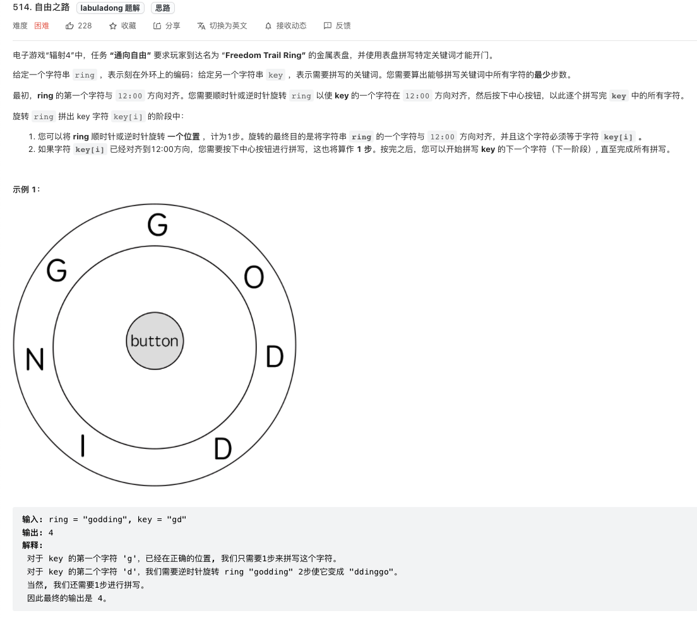
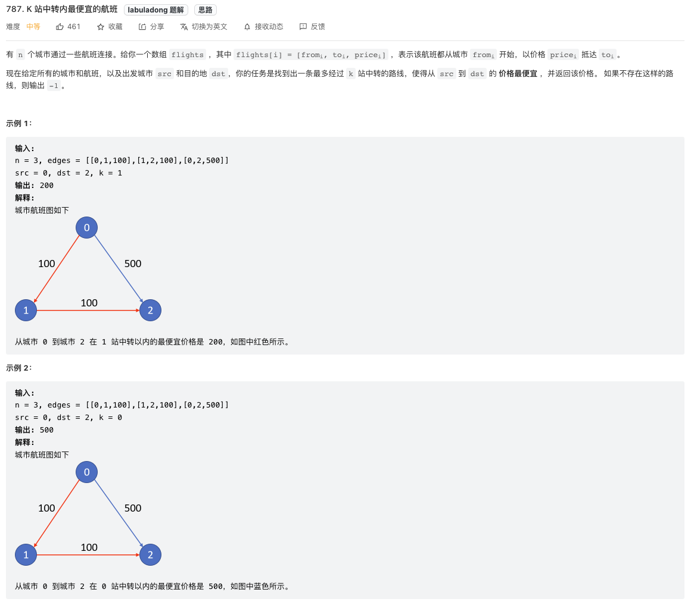
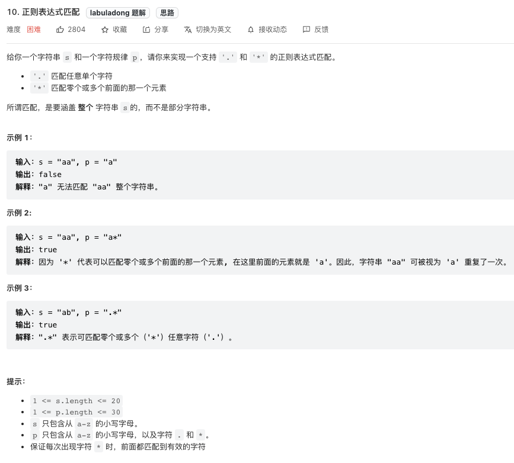
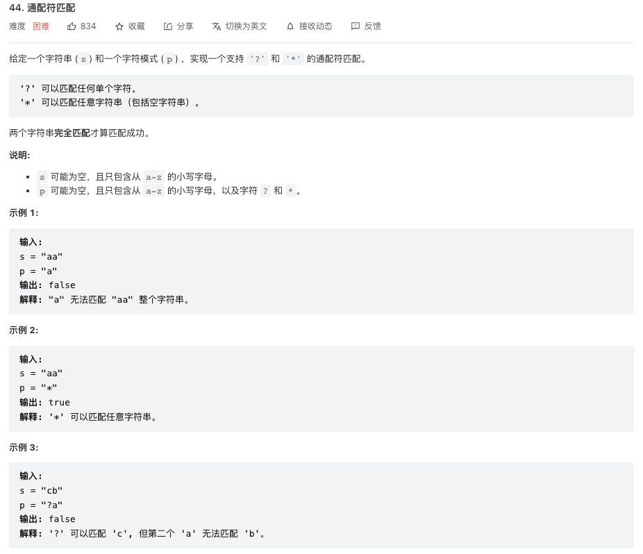

# 记忆化搜索 --> 就是动规
### **先BB两句**.
**记忆化搜索就是动规。从本质上讲，这两个是完全一个东西，都是对最优子结构问题处理方式。记忆化搜索是自顶而下的一种思维，而传统的动态规划则是一种自底向上的思维方式。记忆化搜索的思维似乎看着不是那么玄乎，但是据我个人经验，不是每道题都能将记忆化搜索转化成自底向上的动规思维，尤其是题中的起点或者终点不容易确定的时候，或者子问题的个数不能提前确定的时候.**

?> 借着本文希望能体现记忆化搜索高大上的地方。

!> **敲黑板** 回溯框架没有分治版的，我这里多次提到回溯框架的分治版实际上指的是带返回值的dp函数定义，这种定义写的时候非常像回溯模板，只不过`做选择`的结果会直接传入递归的下一层，所以也就没有必要`撤销选择`了。这些传入递归的下一层参数，自变量参数就是所谓的动规的`状态`，而dp函数本身通过`遍历选择`进行一个`状态转化方程`，这个dp函数的递归出口就是所谓的`base case`。

现在回头看看自底而上动规的模板框架：
```js
# 初始化 base case
dp[0][0][...] = base
# 进行状态转移
for 状态1 in 状态1的所有取值：
    for 状态2 in 状态2的所有取值：
        for ...
            dp[状态1][状态2][...] = 求最值(选择1，选择2...)
```
其实所谓的dp函数就是这个for循环迭代遍历写法的`递归版写法`。总结一下，就会长得下面这个样子：
```js
var memo = []
const dp(路径，选择列表，状态1，状态2，...){
    //base case 递归出口
    if(满足结束条件，比如说状态1已结遍历完) return 0；//一个base case对应的已知值

    if(memo[状态1][状态2][...] != 特定值) return memo[状态1][状态2][...];
    let res=所求最值得对立面；
    for(const 选择 of 选择列表){
        let subproblem = dp(路径，选择列表，状态1’，状态2‘，...)；
        //后序处理subproblem跟当前递归层的逻辑关系，就是状态转化方程
        //e.g., res += subproblem;
        求最值（res, subproblem);
    }

    memo[状态1][状态2][...] = res;
    return res;
}
```
> 总结一下跟回溯模板的不同：没有explicitly的`做选择`和`撤销选择`，因为`做选择`和`撤销选择`的步骤被直接当参数传去下一层了，这些参数也只是所谓的`状态`，可以用作memo里的索引。

#### **刷题列表**
1. [494. 目标和（中等）](#目标和) 
1. [514. 自由之路（困难）](#自由之路)
1. [787. K站中转内最便宜的航班（中等）](#K站中转内最便宜的航班)
1. [10. 正则表达式匹配（困难）](#正则表达式匹配) 
1. [44. 通配符匹配（困难）](#通配符匹配) 
1. [72. 编辑距离](#编辑距离)
1. [领扣107 单词拆分]() https://www.lintcode.com/problem/107/
1. [领扣683 单词拆分 III]() https://www.lintcode.com/problem/683/
1. [领扣305 矩阵中的最长递增路径](#矩阵中的最长递增路径) 

##### 目标和
[494. 目标和（中等）](https://leetcode.com/problems/target-sum/) 



?> **[思路]** 这里展示一下用记忆化搜索的思路，先看看暴力枚举怎么做。以下写法实际上是回溯框架的递归版写法。

> **误区** 这个题很容易搞混题意，主要是看上去很像组合问题。组合问题是个O(2^n)的时间复杂度问题，因为组合是个子序问题；而排列问题是O(n!)的时间复杂度问题，因为排列是个子序问题而且还可以回头；而这个题的要点是要理解每个元素都只有两个选择（+或者-），而且每个元素只能用一次，说白了有点像子串问题，时间复杂度是O(n^2)。延伸一下，切个字符串成子串（注意不是子序列）的时间复杂度是多少？其实是O(n^2)。

[example.js](../snippets/example.js ":include")

**[思路]** 有了暴力搜索做铺垫，可否进行记忆化搜索剪枝呢？答案是可以的，因为进入同一个[index,curSum]组合的路径有多条，比如说例题（nums[1,1,1,1,1], target=3），进入[1,1]的可能路径有(+1-1+1 -->),(-1+1+1 -->),(+1+1-1 -->)，所以记忆化剪枝肯定有作用。怎么建memo实际也是个熟能生巧的活儿，因为这就是再找所谓的动态`状态`。此题的`状态`有两个：index和curSum。建memo通常是个数组，一维二维都常见，但是这题的话用hashmap更合适，这样就不用算curSum最大的范围了。最后不同一句，这题实际上直接变形成自顶向上的动规写法是有难度的，但是如果能把问题转化成`背包`问题，可能就好写多了。但是我个人觉得除非高手，一下能把这题转化为背包问题的思路可能并不好想到。
```js
var memo = {};
var findTargetSumWays = function(nums, target) {
    memo = {};
    return dp(nums, target, 0, nums.length-1);
};

const dp = (nums, target, curSum, index) => {

    if(index<0 && target==curSum) {
        return 1;
    }
    
    if(index<0) {
        return 0;
    }
    
    if(memo[index+'_'+curSum] != undefined || memo[index+'_'+curSum] != null) 
        return  memo[index+'_'+curSum];
    
    //这里选择列表就两种：+ nums[startIdx] 或者 - nums[startIdx]
    let negative = dp(nums, target, curSum-nums[index], index-1);
    let positive = dp(nums, target, curSum+nums[index], index-1);
    
    memo[index+'_'+curSum] = positive+negative;
    return positive+negative;

}
```
##### 自由之路
[514. 自由之路（困难）](https://leetcode.com/problems/freedom-trail/) 


**[思路]** 这题乍一看实际上蒙的，但是仔细想想吧，题里提到`顺时针或逆时针旋转`，这其实就是一个选择列表。这题是hard是有原因的，因为看原题连暴力算法甚至都很那下手，更何况直接去找状态、状态转化方程、以及base case了。不妨转化一下原题：圆盘固定，我们可以拨动指针；现在需要拨动指针并按下按钮，最少可以多少次操作输入key字符串？

先说说经验法则吧，当看到题目里有两个字符串作为输入时，第一反应就是两个指针i和j，分别指向两个字符串的开头。不妨在脑子里直接有一个dp(str1, i, str2, j)的函数概念。顺着这个思路，顺着题的原语义，看看能不能把函数的定义明确出来。比如说这题，可以这样思考：当圆盘指针指向ring[i]时，输入字符串key[j...]至少需要多少步操作？

这题还有一个陷阱，当圆盘指针指向ring[i]时，操作它达到字符串key[j]的计算是很简单的，其实就是比较一下顺时针还是逆时针，哪个操作步骤少。但是问题不是这样的，比如说这个case：`ring=‘gdonidg’，key=‘di’`,这种情况下即使左边的‘d'离得近，也应该去右边的’d'，因为右边‘d’的旁边就是‘i’，整体操作少。

有了这些，我觉得至少可以开始写暴力算法了。核心还是个分治版的回溯框架，只不过不需要explicitly做选择和撤销选择，因为`做选择`和`撤销选择`的步骤被直接当参数(i,j)传去下一递归层了。
```js
var charToIdx = {};
var findRotateSteps = function(ring, key) {
    charToIdx = {};
    //init charToIdx以便于计算距离
    for(let i=0; i<ring.length; i++){
        if(charToIdx[ring.charAt(i)]){
            charToIdx[ring.charAt(i)].push(i);
        } else {
            charToIdx[ring.charAt(i)] = [i];
        }
    }
    
    return dp(ring, 0, key, 0);
};

//当圆盘指针指向ring[i]时，输入字符串[j...]至少需要多少步操作
const dp = (ring, i, key, j) => {
    //base case
    if(j>=key.length) return 0;
    
    let res = Number.MAX_VALUE;
    let targets = charToIdx[key.charAt(j)]; //可能含有重复的字符
    for(const target of targets){
        
        let dist = Math.abs(i-target);
        //先比较顺时针还是逆时针
        let cost = Math.min(dist, ring.length-dist);
        let subproblem = dp(ring, target, key, j+1);
        res = Math.min(res, 1+cost+subproblem); //按键本身也是1步操作
    }
    
    return res;
}
```

**[思路]** 暴力算法写出来了，看看怎么记忆化吧。举个例子，ring=‘caotmcaataijjxi’，key=‘oatjiioicitatajtijciocjcaaxaaatmctxamacaamjjx’，这个到达[i,j]的路径可以是（i+delta,j),也可以是（i，j-1），所以一定存在重复子问题。记忆化写法就是直接用一个二维dp数组做记忆化搜索剪枝。
```js
var memo = [];
var charToIdx = {};
var findRotateSteps = function(ring, key) {
    memo=[...Array(ring.length)].map(x=>Array(key.length).fill(-1));
    charToIdx = {};
    //init charToIdx以便于计算距离
    for(let i=0; i<ring.length; i++){
        if(charToIdx[ring.charAt(i)]){
            charToIdx[ring.charAt(i)].push(i);
        } else {
            charToIdx[ring.charAt(i)] = [i];
        }
    }
    
    return dp(ring, 0, key, 0);
};

const dp = (ring, i, key, j) => {
    //base case
    if(j>=key.length) return 0;
    
    if(memo[i][j] != -1) return memo[i][j];
    
    let res = Number.MAX_VALUE;
    let targets = charToIdx[key.charAt(j)]; //可能含有重复的字符
    for(const target of targets){
        
        let dist = Math.abs(i-target);
        //先比较顺时针还是逆时针
        let cost = Math.min(dist, ring.length-dist);
        let subproblem = dp(ring, target, key, j+1);
        res = Math.min(res, 1+cost+subproblem); //按键本身也是1步操作
    }
    
    memo[i][j] = res;
    return res;
}
```

##### K站中转内最便宜的航班
[787. K站中转内最便宜的航班（中等）](https://leetcode.com/problems/cheapest-flights-within-k-stops/) 


**[思路]** 用文学词汇讲，这题叫坐标型动规题，就是在有向加权图里找最短路径。这个题很好理解，看完题可以直接撸出一个dp函数定义来：dp(d, src, dst, graph, k)表示从src到d最多走k个中专站的最便宜路径。这题不管是从src往dst一步一步推，还是反过来从dst一步一步回推到src，思路都是一样的，都能得到正确答案。这题用自底向上的动规写法很难写，主要是因为不知道subproblem有几个。这个dp函数中的状态是d和k。

```js
var findCheapestPrice = function(n, flights, src, dst, k) {
    //先构建邻接表图
    let graph = [...Array(n)].map(x=>[]);
    for(const flight of flights){
        let from = flight[0];
        let to = flight[1];
        let price = flight[2];
        
        graph[from].push([to, price]);
    }
    
    return dp(src, src, dst, graph, k+1);
};

//依旧是分治法dp函数
//dp函数定义，从src到dst最多走k个中专站的最便宜路径
//有最优子结构，到达dst的上一层到达dst的路径有最优
const dp = (d, src, dst, graph, k) => {
    
    //base case
    if(d == dst) return 0;
    
    if(k==0) return -1;
    
    //做选择
    let res = Number.MAX_VALUE;
    for(const nxt of graph[d]){
        let price = nxt[1];
        
        let subproblem = dp(nxt[0], src, dst, graph, k-1);
        // 跳过无解的情况
        if(subproblem != -1) {
            res = Math.min(res, price + subproblem);
        }
    }
    
    res = (res == Number.MAX_VALUE) ? -1 : res;
    return res;
}
```
加上记忆化搜索就是
```js
var memo;
var findCheapestPrice = function(n, flights, src, dst, k) {
    memo = [...Array(n)].map(x=>Array(k+2).fill(-666));
    //先构建邻接表图
    let graph = [...Array(n)].map(x=>[]);
    for(const flight of flights){
        let from = flight[0];
        let to = flight[1];
        let price = flight[2];
        
        graph[from].push([to, price]);
    }
    
    return dp(src, src, dst, graph, k+1);
};

//依旧是分治法dp函数
//dp函数定义，从src到dst最多走k个中专站的最便宜路径
//有最优子结构，到达dst的上一层到达dst的路径有最优
const dp = (d, src, dst, graph, k) => {
    
    //base case
    if(d == dst) return 0;
    
    if(k==0) return -1;
    
    if(memo[d][k] != -666) return memo[d][k];
    //做选择
    let res = Number.MAX_VALUE;
    for(const nxt of graph[d]){
        let price = nxt[1];
        
        let subproblem = dp(nxt[0], src, dst, graph, k-1);
        // 跳过无解的情况
        if(subproblem != -1) {
            res = Math.min(res, price + subproblem);
        }
    }
    
    res = (res == Number.MAX_VALUE) ? -1 : res;
    memo[d][k] = res;
    return res;
}
```
##### 正则表达式匹配
[10. 正则表达式匹配（困难）](https://leetcode.com/problems/regular-expression-matching/) 



?> **[思路]** 经典问题了，背过都可以。又是两个字符串，凭经验也应该快速写出对应的dp函数`dp(s, i, p, j)`，然后顺着语义把这个dp函数定义清楚，`dp返回s[i...]是否匹配p[j...]`，这样暴力解法就出来了。再把memo加进去，一个正宗的记忆化搜索解法就出来了。说实话，这题如果用一个二维dp数组写，着实没有用记忆化搜索模板写出来容易理解。

> 此题写法中比没有检查越界的问题，使用为javascript会自动处理这些越界问题。

```js
var memo = [];
var isMatch = function(s, p) {
    memo = [...Array(s.length)].map(x=>Array(p.length));
    return dp(s, 0, p, 0);
};

//两个字符串，哈哈
//定义：返回s[i...]是否匹配p[j...]
const dp = (s, i, p, j) => {
    
    //base case
    if(j>=p.length) return i==s.length;
    
    if(i==s.length){
        if((p.length-j)%2 !=0) return false;
        //看剩余的是否为x*y*z*的pattern
        for(;j<p.length;j++){
            if((p.length-j)%2==1 && p.charAt(j)!='*'){
                return false;
            }
        }
        
        return true;
    }

    // 记录状态 (i, j)，消除重叠子问题
    if(memo[i][j] != null &&  memo[i][j] !== undefined) return memo[i][j];
    let res = false;
    
    if(s.charAt(i) == p.charAt(j) || p.charAt(j)=='.'){
        if(p.charAt(j+1)=='*'){
            //看后面是否有通配符，可以匹配0个或者多个
            res = dp(s, i, p, j+2) || dp(s, i+1, p, j);
        } else {
            //匹配单字符
            res = dp(s, i+1, p, j+1);
        }
        
    } else {
        //不匹配单字符
        if(p.charAt(j+1)=='*') {
            //只可以匹配0个
            res = dp(s, i, p, j+2);
        } else {
            //匹配已经失败
            res = false;
        }
    } 
    return res;
}
```
##### 通配符匹配
[44. 通配符匹配（困难）](https://leetcode.com/problems/wildcard-matching/) 



?> **[思路]** 又是一个经典问题，跟[正则表达式匹配](#正则表达式匹配)非常类似。这个题还是我们的经典成名思路：又是两个字符串，凭经验也应该快速写出对应的dp函数`dp(s, i, p, j)`，哈哈。然后再顺着原题语义把这个dp函数定义清楚，`s[i...] 是否能被p[j...]匹配`，这样暴力解法就出来了。再把memo加进去，一个正宗的记忆化搜索解法就出来了。再说一次，这题我其实根本没想过用dp数组自底而上来写代码。

> 这题一个小技巧就是先把连续的'*'通配符trim成一个，这样会加速计算通过leetcode大哥。

```js
var memo;
var isMatch = function(s, p) {
    memo = [...Array(s.length)].map(x=>Array(p.length));
    //trim off consecutive *
    let pA = [];
    let pre='';
    for(let i=0; i<p.length; i++){
        let c = p.charAt(i);
        if(c!='*' || (c=='*' && pre!='*')){
            pA.push(c);
            pre=c;
        }
    }
    p = pA.join('');
    return dp(s, 0, p, 0);
};

//dp定义：s[i...] 是否能被p[j...]匹配
const dp = (s, i, p, j) => {
    //base case
    if(j==p.length) return i==s.length;
    
    if(i==s.length) {
        //看是否只剩'*'通配符
        for(;j<p.length;j++){
            if(p.charAt(j)!='*') return false;
        }
        
        return true;
    }
    
    // 记录状态 (i, j)，消除重叠子问题
    if(memo[i][j] != null &&  memo[i][j] !== undefined) return memo[i][j];
    
    let res = false;
    //做选择
    if(s.charAt(i)==p.charAt(j) || p.charAt(j)=='?'){
        res = dp(s, i+1, p, j+1);
    } 
    else if (p.charAt(j)=='*') {
        //可以匹配0个字符或者多个字符
        res = dp(s, i+1, p, j) || dp(s, i, p, j+1); //分别代表多个和0个
    } 
    else {
        res = false;
    }
    
    memo[i][j] = res;
    return res;
}
```
### 编辑距离
[72. 编辑距离](https://leetcode.com/problems/edit-distance/)


?> **[思路]** 这题是子序动规里很经典的问题，但是也是让人看了就蒙的hard题。不过还是按照套路来嘛，又是两个字符串的问题，凭经验也应该快速写出对应的dp函数`dp(s1, i, s2, j)`，然后顺着语义把这个dp函数定义清楚，`dp函数代表s1[0...i]和s2[0...j]之间的最小编辑距离`，然后接下来就是套我们记忆化搜索模板。这题需要注意的是，其实选择列表有四个选项，增删替，还有就是啥都不做。这题的自底而上解法会在[**这里**](./coding/dp/subsequence?id=编辑距离)给出，但是说实话，我个人能写出这个自底而上的解法完全是因为能先写出这个记忆化搜索的解法。

```js
var memo;
var minDistance = function(word1, word2) {
    memo = [...Array(word1.length)].map(x=>Array(word2.length));
    return dp(word1, word1.length-1, word2, word2.length-1);
};

const dp = (s1, i, s2, j) => {
    //base case
    if(i<0) return j+1;
    if(j<0) return i+1;

    if(memo[i][j] != null && memo[i][j] !== undefined) return memo[i][j];

    //选择列表
    let res = 0;
    if(s1.charAt(i) == s2.charAt(j)) {
        res = dp(s1, i-1, s2, j-1); //啥都不做就是最好的编辑距离
    }
    else {
        res = Math.min(
            dp(s1, i-1, s2, j), //增
            dp(s1, i, s2, j-1), //删
            dp(s1, i-1, s2, j-1), //替换
        ) + 1; //都是一个操作，所以加1
    }
    memo[i][j] = res;
    return res;
}
```
### 矩阵中的最长递增路径
[领扣305 矩阵中的最长递增路径](https://www.lintcode.com/problem/305/)
> **思路** 这题如果你要是硬是想用自底而上的dp数组写法，我几乎肯定你写不出来。但是通过审题，你应该很容易发现这是一道动规题，题目中说`路径可以以矩阵中任何一个坐标作为起点`，所以如果你想自定而上写，那base case初始化的条件是啥？你是否想到了LIS那题？[最长递增子序](./coding/dp/subsequence?id=#最长递增子序)，那题的好处就是可以初始base case，但是每次都还是要回头看某个元素的所有之前的元素。这题有点类似，比较无脑的想法就是，

```java
public class Solution {
    /**
     * @param matrix: A matrix
     * @return: An integer.
     */
    private static int[][] MOVES = {{-1,0},{1,0},{0,-1},{0,1}};
    private int[][] memo;
    public int longestIncreasingPath(int[][] matrix) {
        // Write your code here.
        if (matrix == null || matrix.length == 0 || matrix[0].length == 0) {
            return 0;
        }
        
        int m = matrix.length, n=matrix[0].length;
        memo = new int[m][n];
        int res = 0;
        for(int i=0; i<m; i++){
           for(int j=0; j<n; j++) {
               int interim = longestIncreasingPath(matrix, i, j);
               res = Math.max(res, interim);
           }
        }

        return res;
    }

    private int longestIncreasingPath(int[][] matrix, int i, int j) {
       int m = matrix.length, n=matrix[0].length;

       if(memo[i][j]>0) return memo[i][j];

       memo[i][j] = 1;
       //DFS进行到底
       for(int[] move : MOVES){
           int x = i+move[0];
           int y = j+move[1];

           if(x<0 || y<0 || x>=m || y>=n){
               continue;
           }

           if(matrix[i][j]>=matrix[x][y]) continue;

           memo[i][j] = Math.max(memo[i][j], 1+longestIncreasingPath(matrix, x, y));

       }

       return memo[i][j];
    }
}
```