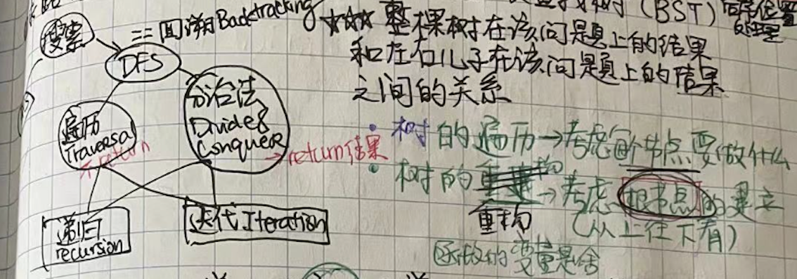

# 关于二叉树，是所有高级图论算法的基础

##### 知识要点.

- [二叉树解题全靠套路](#二叉树解题全靠套路)
- [我告诉你遍历回溯分治动规](#我告诉你遍历回溯分治动规)
- [二叉树解题九章模板](#二叉树解题九章模板)

### **二叉树解题全靠套路**

**大学里的数据结构课只是告诉我们，前序中序和后序遍历二叉树的结果，所以我在之后很长的一段时间里一直觉得所谓`traversal`就是对应三种(前中后序)不同的`List<Integer>`列表。直到去年(2021)底，我才在读了[这篇文章](https://labuladong.github.io/algo/2/19/22/)之后重新正确认识了`traversal`。其实前序中序后序遍历二叉树，实际上是代表过程中处理每个节点的三个`特殊时间点`，如下图所示：**


> 如图所示，每个节点都有`唯一`属于自己的前中后序位置，而且所有二叉树的问题，其实就是让你在前中后序位置注入巧妙地代码逻辑。

> 二叉树题目几乎全是 dfs 的问题，而且递归的框架只有下面一个。从思路上说，二叉树的题目有两类思路：遍历法和分治法。遍历法就是说遍历一遍二叉树就能得出答案，具体到代码里就是 traverse 函数通常不用 return 一个结果；分治法是则不同，要通过分界问题计算答案，所以函数里要返回响应的`result`以便于应用。
>
> 如果进阶一点思考：如果你能够告诉我，**快速排序就是个二叉树的前序遍历，归并排序就是个二叉树的后序遍历，**那说明你悟透了所谓前中后序遍历的思想精髓了。

> **[更新 2022-10-08]**：两个多月没刷题，手似乎生了些。又从二叉树开始刷，现在来谢谢二次进入的体会吧。二叉树的题套路真的很强，几乎都是可以用**遍历法**和**分治法**两种不同的思维去解题。这里说说关于上下文 contexts 的传递，因为有两种思维可行，也就是说**自顶而下**或者**自下而上**。经典题就是[98. 验证二叉搜索树（中等）](https://leetcode.com/problems/validate-binary-search-tree/)，给你一个二叉树的跟，问你这个树是否为 BST。判断是否为 BST，你可以这么表述：**这个根节点的左儿子值<根值<右儿子值，外加左子树是 BST 且右子树也是 BST**，其实这些条件还是不够的，因为你的左子树的右向分支里可能存在比你大的节点；这样的话更严格的表达是这样的：**左子树的所有节点的值都必须小于根节点的值，右子树的所有节点的值都必须大于根节点的值，外加左子树是 BST 且右子树也是 BST**，这段表达里隐含了两层意思，判断左右子树都是 BST 隐含了递归性，左右子树的判断需要知道当前根节点的值，隐含这个值要传递下去。这里就说说**如何将`根`节点的值传递下去的思路**，你仔细思考一下的话，这个传递下去的意思是一个线性的过程，往左传递，你要保证这个值一直减小的，不然的话你可能已经返回 false 了，同理往右传递，你要保证这个值一直增大的，不然的话你也已经返回 false 了；照着这个思路，你应该能写出下边代码：

```python
class Solution:
    def isValidBST(self, root: Optional[TreeNode]) -> bool:
        def validate(node, min, max):
            if not node:
                return True
            if not min<node<max:
                return False
            return validate(node.left, min, node.val) \
                    and validate(node.right, node.val, max)

        return validate(root, float('-inf'), float('inf'))
```

> 这是明显的前序遍历写法，那么能否用后续遍历的思维来写呢？这就是**自下而上**的思路了。在回顾一下这个条件**左子树的所有节点的值都必须小于根节点的值，右子树的所有节点的值都必须大于根节点的值**，那么你这么思考，如果我能够指导一个`子树`的所有值的区间，那么是不是就很容易判断他们与根节点值得关系了？要知道一个子树的所有值的区间，DFS 肯定是能够给到你答案的，比如说一个子树[1]，那么它的值区间就是`[1,1]`; 一个子树[2,1,3]，那么它的值区间就是`[1,3]`。这里有个技巧就是当你遇到空节点的时候，怎么合理的定义它的值域呢？`return (True, float('inf'), float('-inf'))`这句 statement 就是关键，也就是它的值域是`[正infinity, 负infinity]`，这样做的主要目的就是它的父节点比空节点的最小值小且比最大值大，现在直接看代码吧：

```python
class Solution:
    def isValidBST(self, root: Optional[TreeNode]) -> bool:
        def validate(node):
            if not node:
                return (True, float('inf'), float('-inf'))
            # 先判断左子树
            left = validate(node.left)
            if not left[0]:
                return (False, None, None)
            # 判断右子树
            right = validate(node.right)
            if not right[0]:
                return (False, None, None)

            # 后序判断与当前根节点node的关系
            if left[2] < node.val < right[1]:
                cur_min = min(node.val, left[1])
                cur_max = max(node.val, right[2])
                return (True, cur_min, cur_max)
            return (False, None, None)
        return validate(root)[0]
```

> 你细品一下，后序遍历的时候我们要把子结果返回回来，这就是**分治思想**！
>
> 当然了还有另一种传递 contexts 的思想，那就是比较简单粗暴的方法：**用 global 参数**，这个嗯，我也用了一个单独的帖子来掩饰，细节请看[这篇](./coding/tree/postorder.md)。

> **[更新 2022-10-09]** 我问你啊，计算机里多数是在处理集合对吧，处理集合的一个重要的指标就是你能不能**穷举**遍历完集合里所有的的元素。假设我给你一个数组(集合)，你肯定会直截了当的告诉我遍历这个数组的所有元素简单啊，一个`for`循环，或者一个`while`循环不就完了嘛！没错啊，你之所以能够说出`for`循环这个关键字是因为你有编程基础嘛，你学语言的时候老师一定告诉过你，这个`for`循环能保证不重复的遍历所有元素(且每个元素只遍历一次！)，这是编程语言提供给你的高端接口帮你写代码，如果你对 Python 有一定的研究，你就发现这个 for 关键字可以应用在任何所谓的`iterable`上，即使你自己客制了一个 class，只要你实现了`__iter__`和`__next__`函数，你就可以用`for`关键字了。比如说你要遍历一个数组：

```java
void traverse(int[] arr){
    for(int i=0; i<arr.length; i++)
        ....
}
```

> 你应该从来不会问这个 for 循环里是怎么避免不重复访问同一个元素的，因为这是编程语言提供的基本的语法。再比如如果你的集合是单链表，怎么遍历？

```java
void traverse(ListNode head){
    for(ListNode p=head; p.next!=null; p=p.next)
        ....
}
```

> 我再问你，假设不让你用 for 循环迭代式的遍历数组或者单链表，而是让你**递归式**的利用编程语言的栈来遍历，该怎么做？

```java
void traverse(int[] arr, int i){
    //递归一定有结束条件
    if(i==arr.length)
        return
    // 前序位置
    traverse(arr, i + 1);
    // 后序位置
}

void traverse(ListNode head){
    //递归一定有结束条件
    if(head==null)
        return
    // 前序位置
    traverse(head.next);
    // 后序位置
}
```

> 写到这儿你应该猜到我要表达的意思了，我想说数组和单链表的遍历比较线性，但是针对里边的每个元素(你把它抽象成一个**黑盒子**)，其实都提供了两个 hook point（插入点）来执行你的逻辑，这两个 hook points 就是**前序位置**和**后序位置**，一个是**进入黑盒前**，一个是**离开黑盒后**。比如说让你倒序打印单链表的值，你就可以把打印逻辑放置于后序位置。
>
> 实际算法应用中肯定不是单纯让你打印出元素值来，但是**万变不离其宗**，你肯定需要思考两个点：1. 面对每一个**黑盒子**我需要执行啥样的逻辑？2. 这个逻辑应该啥时候执行，前序位置还是后序位置？
>
> 说我线性的数字和单链表，现在来说说树形结构，从最基本的二叉树说起吧。二叉树也是节点的集合对吧？怎么样才能把一个二叉树集合里的元素都遍历一遍(**且只一遍**)呢？树实际上是个多条链表，你可以说把每个链表都 for 循环一遍呗，但是不行哟，因为这多个链表是有重复的，为了最高效的遍历，下面函数你可以认为是二叉树的 for 循环：

```java
void traverse(TreeNode root){
    //递归一定有结束条件
    if(root==null)
        return
    // 前序位置
    traverse(root.left);
    // 中序位置
    traverse(root.right);
    // 后序位置
}
```

> 这个遍历是非常高效的，每个 tree node 会被访问一次且只一次，不会有重复！
>
> 你现在看看，面对每个节点，你现在有三次机会 hook points 执行你的逻辑，分别是**前序位置**、**中序位置**和**后序位置**，中序位置是二叉树特有的 hook point。**前序位置**对应的是`自顶而下`的遍历思路，也就是说你能够看到上一层传给你的信息(e.g.,父节点的是多少，到此节点的路径上最大最小值是多少等)，这个前序位置的逻辑通常也可以放到其他位置执行，只不过复杂的可能会不同。**后序位置**对应的是`自底而上`的分治思路，因为在后序位置上，你似乎是有了上帝视角，因为你能够看到左右子树返回的信息(e.g., 左右子树值域，左右子树深度等)，这时候你就可以做很多跨越左右子树的逻辑代码了。
>
> 给你一棵二叉树，问你几个问题，让你体会一下**前序位置**和**后序位置**玄机：
>
> 1. 如果把根节点看做第 1 层，如何打印出每一个节点所在的层数？
> 1. 如何打印出从根节点到达每一个节点路径上的所知最大值？
> 1. 如何打印出每个节点的左右子树各有多少节点？
> 1. 如何打印出每个节点的左右子树的值域？
>
> 没有人规定你不能在遍历过程中**夹带私活**对吧？比如说我最终的目的是找到二叉树里的最大直径，那么在遍历(分治)过程中我还是一如既往的返回子树的最大深度，但是这并不妨碍我再返回前看看这个子树的直径是不是比已知的最大直径大，这就是 global 参数的妙用，细节请看[这篇](./coding/tree/postorder)。

> 这里顺便提一嘴，对于算法里的许多文学词汇，其实听着挺高大上，不过他们之间其实都或多或少的有 overlap，下面图展示了`搜索`，`BFS`, `DFS`, `回溯`，`遍历`，`分治`，`递归`，迭代等文学词汇的关系。
>
> 

> 最后，再提一下二叉树刷题的统一思路：看到二叉树遍历/分治类的题，就考虑两个问题： 1. **每个节点需要做什么**，2. **在前中后哪个位置做最合适**，其他的我就交给我信任的遍历框架去保证每个节点被遍历一次且只一次；看到重构二叉树的问题，仔细考虑`根节点`怎么建立（自顶向下思维）。另一个刷题中常出现的错误是代码中出现了多次遍历树的代码，这个时候一定回头仔细仔细考虑是不是一次`后序遍历`就可以全部解决了？其实后序遍历的题应该算是二叉树中比较难的了，请看[这篇文章](./coding/tree/postorder)深化理解。

```js
// 所有二叉树的题都是下列模板的巧妙变形套用
const traverse = (TreeNode root) => {
    if (!root) {
        return; //如果是分治法，返回向右的空节点时候赋值
    }
    // 前序位置
    traverse(root.left);
    // 中序位置
    traverse(root.right);
    // 后序位置
}
```

### 我告诉你遍历回溯分治动规

> 抽象一点讲，**分治法**代表的是一种`自底向上`的思维(因为你可以返回底下子树的统计信息)，而**遍历法**代表的是`自顶向下`的思维(因为你只可以接收上一层传下来的统计信息)。扩展一下讲，遍历法可以延伸到图（或者隐式图）的`回溯遍历框架`，而分治法可以延伸到[动态规划框架](./coding/dp/index)。与此同时，二叉树的结构一下特性让二叉树的题变得相对简单：
>
> 1.  二叉树的`**选择列表**`只有两项：左儿子和右儿子，所以不需要 for 循环处理；
> 1.  二叉树只有**父节点指向子节点**的指针，所以不存在`重复访问`的问题；
> 1.  二叉树的每个节点都最多只有 1 个父节点，所以`不存在重复字问题`的；
> 1.  `最优子结构`的话，通常就是后序遍历的问题，因为最优子结构通常是比较左子树、右子树和自己为根的当前子树得到的；

> 到这里了，我就是试图跟你唠唠一层更加抽象更加高层的框架。
>
> 1.  我先问问你什么数据结构？我可以负责的告诉你数据结构只有两种：**数组**和**链表**，这俩都是线性的。那么矩阵是啥啊？写过程序的你会告诉我是`[[],[],[],[]]`，你看看，不还是一个*数*组嘛！那多叉树呢？你会告诉我是一个*数(TreeNode)*里面存了一些指向它的儿子们的指针，不就是链表的 next 指针嘛！只不过这个 next 指针是一组指针集合对吧？那**图**呢？图就是个多叉树，你可以用**邻接链表**(就是多叉树)来表示一个图，也可以用**邻接矩阵**(就是数组)表示一个图，还记得吗？
> 1.  如果我问你**如何遍历一遍一个链表、一个数组、或者一个字符串？**，你大脑里一定显现的是一个 for 循环**按部就班**的从左往右(少数人人会从右往左)。为什么你大脑可以和计算机这么同步？因为这个是**单**线性的思维，大脑也非常擅长这个。
> 1.  如果我问你**如何遍历一遍二叉树？**，这时候你的大脑闪现的和我的大脑闪现可能不一样了，因为这里的**按部就班**其实根据你对计算机的理解深度不同，你的规则很可能也不同。受过计算机基础训练的都会告诉你有两种**按部就班**方式，一种叫**DFS 深度优先搜索**，另一种叫**BFS 宽度优先搜索**。先不说这两种思维的优劣，但是这两种思维确实存在差异，而且其实算是两个互相垂直维度的思维，但是我个人觉得**BFS 宽度优先搜索**在大脑里更线性，也就是说更具备**迭代属性**，而**DFS**需要你经过一定的基础培训才能让你大脑同步。但我想说这两种思维也是线性的，只不过多条线嘛。
>     - 二叉树的**DFS 式**的遍历呢，围绕着你要遍历的节点，他给你留了 3 个特别的位置，让你可以进行**后序遍历**、**前序遍历**、**中序遍历**操作。
>     - 二叉树的**DFS 式**的遍历过程中，你的**选择列表**非常固定，那就是节点的两个儿子，所以你不会用到 for 循环来 dynamic 的选择；比如说当你需要 cache 记录一些状态的时候呢，你可以在递归进入选择列表前`depth++`，在递归两个选择后`depth--`；
> 1.  如果我问你**如何遍历一遍多叉树？**，基于以上的思考，你大脑里应该还是闪现的**按部就班**的**DFS 深度优先搜索**和**BFS 宽度优先搜索**，只不过这次你的大脑更加觉得从上往下的一层一层的遍历似乎更加线性，我说的对吗？那这里当你写的**DFS 深度优先搜索**时候，是不是就需要一个**个数可能不同**的儿子们的`选择列表`？说起这个**选择列表**，你是否想起了著名的**回溯框架**呢？你用这个回溯框架解决排列组合题的时候，其实就是在**DFS 式**的遍历一个多叉树！不信你回忆一下，是不是你当时为了解释给面试官听，你画了个多叉树来解释你的回溯思路的？
>     说了这么多，我其实就是想告诉你一件事儿，只要是给你一个`**集合**`（**数组**或者**链表**），让你遍历集合里所有元素的时候其实就两种方式：**BFS 式**和**DFS 式**。然后**DFS 式**呢都是遵循回溯框架的，重点就是看你怎么每个元素的`儿子们`，也就是所谓的`选择列表`。

> 上个 section 给你更抽象的唠了唠何为通过回溯框架进行**DFS 式**的集合遍历，其实算是递归式的暴力遍历，但在这个过程中我们是有机会把问题**按部就班**的切成若干个**子问题**，这既是所谓的**分治**思想。
>
> 1.  在链表那篇帖子里，我们分析了一题[25.K 个一组翻转链表](https://leetcode.com/problems/reverse-nodes-in-k-group)，那里我们简述了一个思想就是**你把一个链表招拆除掉前 K 个元素后，剩下的元素还是一个子链表**，通过那个思想我们把问题的递归性找出来了，并且找到了所谓的**子问题**，即我们每次反转前 K 个元素，把这个操作存在一个结果 cache 里，剩下的就是**子链表**继续这个操作，这里的`状态`变化就是**子链表**的长度一直在变短。
> 1.  如果给你一个二叉树，让你求它的最大深度，你脑子里可能会想用之前讲的**回溯框架**遍历整个二叉树所有节点，并且通过 depth++ depth--来记录每个节点的深度，这样那就可以在叶子节点时大擂台得到最大深度，没错，那就是回溯思想，一边遍历一边记录 depth；但是你有没有想过，一个二叉树是不是由**左子树**加**右子树**和一个 root 节点组成的？那么这两个**子树**是不是也可以让你分别找它们的最大深度？而且如果你知道了左右子树的最大深度，你是不是可以通过这个方程来进行**状态转化**`int res = Math.max(leftMax, rightMax) + 1;`？我们就找到了所谓的**子问题**，这里的`状态`变化就是**子树**的 size 一直在变小。你品你细品，这就是分治思想！动态规划就是在找**子问题**，只不过动规里不止有**子问题**，而且有**最优子结构**，也就是对**子问题**取最优解，然后 aggregate 到更大的**子结构**。
> 1.  你再回忆一下这道题[140. 单词拆分 II](https://leetcode.com/problems/word-break-ii/)，给你一个字符串 s，让你找出这个 s 是否能从字典 wordset 里找一些单词来组成这个 s。我们怎么找这个问题的**子问题**呢？这题是个子串问题，子串的定义是**连续的**几个字符，那我们可不可以把这个 s 一切为二想象成两部分，头部是`s.substring(0, i+1)`和尾部`s.substring(i+1)`，如果你的`s.substring(0, i+1)`是字典里的一个单词，那么尾部`s.substring(i+1)`剩下的字符串该咋处理？--> 我们是不是只要判断剩下的这个`s'`是否为一个可切分的字符串就可以了？这题的思路是不是跟`K个一组翻转链表`那题如出一撤？
> 1.  现在再想想这道题[241. 为运算表达式设计优先级]()，就是说给你一个表达式`1 + 2 * 3 - 4 * 5`，问你一共可以几种方式来添加括号。你品你细品，基于我们上一段讲的字符串`二分切割`思想，你脑子里是不是觉得似曾相识？不过我更想告诉你，你如果看到表达式长这样子`(1 + 2 * 3) - (4 * 5)`，你是不是觉得这跟二叉树长得更像？不管你脑子里闪现的是**字符串`二分切割`成一头一尾**，还是**字符串`二分切割`为左右子串**，恭喜你，你脑回路已经有**分治**思维了，因为你脑子里已经出现了这个问题的**子问题**。
> 1.  分治即**分而治之**，就是把一个复杂的问题分成两个或更多的相同或相似的**子问题**，再把子问题分成更小的子问题，直到最后子问题可以简单的**直接求解**，原问题的解即子问题的解的**合并**。我们一直说**分治**思维是动态规划的基础，现在就来看看这个**分而治之**在动规题中的体现。原题大意就是说给你一串硬币，比如说`[1,2,5]`，然后输入一个金额`amount`，返回凑出`amount`的**最少硬币个数**。现在假设给你一个 amount=7，你咋分治它呢？针对每种硬币面值，你是不是脑子里可以画出一个三叉树呢？也就是说，假设存在一个函数`fn(amount)`，那么`fn(7)`其实是`1+取最优(fn(6),fn(5),fn(2))`，意思就是针对三种硬币，你假设它是存在于最终答案的，那么你的问题就可以缩小成在`fn(7-1)`,`fn(7-2)`,`fn(7-5)`三个里取最优，就这样问题会切得越来越小。聪明如你肯定是发现了**动态**规划的奥秘对吧？你发现在你拆解这个问题成 n 个**子问题**的过程中，有很多**重复**的子问题，比如说`f(2)`可以是`fn(7-5)`，也可以是`fn(4-2)`，或者可以是`fn(3-1)`，这也是动态规划问题的三要素之一。另外两个是**最优子结构**和**状态转移方程**，我们把这些留到动规相关的帖子里再细聊。
>
> **分治**思想的核心就是你可以找到一个量级更小的子问题，然后在规模比较小的子问题里求局部结果，所以你的函数里一定是返回结果数值的。这个把问题**拆分**的过程中，我负责的告诉你，先先试试**二分**思想，通常这个神奇的二分思想就已经可以帮您切小问题了。至于子问题的**局部答案**怎么 aggregate 到最终全局问题的答案，这里应该是在你思索子问题的过程中就已经发现奥秘了。

#### **二叉树解题九章模板**

**使用条件**

1. 二叉树相关(99%)
1. 可以一分为二分别处理后在合并结果的(100%)
1. 数组相关的问题(10%)
   **复杂度**
1. 时间复杂度`O(n)`
1. 空间复杂度`O(n)` (含递归调用的栈空间最大耗费)

```java
public ResultType divideConquer(TreeNode node){
    //递归的出口
    // 一般处理node==null就够了
    // 大部分情况不需要处理 node==leaf
    if(node==null) return ...;

    // 做选择，分别处理左右子树
    ResultType leftResult =divideConquer(node.left);
    ResultType rightResult =divideConquer(node.right);

    //后序遍历位置，合并答案
    ResultType result = merge leftResult and rightResult;

    return result;

}
```
