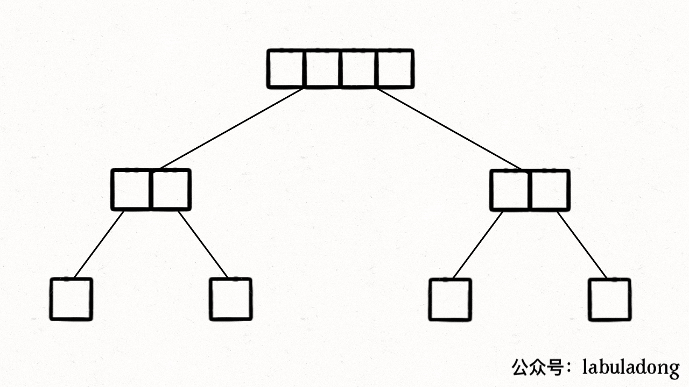

# 归并排序 和 快速排序

> 这篇其实是对两个排序法进阶理解。虽然这篇帖子归类在双指针的chapter下，是这两种排序法是对递归思想的进阶阐释。**敲黑板** 先买个官司来个貌似玄学的statement：**归并排序是后序代码，快速排序是前序代码**。听起来是不是像我们在描述二叉树的前中后序遍历的时候的思想？其实没错，所有的递归算法，不管是干什么用的，**本质都是在遍历一个（递归）树，然后在节点上执行代码**。直白点说，你要写递归算法，弄清楚递归的三要素（1. *递归的定义*；2. *递归的拆解*；3. *递归的出口*），然后就是告诉每个节点需要做什么。
>
> **重点** 你仔细琢磨琢磨这就话，**递归的本质是在遍历一个（递归）树**，你现在再闭上眼回忆一下二叉树的遍历模板->回溯模板，分治模板->图的遍历模板->动态规划模板等等，你的脑子里能否抽象出对应的递归树？

## 归并排序
> 说二叉树问题思路的时候，我们通常是有两类思路，一类是**遍历**一遍二叉树的思路，另一类是**分解**问题的思路；按这个思路类比，归并排序显然利用的是分解问题的思路。
>
> 先来句经典的：**归并排序就是先把左半边数组排好序，再把右半边数组排好序，然后把两半数组合并**。

> 首先，归并排序的递归树长啥样啊？归并排序的过程可以在逻辑上抽象成一棵二叉树，树上的每个节点的值可以认为是 nums[lo..hi]，叶子节点的值就是数组中的单个元素：


> 当左右半边数组都sort好了，就merge呗。这个`merge`操作会在二叉树的每个节点上都执行一遍，执行顺序是二叉树后序遍历的顺序：


> 现在借助东哥的一张动图来可视化一下`这个二叉树的后序遍历`：


说到这里，再不上code就显得太理论了，下面是归并排序的模板代码：
```js
var temp = [];
var sort = function(nums) {
    temp = Array(nums.length);
    // 排序整个数组（原地修改）
    sortIt(nums, 0, nums.length - 1);
}

const sortIt = (nums, lo, hi) => {
    if (lo == hi) {
        // 单个元素不用排序
        return;
    }
    // 这样写是为了防止溢出，效果等同于 (hi + lo) / 2
    let mid = Math.floor(lo + (hi - lo) / 2);
    // 先对左半部分数组 nums[lo..mid] 排序
    sortIt(nums, lo, mid);
    // 再对右半部分数组 nums[mid+1..hi] 排序
    sortIt(nums, mid + 1, hi);
    // 将两部分有序数组合并成一个有序数组
    merge(nums, lo, mid, hi);
}

// 将 nums[lo..mid] 和 nums[mid+1..hi] 这两个有序数组合并成一个有序数组
const merge = (nums, lo, mid, hi) => {
    // 先把 nums[lo..hi] 复制到辅助数组中
    // 以便合并后的结果能够直接存入 nums
    for (let i = lo; i <= hi; i++) {
        temp[i] = nums[i];
    }

    // 数组双指针技巧，合并两个有序数组
    let i = lo, j = mid + 1;
    for (let p = lo; p <= hi; p++) {
        if (i == mid + 1) {
            // 左半边数组已全部被合并
            nums[p] = temp[j++];
        } else if (j == hi + 1) {
            // 右半边数组已全部被合并
            nums[p] = temp[i++];
        } else if (temp[i] > temp[j]) {
            nums[p] = temp[j++];
        } else {
            nums[p] = temp[i++];
        }
    }
}
```

> **敲黑板** 都知道归并排序算法的时间复杂度是O(nlogn)，但是你怎么解释这个O(n*logn)呢？对于归并排序来说，时间复杂度显然集中在merge函数遍历`nums[lo..hi]`的过程，但每次merge输入的 lo 和 hi 都不同，所以不容易直观地看出时间复杂度。
> merge函数到底执行了多少次？每次执行的时间复杂度是多少？总的时间复杂度是多少？先看图吧：


!> 执行的次数是二叉树节点的个数，每次执行的复杂度就是每个节点代表的子数组的长度，所以总的时间复杂度就是整棵树中「数组元素」的个数。所以从整体上看，这个二叉树的高度是`logN`，其中每一层的元素个数就是原数组的长度N，所以总的时间复杂度就是`O(NlogN)`。

## 快速排序
> 如果是**归并排序**`就是先把左半边数组排好序，再把右半边数组排好序，然后把两半数组合并。`，那么**快速排序**是`先将一个元素排好序，然后再将剩下的元素排好序`。所以你体会体会，不就是说归并排序是后序代码，而快速排序是前序代码嘛。

> 快排的基本模板如下：
```js
const quickSort = (nums, start, end) => {

    if(start>=end) return;
    //前序遍历代码
    let [left, right] = partition(nums, start, end);
    
    quickSort(nums,start,right);
    quickSort(nums,left,end);
}
```
> 快速排序的核心无疑是partition函数，**partition函数**的作用是在`nums[start..end]`中寻找一个分界点p，通过交换元素使得`nums[start..p-1]`都小于等于`nums[p]`，且`nums[p+1..end]`都大于`nums[p]`：

>
> **从二叉树的视角，我们可以把子数组 nums[lo..hi] 理解成二叉树节点上的值，sort 函数理解成二叉树的遍历函数**。


> 你在深入思考一下，**快速排序的过程是一个构造二叉搜索树的过程**。


> 很显然，这个算法的关键在于partition函数，下面就写一版九章里的模板：
```js
const partition = (nums, start, end) => {
    if(start>=end) return end;
    let left=start, right=end;
    let pivot = nums[Math.floor((start+end)/2)];
    while(left<=right){
        while(left<=right && nums[left]<pivot){
            left++;
        } 
        while(left<=right && nums[right]>pivot){
            right--;
        }
        //交换
        if(left<=right){
            [nums[left],nums[right]] = [nums[right],nums[left]]
            left++;
            right--;
        }
    }
    return [left, right];
}
```

!> 显然，快速排序的时间复杂度主要消耗在**partition函数**上，因为这个函数中存在循环。所以partition函数到底执行了多少次？每次执行的时间复杂度是多少？总的时间复杂度是多少？
!> partition执行的次数是二叉树节点的个数，每次执行的复杂度就是每个节点代表的子数组`nums[lo..hi]`的长度，所以总的时间复杂度就是整棵树中「数组元素」的个数。
!> 假设数组元素个数为`N`，那么二叉树每一层的元素个数之和就是`O(N)`；分界点分布均匀的*理想情况下*，树的层数为`O(logN)`，所以理想的总时间复杂度为`O(NlogN)`。
!> 由于快速排序没有使用任何辅助数组，所以空间复杂度就是递归堆栈的深度，也就是树高`O(logN)`。


!> 快速排序的效率存在一定随机性，如果每次partition切分的结果都极不均匀：


> 快速排序就退化成选择排序了，树高为`O(N)`，每层节点的元素个数从`N`开始递减，总的时间复杂度为：
> ```
> N + (N - 1) + (N - 2) + ... + 1 = O(N^2)
> ```
> 所以我们说，快速排序理想情况的时间复杂度是`O(NlogN)`，空间复杂度`O(logN)`，极端情况下的最坏时间复杂度是`O(N^2)`，空间复杂度是`O(N)`。

### 刷题列表
1. [912. 排序数组](#排序数组) 
1. [315. 计算右侧小于当前元素的个数](#计算右侧小于当前元素的个数)
1. [493. 翻转对](#翻转对) 
1. [327. 区间和的个数](#区间和的个数) 

### 排序数组
[912. 排序数组](https://leetcode.com/problems/sort-an-array/)
> **思路** 这题是模板性的排序问题，这里展示两种解法，一种是快速排序，一种是归并排序；
```js
/**
 * @param {number[]} nums
 * @return {number[]}
 */
var sortArray = function(nums) {
    quickSort(nums,0,nums.length-1);
    return nums;
};

const quickSort = (nums, start, end) => {

    if(start>=end) return;
    
    let left=start, right=end;
    let pivot = nums[Math.floor((start+end)/2)];
    while(left<=right){
        while(left<=right && nums[left]<pivot){
            left++;
        } 
        while(left<=right && nums[right]>pivot){
            right--;
        } 
        
        //交换
        if(left<=right){
            [nums[left],nums[right]] = [nums[right],nums[left]]
            left++;
            right--;
        }
    }
    
    quickSort(nums,start,right);
    quickSort(nums,left,end);
}
```

```js
/**
 * @param {number[]} nums
 * @return {number[]}
 */
//试一下merge sort
var temp;
var sortArray = function(nums) {
    temp = Array(nums.length);
    mergeSort(nums, 0, nums.length-1);
    return nums;
};

const mergeSort = (nums, lo, hi) => {
    if(lo==hi) return;
    
    let mid = Math.floor(lo + (hi-lo)/2);
    mergeSort(nums, lo, mid);
    mergeSort(nums, mid+1, hi);
    
    merge(nums, lo, mid, hi);
}

const merge = (nums, lo, mid, hi) => {
    //copy it to temp
    for(let i=lo; i<=hi; i++){
        temp[i] = nums[i];
    }
    
    //for循环again来判定左右大小
    let i=lo, j=mid+1;
    for(let p=lo; p<=hi; p++){
        //左半数组已经遍历完了
        if(i==mid+1){
            nums[p] = temp[j++];
        } 
        else if(j==hi+1) { //右半数组已经遍历完了
            nums[p] = temp[i++];
        }
        else if(temp[i]>temp[j]){
            nums[p] = temp[j++];
        }
        else {
            nums[p] = temp[i++];
        }
    }
}
```