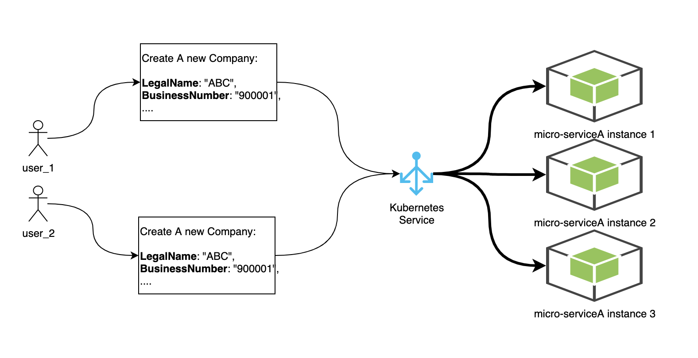
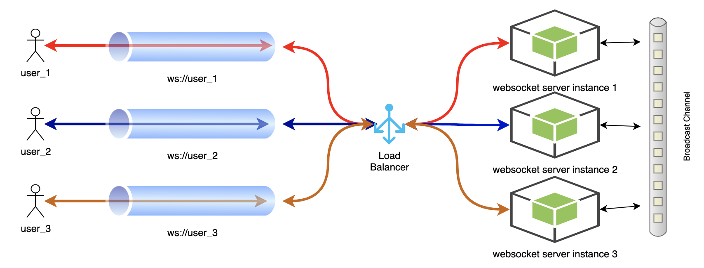

# When should you adopt sticky-session for your micro-frontend?

#### Disclaimers
* The example provided in this post will be heavily based on a container deployment in Kubernetes.

#### Assumptions
* The frontend application (e.g., Single Page Application) is one of the micro-frontend applications in your platform, which means it has a relatively small set of functions and features.

## Scenarios
1. Your backend is running multiple instances (e.g., as a Kubernetes deployment with replica of 3), and one of the major function is to provide an API for users to create a new company record.
    * User needs to provide at minimum **LegalName** and **BusinessNumber** in order to create new company;
    * The **BusinessNumber** is one of the unique fields the service needs to keep as invariant. 
    * **Constraint 1**: the service implementer is NOT willing to acquiring a distributed lock from a third system (e.g., Redis Lock, Zookeeper etc.) during the creation of a new company record.
    * **Constraint 2**: the service implementer has put a **unique** constraint of **BusinessNumber** on the database layer, but he/she does not want that constraint to be violated too frequently.
    
    

2. One of your micro-frontend applications (e.g., Single Page Application backed by ReactJS) requires to enable `Collabrative` edit of a document.
    * Your team decided to adopt a way of long running connection where both client and server can pub/sub messages/events (e.g., commenting a document, changing a field value of a document etc.) about the document itself, so that the server side can real-timely broadcast the messages to other online users. 
    * Your team decided to use websocket technology to implement this `Collabrative` feature.
    * **Disclaimer** Discussion of pros and cons among [**WebSocket**](https://tools.ietf.org/html/rfc6455), [**Long Polling Request**](http://en.wikipedia.org/wiki/Push_technology#Long_polling) and [**Server Sent Event**](https://en.wikipedia.org/wiki/Server-sent_events) is out of scope for this post. [Here](https://medium.com/system-design-blog/long-polling-vs-websockets-vs-server-sent-events-c43ba96df7c1) is an awesome post which covers this.
    
    

## Solutions

#### Secnario #1:
* Essentially, the solution should be able resolve the issue of racing condition of multiple users creating the same company record simultaneously.
* To reduce the possibility of violating the database constraint (the **uniqueness** constraint of **BusinessNumber**), the service layer (or some layer above, e.g., the API Gateway layer) needs to checking the potential racing condition.
* As such, if all the creation request (aka, `POST` traffic) of the **BusinessNumber** can be routed to the same instance of your application, then your application can leverage well-known `optimistic locking` (e.g., RW lock etc.) for the business critical zone.
* **Solution Snippet**: 
    * In your Kubernetes ingress controller spec, configure your corresponding ingress rule as following:
    ```
    apiVersion: extensions/v1beta1
    kind: Ingress
    metadata:
      name: nginx-company
      annotations:
        nginx.ingress.kubernetes.io/affinity: "cookie"
        nginx.ingress.kubernetes.io/session-cookie-name: "com-sticky"
        nginx.ingress.kubernetes.io/session-cookie-expires: "172800"
        nginx.ingress.kubernetes.io/session-cookie-max-age: "172800" 
        ...
    ```
* **NOTE**: Currently, `cookie` is the only mode it is supported in Kubernetes in terms of session affinity. As such, the solution we have experimented could not drill down to the granularity of `http method + cookie value`.    
    
#### Secnario #2:
* Essentially, the solution should be able resolve the issue of racing condition of multiple users creating the same company record simultaneously.
* To reduce the possibility of violating the database constraint (the **uniqueness** constraint of **BusinessNumber**), the service layer (or some layer above, e.g., the API Gateway layer) needs to checking the potential racing condition.
*  
* **Solution Snippet**: 
    * In your Kubernetes ingress controller spec, configure your corresponding ingress rule as following:
    ```
    apiVersion: extensions/v1beta1
    kind: Ingress
    metadata:
      name: document-collabrator 
      annotations:
        kubernetes.io/ingress.class: nginx
        nginx.ingress.kubernetes.io/affinity: "cookie"
        nginx.ingress.kubernetes.io/session-cookie-name: "doc-sticky"
        nginx.ingress.kubernetes.io/session-cookie-expires: "172800"
        nginx.ingress.kubernetes.io/session-cookie-max-age: "172800" 
        ...
    ```

## Fruit of Thoughts 

