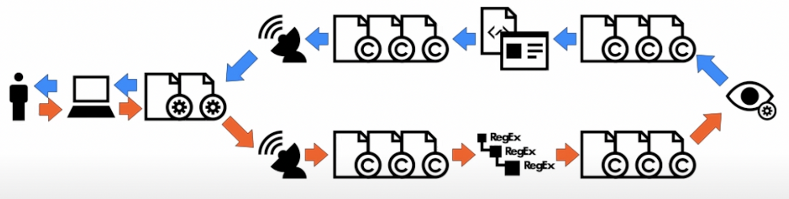

# 记录我的Django之路

## 先来写高屋建瓴的理论
>
> 从基础上说，一个HTTP request的生命周期跟其他语言的Web Framework是遵循了一个套路的，这篇[帖子](https://goutomroy.medium.com/request-and-response-cycle-in-django-338518096640)解释的简明扼要:

> 
>如果你想要再深入的了解一下的话，看看这个[短片](https://www.youtube.com/watch?v=Lwp73bSaplo)

>
> 跟其他的Web Framework一样，生产环境里需要一个类似于nginx的Web Server来作为Reverse Proxy。Reverse Proxy里能做啥和能做啥，个人经验是现在好多人不喜欢放太多功能在这儿，但是Nginx+一直拼命的推销越来越多功能让用户陷入混乱。经验法则上来说，大家对Reverse Proxy基本上只做这几块功能，比如说Load balancing, Web acceleration, Security and anonymity等。
>
> Python世界里呢，对于从HTTP到Python语言semantics的转化桥梁这块，单独进行了诠释，这个诠释使用协议的方式进行的，这个协议的全称叫做Web Server Gateway Interface，简称WSGI。比较模板式的WSGI实现叫做gunicorn。个人觉得跟其他语言相比呢，Python在这块切的比较干净，用户基本上不会觉得WSGI server做了Reverse Proxy应该做的事情。当年的J2EE就是一个反面典型，J2EE对Reverse Proxy基本上是和Apache Web绑定了，也没有专门一层来定义如何从Web Server(Reverse Proxy)到Application Server进行交互。
>
> WSGI Server到底做了啥呢？其实特别特别简单，就是来说多启动几个process，然后每个Process可以handle一个request at one time。比如说，你可以让gunicorn启动3个worker（每个worker对应一个Process），每个worker都有相应的**独立**的memory管理空间，然后每个worker都去跑一个Django的app，这个Django app指的是同一个app，虽然process管理的memory是独立的，但是因为是同一套程序代码，所有就有process之间竞争资源的事情，比如：当你的Django app指定把log写到一个固定的文件file里时候，那么3个process（并行跑的）就可能会同时去写进去同一个file里，那么log就可能没那么容易读了；再举个例子，那就是数据库的读写，假设你的Django app每次指定只打开一个固定db connection，那么就会跟上面写log去file里一样，会有资源竞争的问题。不过这块呢，Django本身对它所支持的Database都进行了concurrency（严格来讲应该叫**同时并发性**）支持；再举个例子，假设你需要把log写到datadog里，这里就建议你起一个deamon process来跑那个datadog agent，理论是一台物理机器跑一个agent，然后呢你的Django app就假设你所跑的物理机器上有个datadog agent process可以让你调用，这样即使你有3个process同时run你的Django app，那么也对于跟datadog agent process就没有所谓的资源竞争问题了，只要Django记得把自己所在的process_id信息传给datadog agent process，因为是interprocess communication (IPC)嘛，这个process_id信息是一定在的。
>
>小结一下的话，那就是WSGI server其实就是个**门神**，英文里没有**门神**这个说法，比较接近的就是**gatekeeper门卫**这词。现在举个例子，你把WSGI server想象成**某桃花园村**入口大门的门神，这个门神有内外两边，左边是所谓的`来自外部世界的访客`，通常这些访客并非来自真正的外部世界，因为这些访客到达村入口之前都先经历了一个Nginx的县里门神的搜查。这些门神的后边通常站着一队排列整齐的**外卖骑手小哥**，门神就把访客把**访客和一个外卖小哥进行一对一绑定**，这样之后呢，每个外卖小哥有套神奇的**芝麻开门的魔力**，那就是突然间启动村里的某个房子的门，然后把游客送进房间，这个期间这个`外卖小哥`会一直在房子外等着以待招呼访客，比如说访客在房子里买了很多东西，需要`外卖小哥`先给存着（存在小哥叫做process RAM的打包里），都有时候呢外卖小哥也需要付出额外的努力来服务访客，比如说某个访客想投币到许愿池（物理机器的文件系统），但是这个许愿池是村里公用的，所有访客都只能通过某个固定的入口投币，每次只允许一个访客投币，这时候就只能等自己顺序了；当游客访问结束，外卖小哥会送访客去门神哪儿，门神基本上再检查一下就放行了。**放行之后需要理解通知那个外卖小哥，把访客刚才待过的那个房子快速地清理干净！！！**

## 详解一下一个request在django框架里都经历了什么

## 关于如何让你web service增加高并发量和吞吐量
>基于这篇[帖子](https://stackoverflow.com/a/20939442/3036854)，浅谈一下对提高并发量的理解吧。关于GIL的理解，你可以看看这个[帖子](https://realpython.com/python-gil/#:~:text=The%20Python%20Global%20Interpreter%20Lock%20or%20GIL%2C%20in%20simple%20words,at%20any%20point%20in%20time.)
>
>Python里有个东西GIL，Global Interpreter Lock，简而言之，就是一个mutex lock，让一个Python进程process里同时只有一个thread能控制这个Python interpreter。这个东西有个明显的坏处，那就是让Python里的多线程基本上是**无能状态**。
>
>这个GIL，主要的设计原则就是让Python process里的内存管理memory management变得无比简单。Python的所有东西都是object，而且每个object都有个东西叫做**reference count**，来追踪某个object有几个reference指向它，举个简单例子说明一下，下面的empty list object[]一共有**3**个reference指向它，分别是a, b，还有传给`sys.getrefcount()`的argument：
```python
import sys
a = []
b = a
sys.getrefcount(a)
```
>
>这个reference count是整个Python interpreter的，所以整个跑Python的那个process里只有一个。那么也就是说多线程的情况下，每个thread就会可能存在racing condition来`增加`或者`减少`这个ref count，要不那就可能导致**memory leak**或者更糟糕的**过早删除**的状况。
>
>Java里有个concurrency包，比如说`java.util.concurrency.BlockingQueue`，说白了就是为了Thread安全，几乎都强加了一个安全锁。那是不是把Python里的`sys.getrefcount`这个函数写成thread safe就好了呢？这么说也没毛病，这样做就会有产生Deadlock的可能，而且一直不停的acquire和releaselock也会耗能太大。Python（还有Ruby）这种动态语言就简单粗暴的选择了GIL这种解法，因为GIL只有一个锁，就不可能产生Deadlock的状况。
>
>**思考** 多线程是为了啥？说白了就是**物尽其用**原则，你恨不得CPU一直不闲着才最好，累死它！就单核的时候，这种多线程其实没有显现出很大优势来，当时一台多核的物理机，多线程就真的很好用了。但我们说的**物尽其用**的时候，意思是说你有足够的东西要用cpu，也就是说计算量大，也叫做cpu-bound，几个几点的例子就是**matrix multiplications, searching, image processing等**。如果你的一个任务本身就足够的让cpu不闲着，其实多线程就可以用**多进程multiprocessing**来实现了，比如说你物理机上有4核，那比较粗暴的做法就是同样的Python codebase，你直接启动4个process独立运行，我直白的告诉你，OS会很聪明的让你的每个python process大部分时间分别泡在不同的core里。如果你的逻辑更复杂一点，那么你可以用python里的`multiprocessing`包来实现。
>
>cpu-bound是对cpu**物尽其用**，但是现实世界里的每个程序/服务都不是本身就完成一切的，几乎所有的app都需要从物理机的文件系统里读数据，也几乎都需要从部署在另一台物理机的数据库里拉数据，甚至几乎都需要从网络里的另一个服务里调数据，你说对吧？你开发的微服务里，有几个是单纯做计算用的？当你调用数据的时候，你的CPU几乎是闲着的，如果你的服务就是单出的从几个不同的数据库里拉数据然后一起返回给前端，这时候你的cpu几乎就是没用的，这种程序叫做I/O-bound。
>
>
>Gunicorn is based on the pre-fork worker model. This means that there is a central master process that manages a set of worker processes. The master never knows anything about individual clients. All requests and responses are handled completely by worker processes.
>

## 小小的历史回忆
> 当年在学Perl的时候(当时在半导体生产厂GlobalFoundries)，那时候接触了一个东西叫做Common Gateway Interface，简称CGI。这个CGI就是能够是Perl的Scripts可以让你的内容和逻辑跟Web联系起来。当时的应用场景是这样的，有个网站能够让用户对他们的生产规则进行克制化，并对一些SPC数据进行可视化，基本上所有人都告诉你有个内部网址提供了这个功能，但是巨慢无比！那时候就听说慢的原因是应为所有的Perl脚本相当于handler，然后CGI会把每个HTTP request都转化成这样一个指令：新启动一个Process，让后这个Process可以run一些Perl的脚步，这些Perl脚本其实就是handlers，基本上是对Response进行内容修改。
>
>