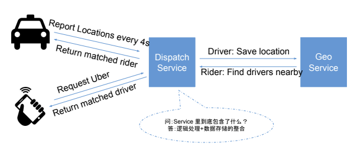
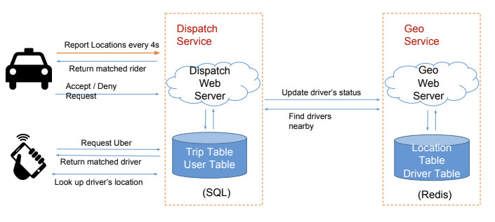

# 基于地理位置的服务

> **在面试中，这绝对是非常高频的题。我个人经验的话，有好几个小公司以及大厂都面了这个类似的题。**

?> 因为 LBS 的题很多，比如说 Facebook Nearby, Yelp, Pokemon Go, Uber 等等，也很容易扩展，比如说 events nearby，广告推荐等等。这篇文章就以 Design Uber 为底子吧，把重点的几个知识点过一过，等以后哪天有时间了再扩展扩展其他 LBS 相关的面试类型。

- [Scenario 层](#Scenario层)
- [Service 层](#Service层)
- [Storage 层](#Storage层)
- [Scale 层](#Scale层)

按套路来讲吧，先看看怎么回问面试官问题。

## Scenario 层

> 打车软件嘛，先自己脑子过一下需要哪些功能。

1. 第一境界
   - Driver 能报告自己的位置(location)；
   - Rider 能找到附近的 Drivers, 并且能 book 一个 trip；
   - Rider 可以直接一键申请 match 一个附近的 driver；
1. 第二境界
   - Driver 拒绝或者接收一个订单；
   - Driver 拒绝一个系统 match 的订单；
   - Rider 取消一个订单；
   - Driver 接载一个 Rider 开始一个 trip；
   - Driver 卸载一个 Rider 结束一个 trip；
1. 第三境界
   - Uber Pool；
   - Uber Eat；

> 这时候问问面试官，大约需要那些功能啊；问问能不能先从第一境界开始做出个 working solution 来。
>
> 都开始问面试官了，那就按照套路继续问吧，问些常规的数据，比如说`每天有多少个载客啊`， `每个在线的司机多少啊`之类的，面试官会告诉你的，甚至直接贴一组数据上来。比如说 2018 年每天有 2M 个司机载客，同时在线的司机大约有 600k（一个可以告诉面试官是基于自己的猜测），如果每 4 秒 Driver 需要 report 自己的位置，那么平均 QPS 就是 150k/s，那么 peak 的 traffic 可以简单估算成平均值得 2 倍，就是 300k/s 的 peak QPS。

!> Rider QPS 可以忽略这里，因 Rider 不需要一直随时 report 自己的位置。

> 算完 QPS 了，按套路继续算存储。
>
> 1. 假如每条 location 都存储: `600k*86400/4 *100bytes(这个可以假设每条位置记录的大小) ~= 1.3 T/天`
> 1. 假如你只想记录当前位置 location: `600k *100bytes(这个可以假设每条位置记录的大小) ~= 60M T/天`

## Service 层

> 问到这里，基本上就可以进入`Service层`设计了。

> Service 层设计也很简单，两个 Services 就可以搞定，如下图所示。

!> 这里可能面试官会问很多的扩展问题，比如说怎么排序，怎么跟第三方 service 整合之类的。

?> 到这里，你可以选择写一些 API 的 signature 出来，但是你也可以告诉面试官你在之后写 Schema 的时候会顺便讲 API 长什么样子。

## Storage 层

> 到这里，就进入本篇 working solution 的重点区域了。能不两个服务对应的数据结构写出来肯定是能解释好 working solution 的重点。要把两个表 Trip 和 Location 的栏位都写出来，可以选择用两个 class 写，也可以选择用 json 写，或者可以直接画表格写。我建议是直接画表格，而且在 codepad 上用打字方式展示，因为手写实在影响时间。

| Location Table | type  |    comments |
| :------------- | :---: | ----------: |
| driver_id      |  fk   | Primary Key |
| lat            | float |    latitude |
| lng            | float |   longitude |

| Trip Table |   type    | comments                                                  |
| :--------- | :-------: | :-------------------------------------------------------- |
| id         |    pk     | Primary Key                                               |
| rider_id   |    fk     | User ID                                                   |
| driver_id  |    fk     | User ID                                                   |
| start_lat  |   float   | 起始位置                                                  |
| start_lng  |   float   | 起始位置                                                  |
| end_lat    |   float   | 目的位置                                                  |
| end_lng    |   float   | 目的位置                                                  |
| created_at | timestamp | 创建时间                                                  |
| status     |    int    | [New, WaitForDriver, PickUp, InTrip, Cancelled, End etc.] |

给出可行解 working solution

## Scale 层

### LBS 类系统的难点：如何存储和查询地理位置的信息

!> 给定一个(lat, lng)的位置数据对，怎么找他附近几公里的位置？这里必须很清楚。

> 解决方案 1：用 Hilbert Curve，就是将一个地址数据对映射到 2^64 的整数，`如果两个一维整数比较接近，对应的二维坐标就比较接近`。Google S2 用的就是这个方案。
>
> 解决方案 2：用 Peano Curve，就是将整个地球地图 32 分(0-9, a-z 去掉 a,i,l,o)，然后在每个小区里再 32 分...`如果两个值得公共前缀越长，两个点越接近`。这个算法通常叫 GeoHash，核心就是经度上二分(-180,180)，纬度上二分(-90, 90)。
