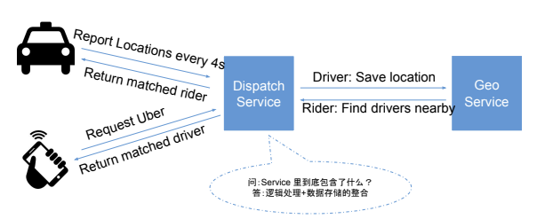

# 过去遇到的面试真题

> **记录一下这里大面试季的真题：本季面试的公司：Facebook, Noom, Narvar, Amazon, Google, Slack, Wayfair, Nylas, Instacart, Microsoft**

?> 这个面试季的一些真题总结。
* [Facebook - 在一个广告平台上展示用过附近的events](#在一个广告平台上展示用过附近的events)
* [Facebook - 针对广告的impressions和clicks设计一个实时analytics dashboard](#针对广告的impressions和clicks设计一个实时analytics-dashboard)
* [Noom - 设计TinyURL](#设计TinyURL)
* [Noom - 设计一个大数据平台处理两个Lists](#设计一个大数据平台处理两个Lists)
* [Narvar - 设计Uber](#设计Uber)
* [Narvar - 设计一个多租户Saas平台的core](#设计一个多租户Saas平台的core)
* [Amazon - 设计一个产品页面点击量的analytics产品](#设计一个产品页面点击量的analytics产品)
* [Slack - 设计@Mentions](#设计@Mentions)
* [Microsoft - 设计一个茶轴两个大log文件的交集的方案](#设计一个茶轴两个大log文件的交集的方案)
* [Ripple - 设计银行支票账户](#设计银行支票账户)
* [Uber - 设计Driver的heatmap](#设计Driver的heatmap)
* [Wish - 设计给商家的账单生成系统](#设计给商家的账单生成系统)

按套路来讲吧，先看看怎么回问面试官问题。

## Scenario层
> 打车软件嘛，先自己脑子过一下需要哪些功能。
1. 第一境界
    * Driver能报告自己的位置(location)；
    * Rider能找到附近的Drivers, 并且能book一个trip；
    * Rider可以直接一键申请match一个附近的driver；
1. 第二境界
    * Driver拒绝或者接收一个订单；
    * Driver拒绝一个系统match的订单；
    * Rider取消一个订单；
    * Driver接载一个Rider开始一个trip；
    * Driver卸载一个Rider结束一个trip；
1. 第三境界
    * Uber Pool；
    * Uber Eat；

> 这时候问问面试官，大约需要那些功能啊；问问能不能先从第一境界开始做出个working solution来。
>
> 都开始问面试官了，那就按照套路继续问吧，问些常规的数据，比如说`每天有多少个载客啊`， `每个在线的司机多少啊`之类的，面试官会告诉你的，甚至直接贴一组数据上来。比如说2018年每天有2M个司机载客，同时在线的司机大约有600k（一个可以告诉面试官是基于自己的猜测），如果每4秒Driver需要report自己的位置，那么平均QPS就是150k/s，那么peak的traffic可以简单估算成平均值得2倍，就是300k/s的peak QPS。

!> Rider QPS可以忽略这里，因Rider不需要一直随时report自己的位置。

> 算完QPS了，按套路继续算存储。
> 
> 1. 假如每条location都存储: `600k*86400/4 *100bytes(这个可以假设每条位置记录的大小) ~= 1.3 T/天`
> 1. 假如你只想记录当前位置location: `600k *100bytes(这个可以假设每条位置记录的大小) ~= 60M T/天`

## Service层
> 问到这里，基本上就可以进入`Service层`设计了。

> Service层设计也很简单，两个Services就可以搞定，如下图所示。

!> 这里可能面试官会问很多的扩展问题，比如说怎么排序，怎么跟第三方service整合之类的。

?> 到这里，你可以选择写一些API的signature出来，但是你也可以告诉面试官你在之后写Schema的时候会顺便讲API长什么样子。

## Storage层
> 到这里，就进入本篇working solution的重点区域了。能不两个服务对应的数据结构写出来肯定是能解释好working solution的重点。要把两个表Trip和Location的栏位都写出来，可以选择用两个class写，也可以选择用json写，或者可以直接画表格写。我建议是直接画表格，而且在codepad上用打字方式展示，因为手写实在影响时间。

|Location Table|type|comments|
|:-|:-:|-:|
|driver_id|fk|Primary Key|
|lat|float|latitude|
|lng|float|longitude|

|Trip Table|type|comments|
|:---|:---:|---:|
|id|pk|Primary Key|
|rider_id|fk|User ID|
|driver_id|fk|User ID|
|start_lat|float||
|start_lng|float||
|end_lat|float||
|end_lng|float||
|created_at|timestamp|创建时间|
|status|int|[New, WaitForDriver, PickUp, InTrip, Cancelled, End etc.]|

给出可行解working solution

## Scale层
### LBS类系统的难点：如何存储和查询地理位置的信息

!> 给定一个(lat, lng)的位置数据对，怎么找他附近几公里的位置？这里必须很清楚。

> 解决方案1：用Hilbert Curve，就是将一个地址数据对映射到2^64的整数，`如果两个一维整数比较接近，对应的二维坐标就比较接近`。Google S2用的就是这个方案。
>
> 解决方案2：用Peano Curve，就是将整个地球地图32分(0-9, a-z去掉a,i,l,o)，然后在每个小区里再32分...`如果两个值得公共前缀越长，两个点越接近`。这个算法通常叫GeoHash，核心就是经度上二分(-180,180)，纬度上二分(-90, 90)。

